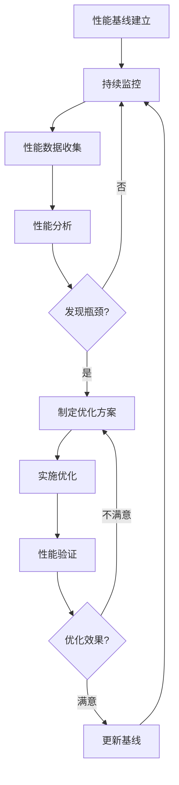

# HarborAI SDK 性能评估标准与执行计划

## 1. 性能评估标准

### 1.1 核心性能指标

基于PRD和TD文档的要求，制定以下性能评估标准：

#### 1.1.1 响应时间标准
| 测试场景 | 目标值 | 警告阈值 | 错误阈值 | 备注 |
|---------|--------|----------|----------|------|
| 基础API调用 | < 500ms | 500-1000ms | > 1000ms | 单次同步调用 |
| 异步API调用 | < 300ms | 300-800ms | > 800ms | 异步调用开销 |
| 流式响应TTFB | < 200ms | 200-500ms | > 500ms | 首字节时间 |
| 结构化输出(Agently) | < 1000ms | 1000-2000ms | > 2000ms | 包含解析时间 |
| 结构化输出(Native) | < 800ms | 800-1500ms | > 1500ms | 原生JSON Schema |
| 推理模型调用 | < 3000ms | 3000-5000ms | > 5000ms | deepseek-reasoner |
| 插件切换开销 | < 5ms | 5-10ms | > 10ms | 插件架构开销 |

#### 1.1.2 并发性能标准
| 并发场景 | 目标值 | 警告阈值 | 错误阈值 | 备注 |
|---------|--------|----------|----------|------|
| 低并发(1-10用户) | 成功率 > 99.9% | 99.5-99.9% | < 99.5% | 基础并发能力 |
| 中并发(10-100用户) | 成功率 > 99.5% | 99.0-99.5% | < 99.0% | 常规业务场景 |
| 高并发(100-1000用户) | 成功率 > 99.0% | 98.0-99.0% | < 98.0% | 峰值负载场景 |
| 极限并发(1000+用户) | 成功率 > 95.0% | 90.0-95.0% | < 90.0% | 压力测试 |
| 吞吐量 | > 100 RPS | 50-100 RPS | < 50 RPS | 每秒请求数 |

#### 1.1.3 资源使用标准
| 资源类型 | 目标值 | 警告阈值 | 错误阈值 | 备注 |
|---------|--------|----------|----------|------|
| 内存使用(空闲) | < 50MB | 50-100MB | > 100MB | SDK基础内存占用 |
| 内存使用(负载) | < 200MB | 200-500MB | > 500MB | 高负载时内存占用 |
| 内存增长率 | < 5%/小时 | 5-10%/小时 | > 10%/小时 | 内存泄漏检测 |
| CPU使用率(平均) | < 30% | 30-50% | > 50% | 平均CPU占用 |
| CPU使用率(峰值) | < 70% | 70-90% | > 90% | 峰值CPU占用 |
| 网络效率 | > 80% | 60-80% | < 60% | 有效数据传输比例 |

#### 1.1.4 稳定性标准
| 稳定性指标 | 目标值 | 警告阈值 | 错误阈值 | 备注 |
|-----------|--------|----------|----------|------|
| 长期运行稳定性 | 24小时无故障 | 12-24小时 | < 12小时 | 持续运行能力 |
| 错误恢复时间 | < 1秒 | 1-5秒 | > 5秒 | 异常恢复速度 |
| 重试成功率 | > 95% | 90-95% | < 90% | 重试机制效果 |
| 降级响应时间 | < 100ms | 100-300ms | > 300ms | 降级策略响应 |

### 1.2 与OpenAI SDK对比标准

#### 1.2.1 性能对比基准
| 对比维度 | HarborAI目标 | OpenAI基准 | 对比要求 |
|---------|-------------|-----------|----------|
| 基础调用开销 | < 1ms | 基准值 | 开销不超过OpenAI的10% |
| 内存占用 | < 1.2倍 | 基准值 | 内存使用不超过OpenAI的20% |
| 并发性能 | ≥ 95% | 基准值 | 并发能力不低于OpenAI的95% |
| 兼容性 | 100% | 基准值 | 完全兼容OpenAI接口 |

#### 1.2.2 功能增强评估
| 增强功能 | 性能影响目标 | 评估标准 |
|---------|-------------|----------|
| 插件架构 | < 5ms开销 | 插件切换不影响整体性能 |
| 异步日志 | < 10ms延迟 | 日志记录不阻塞主流程 |
| 结构化输出 | < 2倍时间 | 结构化处理时间可接受 |
| 智能降级 | < 100ms响应 | 降级决策快速响应 |
| 推理模型支持 | 透明集成 | 不影响非推理模型性能 |

## 2. 测试执行计划

### 2.1 测试阶段规划

#### 阶段一：基础性能验证（第1-2天）
**目标**：验证SDK基础功能的性能表现

**测试内容**：
1. **API响应时间测试**
   - 同步调用性能测试
   - 异步调用性能测试
   - 流式响应性能测试
   - 不同消息长度的性能影响

2. **内存使用基准测试**
   - 空闲状态内存占用
   - 单次调用内存增长
   - 内存回收效率测试

3. **与OpenAI SDK对比测试**
   - 相同场景性能对比
   - 兼容性验证测试

**验收标准**：
- 所有基础API调用响应时间符合目标值
- 内存使用在可接受范围内
- 与OpenAI SDK性能差异在10%以内

#### 阶段二：并发性能测试（第3-4天）
**目标**：验证SDK在并发场景下的性能表现

**测试内容**：
1. **渐进式负载测试**
   - 1-10用户并发测试
   - 10-100用户并发测试
   - 100-1000用户并发测试
   - 1000+用户极限测试

2. **混合场景并发测试**
   - 多模型并发调用
   - 同步/异步混合调用
   - 流式/非流式混合调用

3. **资源竞争测试**
   - CPU密集型并发测试
   - 内存密集型并发测试
   - 网络I/O密集型测试

**验收标准**：
- 各并发级别成功率达标
- 资源使用在合理范围内
- 无明显性能瓶颈

#### 阶段三：高级功能性能测试（第5-6天）
**目标**：验证SDK高级功能的性能影响

**测试内容**：
1. **结构化输出性能测试**
   - Agently结构化输出性能
   - Native JSON Schema性能
   - 复杂Schema解析性能
   - 结构化输出并发测试

2. **推理模型性能测试**
   - deepseek-reasoner调用性能
   - 思考过程解析性能
   - 推理模型并发性能

3. **插件架构性能测试**
   - 插件加载性能
   - 插件切换开销
   - 插件并发调用性能

**验收标准**：
- 高级功能性能开销可接受
- 不影响基础功能性能
- 功能完整性100%

#### 阶段四：稳定性与长期测试（第7-8天）
**目标**：验证SDK长期运行的稳定性

**测试内容**：
1. **长期稳定性测试**
   - 24小时持续运行测试
   - 内存泄漏检测
   - 资源累积监控

2. **异常场景测试**
   - 网络异常恢复测试
   - API错误处理测试
   - 重试机制性能测试
   - 降级策略性能测试

3. **边界条件测试**
   - 极大消息处理
   - 极高并发压力
   - 资源耗尽场景

**验收标准**：
- 24小时稳定运行无故障
- 异常恢复时间符合要求
- 边界条件处理正确

### 2.2 测试环境配置

#### 2.2.1 硬件环境
```yaml
测试环境规格:
  CPU: Intel i7-12700K (12核24线程) 或同等性能
  内存: 32GB DDR4-3200
  存储: 1TB NVMe SSD
  网络: 千兆以太网
  
基准环境规格:
  CPU: Intel i5-10400 (6核12线程)
  内存: 16GB DDR4-2666
  存储: 512GB SATA SSD
  网络: 百兆以太网
```

#### 2.2.2 软件环境
```yaml
操作系统: Ubuntu 22.04 LTS / Windows 11
Python版本: 3.9.x, 3.10.x, 3.11.x
依赖版本:
  - requests: 2.31.x
  - aiohttp: 3.8.x
  - pydantic: 2.x
  - agently: latest
  
测试工具:
  - pytest: 7.x
  - pytest-benchmark: 4.x
  - pytest-asyncio: 0.21.x
  - memory-profiler: 0.61.x
  - psutil: 5.9.x
  - locust: 2.x
```

#### 2.2.3 网络环境
```yaml
网络配置:
  - 延迟: < 50ms (到API服务器)
  - 带宽: > 100Mbps
  - 丢包率: < 0.1%
  - 并发连接数: > 1000
  
API配置:
  - DeepSeek API: 生产环境
  - OpenAI API: 对比基准
  - 测试API Key: 专用测试账号
  - 速率限制: 根据实际限制配置
```

### 2.3 测试数据准备

#### 2.3.1 测试消息数据集
```json
{
  "short_messages": [
    {"role": "user", "content": "Hello"},
    {"role": "user", "content": "What's the weather?"},
    {"role": "user", "content": "简单问题测试"}
  ],
  "medium_messages": [
    {
      "role": "user", 
      "content": "请帮我分析一下这个问题的解决方案，需要考虑多个方面的因素。"
    },
    {
      "role": "user",
      "content": "Can you explain the concept of machine learning in detail, including its applications and limitations?"
    }
  ],
  "long_messages": [
    {
      "role": "user",
      "content": "这是一个很长的测试消息..." // 1000+ 字符
    }
  ],
  "conversation_history": [
    [
      {"role": "user", "content": "第一轮对话"},
      {"role": "assistant", "content": "助手回复"},
      {"role": "user", "content": "第二轮对话"}
    ]
  ]
}
```

#### 2.3.2 结构化输出Schema
```json
{
  "simple_schema": {
    "type": "object",
    "properties": {
      "answer": {"type": "string"},
      "confidence": {"type": "number"}
    },
    "required": ["answer", "confidence"]
  },
  "complex_schema": {
    "type": "object",
    "properties": {
      "analysis": {
        "type": "object",
        "properties": {
          "summary": {"type": "string"},
          "key_points": {
            "type": "array",
            "items": {"type": "string"}
          },
          "recommendations": {
            "type": "array",
            "items": {
              "type": "object",
              "properties": {
                "title": {"type": "string"},
                "description": {"type": "string"},
                "priority": {"type": "integer"}
              }
            }
          }
        }
      },
      "metadata": {
        "type": "object",
        "properties": {
          "processing_time": {"type": "number"},
          "confidence_score": {"type": "number"},
          "model_version": {"type": "string"}
        }
      }
    },
    "required": ["analysis", "metadata"]
  }
}
```

## 3. 性能瓶颈识别框架

### 3.1 瓶颈识别指标

#### 3.1.1 响应时间瓶颈
```python
# 响应时间分解分析
response_time_breakdown = {
    "dns_resolution": "DNS解析时间",
    "tcp_connection": "TCP连接建立时间", 
    "ssl_handshake": "SSL握手时间",
    "request_send": "请求发送时间",
    "server_processing": "服务器处理时间",
    "response_receive": "响应接收时间",
    "local_processing": "本地处理时间"
}

# 瓶颈判断标准
bottleneck_thresholds = {
    "dns_resolution": 50,      # ms
    "tcp_connection": 100,     # ms
    "ssl_handshake": 200,      # ms
    "request_send": 10,        # ms
    "server_processing": 1000, # ms
    "response_receive": 100,   # ms
    "local_processing": 50     # ms
}
```

#### 3.1.2 并发瓶颈识别
```python
# 并发性能指标
concurrency_metrics = {
    "connection_pool_exhaustion": "连接池耗尽",
    "thread_pool_saturation": "线程池饱和",
    "memory_pressure": "内存压力",
    "cpu_saturation": "CPU饱和",
    "network_bandwidth_limit": "网络带宽限制",
    "api_rate_limiting": "API速率限制"
}

# 瓶颈检测算法
def detect_concurrency_bottleneck(metrics):
    bottlenecks = []
    
    if metrics['active_connections'] / metrics['max_connections'] > 0.9:
        bottlenecks.append("connection_pool_exhaustion")
    
    if metrics['cpu_usage'] > 80:
        bottlenecks.append("cpu_saturation")
    
    if metrics['memory_usage'] > 85:
        bottlenecks.append("memory_pressure")
    
    if metrics['error_rate'] > 5 and "429" in metrics['error_codes']:
        bottlenecks.append("api_rate_limiting")
    
    return bottlenecks
```

#### 3.1.3 资源使用瓶颈
```python
# 资源监控指标
resource_monitoring = {
    "memory_leak_detection": {
        "growth_rate_threshold": 5,  # %/hour
        "absolute_threshold": 1000,  # MB
        "gc_efficiency_threshold": 80 # %
    },
    "cpu_efficiency": {
        "utilization_threshold": 70,  # %
        "context_switch_threshold": 10000,  # /sec
        "wait_time_threshold": 20  # %
    },
    "io_performance": {
        "disk_utilization_threshold": 80,  # %
        "network_utilization_threshold": 80,  # %
        "io_wait_threshold": 10  # %
    }
}
```

### 3.2 性能分析工具集成

#### 3.2.1 代码级性能分析
```python
# 使用cProfile进行函数级性能分析
import cProfile
import pstats
from functools import wraps

def profile_performance(func):
    @wraps(func)
    def wrapper(*args, **kwargs):
        profiler = cProfile.Profile()
        profiler.enable()
        
        result = func(*args, **kwargs)
        
        profiler.disable()
        stats = pstats.Stats(profiler)
        stats.sort_stats('cumulative')
        stats.print_stats(20)  # 显示前20个最耗时的函数
        
        return result
    return wrapper

# 使用line_profiler进行行级性能分析
@profile  # 需要kernprof -l -v运行
def critical_function():
    # 关键性能代码
    pass
```

#### 3.2.2 内存分析工具
```python
# 使用memory_profiler进行内存分析
from memory_profiler import profile, LineProfiler

@profile
def memory_intensive_function():
    # 内存密集型操作
    pass

# 使用tracemalloc进行内存跟踪
import tracemalloc

def analyze_memory_usage():
    tracemalloc.start()
    
    # 执行测试代码
    run_performance_test()
    
    current, peak = tracemalloc.get_traced_memory()
    print(f"当前内存使用: {current / 1024 / 1024:.1f} MB")
    print(f"峰值内存使用: {peak / 1024 / 1024:.1f} MB")
    
    tracemalloc.stop()
```

## 4. 优化建议框架

### 4.1 代码执行效率优化

#### 4.1.1 算法优化建议
```python
# 优化建议模板
code_optimization_suggestions = {
    "algorithm_efficiency": {
        "description": "算法效率优化",
        "suggestions": [
            "使用更高效的数据结构（如dict代替list查找）",
            "减少嵌套循环，优化时间复杂度",
            "使用生成器代替列表推导式减少内存占用",
            "缓存计算结果避免重复计算"
        ],
        "impact": "high",
        "effort": "medium"
    },
    "io_optimization": {
        "description": "I/O操作优化", 
        "suggestions": [
            "使用异步I/O减少阻塞",
            "批量处理减少I/O次数",
            "使用连接池复用连接",
            "实现请求去重避免重复调用"
        ],
        "impact": "high",
        "effort": "medium"
    }
}
```

#### 4.1.2 并发优化建议
```python
concurrency_optimization = {
    "async_programming": {
        "description": "异步编程优化",
        "suggestions": [
            "使用asyncio替代多线程减少上下文切换开销",
            "合理设置并发限制避免资源耗尽",
            "使用信号量控制并发数量",
            "实现优雅的错误处理和重试机制"
        ],
        "code_example": """
        import asyncio
        import aiohttp
        
        async def optimized_concurrent_requests():
            semaphore = asyncio.Semaphore(100)  # 限制并发数
            
            async def single_request(session, url):
                async with semaphore:
                    async with session.get(url) as response:
                        return await response.json()
            
            async with aiohttp.ClientSession() as session:
                tasks = [single_request(session, url) for url in urls]
                results = await asyncio.gather(*tasks, return_exceptions=True)
            
            return results
        """
    }
}
```

### 4.2 内存管理优化

#### 4.2.1 内存使用优化
```python
memory_optimization = {
    "object_lifecycle": {
        "description": "对象生命周期管理",
        "suggestions": [
            "及时释放大对象引用",
            "使用弱引用避免循环引用",
            "实现对象池复用昂贵对象",
            "使用__slots__减少对象内存占用"
        ],
        "code_example": """
        class OptimizedClient:
            __slots__ = ['api_key', 'base_url', '_session']
            
            def __init__(self, api_key, base_url):
                self.api_key = api_key
                self.base_url = base_url
                self._session = None
            
            def __enter__(self):
                self._session = aiohttp.ClientSession()
                return self
            
            def __exit__(self, exc_type, exc_val, exc_tb):
                if self._session:
                    asyncio.create_task(self._session.close())
        """
    },
    "garbage_collection": {
        "description": "垃圾回收优化",
        "suggestions": [
            "合理调用gc.collect()强制垃圾回收",
            "监控gc统计信息优化回收策略",
            "避免创建大量短生命周期对象",
            "使用对象池减少分配/释放开销"
        ]
    }
}
```

### 4.3 网络通信优化

#### 4.3.1 网络效率优化
```python
network_optimization = {
    "connection_management": {
        "description": "连接管理优化",
        "suggestions": [
            "使用HTTP/2提高多路复用效率",
            "实现智能连接池管理",
            "启用gzip压缩减少传输数据量",
            "使用CDN加速静态资源访问"
        ],
        "code_example": """
        import aiohttp
        
        # 优化的连接配置
        connector = aiohttp.TCPConnector(
            limit=100,              # 总连接数限制
            limit_per_host=30,      # 每个主机连接数限制
            ttl_dns_cache=300,      # DNS缓存TTL
            use_dns_cache=True,     # 启用DNS缓存
            keepalive_timeout=30,   # 保持连接超时
            enable_cleanup_closed=True  # 清理关闭的连接
        )
        
        timeout = aiohttp.ClientTimeout(
            total=30,       # 总超时时间
            connect=10,     # 连接超时
            sock_read=10    # 读取超时
        )
        
        session = aiohttp.ClientSession(
            connector=connector,
            timeout=timeout,
            headers={'Accept-Encoding': 'gzip, deflate'}
        )
        """
    },
    "request_optimization": {
        "description": "请求优化",
        "suggestions": [
            "实现智能重试机制",
            "使用指数退避算法",
            "实现请求去重",
            "优化请求负载均衡"
        ]
    }
}
```

## 5. 性能监控与持续改进

### 5.1 性能监控指标体系

#### 5.1.1 实时监控指标
```yaml
real_time_metrics:
  response_time:
    - p50_response_time
    - p95_response_time  
    - p99_response_time
    - max_response_time
  
  throughput:
    - requests_per_second
    - successful_requests_per_second
    - failed_requests_per_second
  
  error_metrics:
    - error_rate
    - timeout_rate
    - connection_error_rate
  
  resource_usage:
    - cpu_utilization
    - memory_usage
    - network_io
    - disk_io
```

#### 5.1.2 业务监控指标
```yaml
business_metrics:
  api_usage:
    - api_call_distribution
    - model_usage_distribution
    - feature_usage_statistics
  
  user_experience:
    - user_satisfaction_score
    - feature_adoption_rate
    - error_impact_analysis
  
  cost_efficiency:
    - cost_per_request
    - resource_utilization_efficiency
    - optimization_roi
```

### 5.2 性能回归检测

#### 5.2.1 自动化性能回归测试
```python
# 性能回归检测框架
class PerformanceRegressionDetector:
    def __init__(self, baseline_file: str):
        self.baseline = self.load_baseline(baseline_file)
        self.tolerance = {
            'response_time': 0.1,  # 10%容忍度
            'memory_usage': 0.05,  # 5%容忍度
            'cpu_usage': 0.1       # 10%容忍度
        }
    
    def detect_regression(self, current_metrics: dict) -> dict:
        regressions = {}
        
        for metric, current_value in current_metrics.items():
            if metric in self.baseline:
                baseline_value = self.baseline[metric]
                tolerance = self.tolerance.get(metric, 0.05)
                
                if current_value > baseline_value * (1 + tolerance):
                    regressions[metric] = {
                        'baseline': baseline_value,
                        'current': current_value,
                        'regression': (current_value - baseline_value) / baseline_value,
                        'severity': self.calculate_severity(metric, current_value, baseline_value)
                    }
        
        return regressions
    
    def calculate_severity(self, metric: str, current: float, baseline: float) -> str:
        regression_ratio = (current - baseline) / baseline
        
        if regression_ratio > 0.5:  # 50%以上回归
            return 'critical'
        elif regression_ratio > 0.2:  # 20-50%回归
            return 'major'
        elif regression_ratio > 0.1:  # 10-20%回归
            return 'minor'
        else:
            return 'negligible'
```

### 5.3 持续优化流程

#### 5.3.1 性能优化迭代流程


#### 5.3.2 优化效果评估
```python
# 优化效果评估框架
class OptimizationEffectEvaluator:
    def __init__(self):
        self.evaluation_criteria = {
            'performance_improvement': {
                'response_time_reduction': 0.2,  # 期望响应时间减少20%
                'throughput_increase': 0.15,     # 期望吞吐量增加15%
                'error_rate_reduction': 0.5      # 期望错误率减少50%
            },
            'resource_efficiency': {
                'memory_reduction': 0.1,         # 期望内存使用减少10%
                'cpu_reduction': 0.15,           # 期望CPU使用减少15%
                'cost_reduction': 0.2            # 期望成本减少20%
            }
        }
    
    def evaluate_optimization(self, before_metrics: dict, after_metrics: dict) -> dict:
        evaluation_result = {
            'improvements': {},
            'regressions': {},
            'overall_score': 0
        }
        
        for metric, before_value in before_metrics.items():
            if metric in after_metrics:
                after_value = after_metrics[metric]
                improvement = (before_value - after_value) / before_value
                
                if improvement > 0:
                    evaluation_result['improvements'][metric] = improvement
                else:
                    evaluation_result['regressions'][metric] = abs(improvement)
        
        # 计算综合评分
        evaluation_result['overall_score'] = self.calculate_overall_score(
            evaluation_result['improvements'],
            evaluation_result['regressions']
        )
        
        return evaluation_result
    
    def calculate_overall_score(self, improvements: dict, regressions: dict) -> float:
        # 综合评分算法
        improvement_score = sum(improvements.values()) * 100
        regression_penalty = sum(regressions.values()) * 150  # 回归惩罚更重
        
        return max(0, improvement_score - regression_penalty)
```

---

**文档版本**: v1.0  
**创建日期**: 2025年1月3日  
**更新日期**: 2025年1月3日  
**负责人**: HarborAI性能测试团队  
**审核人**: HarborAI技术架构师