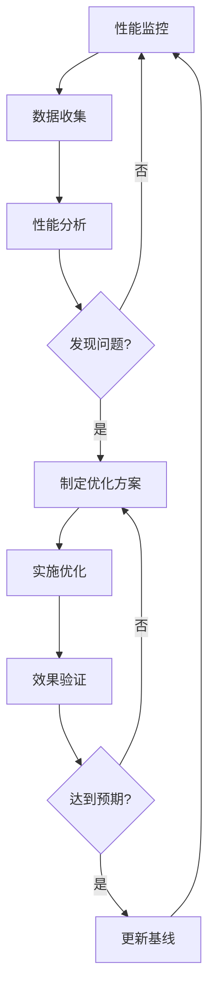
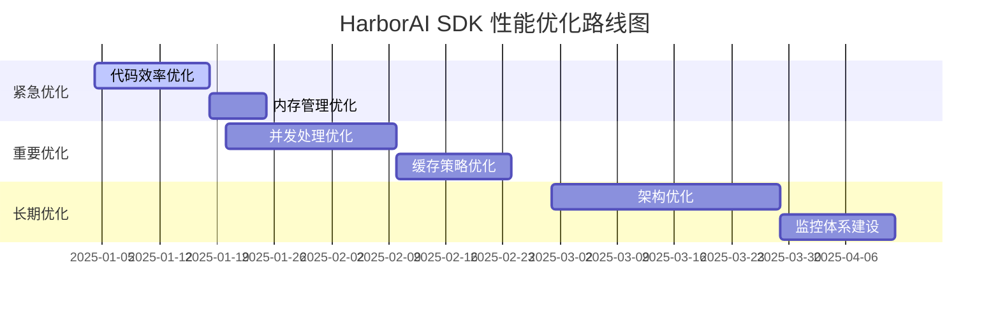

# HarborAI SDK 性能测试执行报告

> **报告生成时间**: {REPORT_DATE}  
> **测试版本**: {SDK_VERSION}  
> **测试环境**: {TEST_ENVIRONMENT}  
> **测试负责人**: {TEST_LEAD}

## 执行摘要

### 测试概述
本次性能测试针对HarborAI SDK进行了全面的性能评估，包括API响应时间、并发处理能力、资源使用效率和系统稳定性等关键指标。测试基于PRD和TD文档中定义的性能要求，并与OpenAI SDK进行了对比分析。

### 关键发现
- **整体性能表现**: {OVERALL_PERFORMANCE_RATING}
- **主要优势**: {KEY_STRENGTHS}
- **关键问题**: {KEY_ISSUES}
- **优化建议**: {OPTIMIZATION_RECOMMENDATIONS}

### 测试结论
{TEST_CONCLUSION}

---

## 1. 测试环境与配置

### 1.1 硬件环境
| 配置项 | 规格 | 备注 |
|--------|------|------|
| CPU | {CPU_SPEC} | {CPU_NOTES} |
| 内存 | {MEMORY_SPEC} | {MEMORY_NOTES} |
| 存储 | {STORAGE_SPEC} | {STORAGE_NOTES} |
| 网络 | {NETWORK_SPEC} | {NETWORK_NOTES} |

### 1.2 软件环境
| 组件 | 版本 | 配置 |
|------|------|------|
| 操作系统 | {OS_VERSION} | {OS_CONFIG} |
| Python | {PYTHON_VERSION} | {PYTHON_CONFIG} |
| HarborAI SDK | {HARBORAI_VERSION} | {HARBORAI_CONFIG} |
| OpenAI SDK | {OPENAI_VERSION} | {OPENAI_CONFIG} |

### 1.3 测试配置
```yaml
测试参数:
  测试持续时间: {TEST_DURATION}
  并发用户数: {CONCURRENT_USERS}
  请求总数: {TOTAL_REQUESTS}
  预热时间: {WARMUP_TIME}
  
API配置:
  基础URL: {BASE_URL}
  测试模型: {TEST_MODELS}
  速率限制: {RATE_LIMITS}
```

---

## 2. 性能测试结果

### 2.1 API响应时间测试

#### 2.1.1 基础API调用性能
| 测试场景 | 平均响应时间 | P95响应时间 | P99响应时间 | 目标值 | 达标状态 |
|---------|-------------|-------------|-------------|--------|----------|
| 同步API调用 | {SYNC_AVG}ms | {SYNC_P95}ms | {SYNC_P99}ms | <500ms | {SYNC_STATUS} |
| 异步API调用 | {ASYNC_AVG}ms | {ASYNC_P95}ms | {ASYNC_P99}ms | <300ms | {ASYNC_STATUS} |
| 流式响应TTFB | {STREAM_TTFB}ms | {STREAM_P95}ms | {STREAM_P99}ms | <200ms | {STREAM_STATUS} |

#### 2.1.2 高级功能性能
| 功能 | 平均响应时间 | P95响应时间 | 目标值 | 达标状态 | 备注 |
|------|-------------|-------------|--------|----------|------|
| Agently结构化输出 | {AGENTLY_AVG}ms | {AGENTLY_P95}ms | <1000ms | {AGENTLY_STATUS} | {AGENTLY_NOTES} |
| Native结构化输出 | {NATIVE_AVG}ms | {NATIVE_P95}ms | <800ms | {NATIVE_STATUS} | {NATIVE_NOTES} |
| 推理模型调用 | {REASONING_AVG}ms | {REASONING_P95}ms | <3000ms | {REASONING_STATUS} | {REASONING_NOTES} |
| 插件切换 | {PLUGIN_AVG}ms | {PLUGIN_P95}ms | <5ms | {PLUGIN_STATUS} | {PLUGIN_NOTES} |

#### 2.1.3 响应时间分布图
```
{RESPONSE_TIME_CHART}
```

#### 2.1.4 与OpenAI SDK对比
| 对比项 | HarborAI SDK | OpenAI SDK | 性能比较 | 分析 |
|--------|-------------|-----------|----------|------|
| 基础调用开销 | {HARBORAI_OVERHEAD}ms | {OPENAI_OVERHEAD}ms | {OVERHEAD_COMPARISON} | {OVERHEAD_ANALYSIS} |
| 平均响应时间 | {HARBORAI_AVG}ms | {OPENAI_AVG}ms | {AVG_COMPARISON} | {AVG_ANALYSIS} |
| P95响应时间 | {HARBORAI_P95}ms | {OPENAI_P95}ms | {P95_COMPARISON} | {P95_ANALYSIS} |

### 2.2 并发性能测试

#### 2.2.1 并发能力测试结果
| 并发级别 | 成功率 | 平均响应时间 | 吞吐量(RPS) | 目标值 | 达标状态 |
|---------|--------|-------------|-------------|--------|----------|
| 低并发(1-10) | {LOW_SUCCESS}% | {LOW_AVG}ms | {LOW_RPS} | >99.9% | {LOW_STATUS} |
| 中并发(10-100) | {MID_SUCCESS}% | {MID_AVG}ms | {MID_RPS} | >99.5% | {MID_STATUS} |
| 高并发(100-1000) | {HIGH_SUCCESS}% | {HIGH_AVG}ms | {HIGH_RPS} | >99.0% | {HIGH_STATUS} |
| 极限并发(1000+) | {EXTREME_SUCCESS}% | {EXTREME_AVG}ms | {EXTREME_RPS} | >95.0% | {EXTREME_STATUS} |

#### 2.2.2 并发性能曲线
```
{CONCURRENCY_CHART}
```

#### 2.2.3 错误分析
| 错误类型 | 发生次数 | 错误率 | 主要原因 | 解决建议 |
|---------|---------|--------|----------|----------|
| 连接超时 | {TIMEOUT_COUNT} | {TIMEOUT_RATE}% | {TIMEOUT_CAUSE} | {TIMEOUT_SOLUTION} |
| 服务器错误 | {SERVER_ERROR_COUNT} | {SERVER_ERROR_RATE}% | {SERVER_ERROR_CAUSE} | {SERVER_ERROR_SOLUTION} |
| 速率限制 | {RATE_LIMIT_COUNT} | {RATE_LIMIT_RATE}% | {RATE_LIMIT_CAUSE} | {RATE_LIMIT_SOLUTION} |

### 2.3 资源使用测试

#### 2.3.1 内存使用分析
| 测试场景 | 基础内存 | 峰值内存 | 平均内存 | 内存增长率 | 目标值 | 达标状态 |
|---------|---------|---------|---------|-----------|--------|----------|
| 空闲状态 | {IDLE_MEMORY}MB | - | {IDLE_AVG_MEMORY}MB | - | <50MB | {IDLE_MEMORY_STATUS} |
| 低负载 | {LOW_BASE_MEMORY}MB | {LOW_PEAK_MEMORY}MB | {LOW_AVG_MEMORY}MB | {LOW_GROWTH}%/h | <200MB | {LOW_MEMORY_STATUS} |
| 高负载 | {HIGH_BASE_MEMORY}MB | {HIGH_PEAK_MEMORY}MB | {HIGH_AVG_MEMORY}MB | {HIGH_GROWTH}%/h | <500MB | {HIGH_MEMORY_STATUS} |
| 长期运行 | {LONG_BASE_MEMORY}MB | {LONG_PEAK_MEMORY}MB | {LONG_AVG_MEMORY}MB | {LONG_GROWTH}%/h | <5%/h | {LONG_MEMORY_STATUS} |

#### 2.3.2 CPU使用分析
| 测试场景 | 平均CPU使用率 | 峰值CPU使用率 | 目标值 | 达标状态 | 备注 |
|---------|-------------|-------------|--------|----------|------|
| 空闲状态 | {IDLE_CPU}% | {IDLE_CPU_PEAK}% | <5% | {IDLE_CPU_STATUS} | {IDLE_CPU_NOTES} |
| 正常负载 | {NORMAL_CPU}% | {NORMAL_CPU_PEAK}% | <30% | {NORMAL_CPU_STATUS} | {NORMAL_CPU_NOTES} |
| 高负载 | {HIGH_CPU}% | {HIGH_CPU_PEAK}% | <70% | {HIGH_CPU_STATUS} | {HIGH_CPU_NOTES} |

#### 2.3.3 资源使用趋势图
```
{RESOURCE_USAGE_CHART}
```

#### 2.3.4 内存泄漏检测
```python
# 内存泄漏检测结果
memory_leak_analysis = {
    "检测方法": "tracemalloc + 长期运行测试",
    "测试时长": "{LEAK_TEST_DURATION}小时",
    "内存增长": "{MEMORY_GROWTH}MB",
    "增长率": "{GROWTH_RATE}%/小时",
    "泄漏评估": "{LEAK_ASSESSMENT}",
    "主要泄漏点": [
        {LEAK_HOTSPOTS}
    ]
}
```

### 2.4 稳定性测试

#### 2.4.1 长期稳定性测试
| 测试项 | 测试时长 | 成功率 | 平均响应时间 | 错误次数 | 目标值 | 达标状态 |
|--------|---------|--------|-------------|----------|--------|----------|
| 24小时稳定性 | {STABILITY_DURATION}h | {STABILITY_SUCCESS}% | {STABILITY_AVG}ms | {STABILITY_ERRORS} | >99% | {STABILITY_STATUS} |
| 内存稳定性 | {MEMORY_STABILITY_DURATION}h | - | - | {MEMORY_LEAKS} | 0泄漏 | {MEMORY_STABILITY_STATUS} |
| 连接稳定性 | {CONNECTION_STABILITY_DURATION}h | {CONNECTION_SUCCESS}% | - | {CONNECTION_ERRORS} | >99.5% | {CONNECTION_STABILITY_STATUS} |

#### 2.4.2 异常恢复测试
| 异常场景 | 恢复时间 | 恢复成功率 | 目标值 | 达标状态 | 备注 |
|---------|---------|-----------|--------|----------|------|
| 网络中断 | {NETWORK_RECOVERY}s | {NETWORK_RECOVERY_RATE}% | <5s | {NETWORK_RECOVERY_STATUS} | {NETWORK_RECOVERY_NOTES} |
| API错误 | {API_ERROR_RECOVERY}s | {API_ERROR_RECOVERY_RATE}% | <1s | {API_ERROR_RECOVERY_STATUS} | {API_ERROR_RECOVERY_NOTES} |
| 超时重试 | {TIMEOUT_RECOVERY}s | {TIMEOUT_RECOVERY_RATE}% | <3s | {TIMEOUT_RECOVERY_STATUS} | {TIMEOUT_RECOVERY_NOTES} |

---

## 3. 性能瓶颈分析

### 3.1 识别的性能瓶颈

#### 3.1.1 响应时间瓶颈
**瓶颈描述**: {RESPONSE_TIME_BOTTLENECK_DESC}

**根因分析**:
- {RESPONSE_TIME_ROOT_CAUSE_1}
- {RESPONSE_TIME_ROOT_CAUSE_2}
- {RESPONSE_TIME_ROOT_CAUSE_3}

**影响评估**:
- 性能影响: {RESPONSE_TIME_IMPACT}
- 用户体验影响: {RESPONSE_TIME_UX_IMPACT}
- 业务影响: {RESPONSE_TIME_BUSINESS_IMPACT}

#### 3.1.2 并发处理瓶颈
**瓶颈描述**: {CONCURRENCY_BOTTLENECK_DESC}

**根因分析**:
- {CONCURRENCY_ROOT_CAUSE_1}
- {CONCURRENCY_ROOT_CAUSE_2}
- {CONCURRENCY_ROOT_CAUSE_3}

**影响评估**:
- 并发能力限制: {CONCURRENCY_LIMITATION}
- 扩展性影响: {CONCURRENCY_SCALABILITY_IMPACT}

#### 3.1.3 资源使用瓶颈
**瓶颈描述**: {RESOURCE_BOTTLENECK_DESC}

**根因分析**:
- {RESOURCE_ROOT_CAUSE_1}
- {RESOURCE_ROOT_CAUSE_2}
- {RESOURCE_ROOT_CAUSE_3}

**影响评估**:
- 资源效率: {RESOURCE_EFFICIENCY}
- 成本影响: {RESOURCE_COST_IMPACT}

### 3.2 瓶颈优先级排序

| 瓶颈 | 严重程度 | 影响范围 | 修复难度 | 优先级 | 建议处理时间 |
|------|---------|---------|---------|--------|-------------|
| {BOTTLENECK_1} | {SEVERITY_1} | {IMPACT_1} | {DIFFICULTY_1} | {PRIORITY_1} | {TIMELINE_1} |
| {BOTTLENECK_2} | {SEVERITY_2} | {IMPACT_2} | {DIFFICULTY_2} | {PRIORITY_2} | {TIMELINE_2} |
| {BOTTLENECK_3} | {SEVERITY_3} | {IMPACT_3} | {DIFFICULTY_3} | {PRIORITY_3} | {TIMELINE_3} |

---

## 4. 优化建议

### 4.1 紧急优化建议（高优先级）

#### 4.1.1 代码执行效率优化
**问题**: {CODE_EFFICIENCY_PROBLEM}

**优化方案**:
```python
# 当前实现（存在性能问题）
{CURRENT_CODE_EXAMPLE}

# 优化后实现
{OPTIMIZED_CODE_EXAMPLE}
```

**预期效果**:
- 响应时间改善: {CODE_OPTIMIZATION_RT_IMPROVEMENT}
- CPU使用率降低: {CODE_OPTIMIZATION_CPU_IMPROVEMENT}
- 实施难度: {CODE_OPTIMIZATION_DIFFICULTY}

#### 4.1.2 内存管理优化
**问题**: {MEMORY_PROBLEM}

**优化方案**:
1. **对象生命周期管理**
   ```python
   # 实现自动资源清理
   class ResourceManager:
       def __enter__(self):
           self.resources = []
           return self
       
       def __exit__(self, exc_type, exc_val, exc_tb):
           for resource in self.resources:
               resource.cleanup()
   ```

2. **内存池化**
   ```python
   # 实现对象池减少内存分配
   class ObjectPool:
       def __init__(self, factory, max_size=100):
           self.factory = factory
           self.pool = []
           self.max_size = max_size
   ```

**预期效果**:
- 内存使用减少: {MEMORY_OPTIMIZATION_IMPROVEMENT}
- 垃圾回收压力降低: {GC_PRESSURE_IMPROVEMENT}

#### 4.1.3 网络通信优化
**问题**: {NETWORK_PROBLEM}

**优化方案**:
1. **连接池优化**
   ```python
   # 优化连接池配置
   connector = aiohttp.TCPConnector(
       limit=200,                    # 增加连接池大小
       limit_per_host=50,           # 增加单主机连接数
       ttl_dns_cache=600,           # 延长DNS缓存时间
       use_dns_cache=True,
       keepalive_timeout=60,        # 延长保持连接时间
       enable_cleanup_closed=True
   )
   ```

2. **请求批处理**
   ```python
   # 实现请求批处理减少网络开销
   async def batch_requests(requests, batch_size=10):
       for i in range(0, len(requests), batch_size):
           batch = requests[i:i+batch_size]
           await asyncio.gather(*batch)
   ```

**预期效果**:
- 网络延迟减少: {NETWORK_OPTIMIZATION_LATENCY_IMPROVEMENT}
- 吞吐量提升: {NETWORK_OPTIMIZATION_THROUGHPUT_IMPROVEMENT}

### 4.2 重要优化建议（中优先级）

#### 4.2.1 并发处理优化
**优化目标**: 提升并发处理能力和稳定性

**具体措施**:
1. **异步编程模式优化**
   - 使用asyncio.Semaphore控制并发数量
   - 实现智能负载均衡
   - 优化异步上下文管理

2. **错误处理和重试机制**
   - 实现指数退避重试算法
   - 添加熔断器模式
   - 优化错误分类和处理

**实施计划**:
- 第1周: 异步模式重构
- 第2周: 错误处理优化
- 第3周: 测试和验证

#### 4.2.2 缓存策略优化
**优化目标**: 减少重复计算和网络请求

**具体措施**:
1. **多级缓存架构**
   - 内存缓存: 热点数据
   - 本地缓存: 配置和元数据
   - 分布式缓存: 共享数据

2. **智能缓存策略**
   - LRU缓存淘汰算法
   - 基于访问频率的缓存预热
   - 缓存一致性保证

### 4.3 长期优化建议（低优先级）

#### 4.3.1 架构优化
**优化目标**: 提升系统整体架构的可扩展性和维护性

**具体措施**:
1. **插件架构优化**
   - 实现插件热加载
   - 优化插件间通信
   - 添加插件性能监控

2. **监控和可观测性**
   - 集成APM工具
   - 实现分布式链路追踪
   - 添加自定义性能指标

#### 4.3.2 性能测试自动化
**优化目标**: 建立持续性能监控和回归检测

**具体措施**:
1. **CI/CD集成**
   - 自动化性能测试
   - 性能回归检测
   - 性能报告自动生成

2. **性能基线管理**
   - 动态基线调整
   - 性能趋势分析
   - 预警机制

---

## 5. 优化效果预估

### 5.1 性能改善预期

#### 5.1.1 响应时间改善
| 优化项 | 当前值 | 目标值 | 改善幅度 | 实施难度 | 预期完成时间 |
|--------|--------|--------|----------|----------|-------------|
| 基础API调用 | {CURRENT_API_RT}ms | {TARGET_API_RT}ms | {API_RT_IMPROVEMENT}% | {API_RT_DIFFICULTY} | {API_RT_TIMELINE} |
| 并发处理 | {CURRENT_CONCURRENCY_RT}ms | {TARGET_CONCURRENCY_RT}ms | {CONCURRENCY_RT_IMPROVEMENT}% | {CONCURRENCY_RT_DIFFICULTY} | {CONCURRENCY_RT_TIMELINE} |
| 结构化输出 | {CURRENT_STRUCTURED_RT}ms | {TARGET_STRUCTURED_RT}ms | {STRUCTURED_RT_IMPROVEMENT}% | {STRUCTURED_RT_DIFFICULTY} | {STRUCTURED_RT_TIMELINE} |

#### 5.1.2 资源使用改善
| 资源类型 | 当前使用量 | 目标使用量 | 改善幅度 | 成本节约 |
|---------|-----------|-----------|----------|----------|
| 内存使用 | {CURRENT_MEMORY}MB | {TARGET_MEMORY}MB | {MEMORY_IMPROVEMENT}% | {MEMORY_COST_SAVING} |
| CPU使用 | {CURRENT_CPU}% | {TARGET_CPU}% | {CPU_IMPROVEMENT}% | {CPU_COST_SAVING} |
| 网络带宽 | {CURRENT_BANDWIDTH}Mbps | {TARGET_BANDWIDTH}Mbps | {BANDWIDTH_IMPROVEMENT}% | {BANDWIDTH_COST_SAVING} |

### 5.2 ROI分析

#### 5.2.1 开发成本估算
| 优化项 | 开发工时 | 人力成本 | 测试成本 | 总成本 |
|--------|---------|---------|---------|--------|
| 代码优化 | {CODE_OPT_HOURS}h | {CODE_OPT_LABOR_COST} | {CODE_OPT_TEST_COST} | {CODE_OPT_TOTAL_COST} |
| 架构优化 | {ARCH_OPT_HOURS}h | {ARCH_OPT_LABOR_COST} | {ARCH_OPT_TEST_COST} | {ARCH_OPT_TOTAL_COST} |
| 监控优化 | {MONITOR_OPT_HOURS}h | {MONITOR_OPT_LABOR_COST} | {MONITOR_OPT_TEST_COST} | {MONITOR_OPT_TOTAL_COST} |
| **总计** | {TOTAL_OPT_HOURS}h | {TOTAL_LABOR_COST} | {TOTAL_TEST_COST} | {TOTAL_OPT_COST} |

#### 5.2.2 收益估算
| 收益类型 | 年度收益 | 计算依据 |
|---------|---------|----------|
| 性能提升带来的用户增长 | {PERFORMANCE_USER_GROWTH_REVENUE} | {PERFORMANCE_REVENUE_CALCULATION} |
| 资源成本节约 | {RESOURCE_COST_SAVING} | {RESOURCE_SAVING_CALCULATION} |
| 运维成本降低 | {OPERATION_COST_SAVING} | {OPERATION_SAVING_CALCULATION} |
| **总收益** | {TOTAL_ANNUAL_REVENUE} | - |

#### 5.2.3 ROI计算
```
ROI = (总收益 - 总成本) / 总成本 × 100%
    = ({TOTAL_ANNUAL_REVENUE} - {TOTAL_OPT_COST}) / {TOTAL_OPT_COST} × 100%
    = {CALCULATED_ROI}%

投资回收期 = 总成本 / 月度收益
          = {TOTAL_OPT_COST} / ({TOTAL_ANNUAL_REVENUE} / 12)
          = {PAYBACK_PERIOD}个月
```

---

## 6. 风险评估与缓解策略

### 6.1 技术风险

#### 6.1.1 性能回归风险
**风险描述**: 优化过程中可能引入新的性能问题

**风险等级**: 中等

**缓解策略**:
- 建立完善的性能基线
- 实施渐进式优化
- 每次优化后进行全面性能测试
- 保留回滚方案

#### 6.1.2 兼容性风险
**风险描述**: 优化可能影响与OpenAI SDK的兼容性

**风险等级**: 高

**缓解策略**:
- 优化前进行兼容性测试
- 保持API接口不变
- 实施A/B测试验证
- 建立兼容性测试套件

### 6.2 业务风险

#### 6.2.1 用户体验风险
**风险描述**: 优化过程中可能影响用户正常使用

**风险等级**: 中等

**缓解策略**:
- 采用蓝绿部署策略
- 实施灰度发布
- 建立实时监控和告警
- 准备快速回滚机制

#### 6.2.2 项目延期风险
**风险描述**: 优化工作可能影响其他功能开发进度

**风险等级**: 低

**缓解策略**:
- 合理安排优化优先级
- 分阶段实施优化计划
- 预留缓冲时间
- 建立项目里程碑检查点

---

## 7. 监控与持续改进计划

### 7.1 性能监控体系

#### 7.1.1 实时监控指标
```yaml
监控指标体系:
  核心性能指标:
    - 平均响应时间
    - P95/P99响应时间
    - 请求成功率
    - 吞吐量(RPS)
  
  资源使用指标:
    - CPU使用率
    - 内存使用量
    - 网络I/O
    - 磁盘I/O
  
  业务指标:
    - API调用分布
    - 错误类型分布
    - 用户满意度
```

#### 7.1.2 告警策略
| 指标 | 警告阈值 | 严重阈值 | 告警方式 | 处理SLA |
|------|---------|---------|----------|---------|
| 平均响应时间 | >800ms | >1200ms | 邮件+短信 | 15分钟 |
| 错误率 | >2% | >5% | 邮件+短信+电话 | 5分钟 |
| CPU使用率 | >70% | >90% | 邮件 | 30分钟 |
| 内存使用率 | >80% | >95% | 邮件+短信 | 15分钟 |

### 7.2 持续改进流程

#### 7.2.1 定期性能评估
- **周度评估**: 关键性能指标趋势分析
- **月度评估**: 性能基线更新和优化效果评估
- **季度评估**: 全面性能审查和优化规划

#### 7.2.2 性能优化迭代


---

## 8. 结论与建议

### 8.1 总体评估

#### 8.1.1 性能表现总结
HarborAI SDK在本次性能测试中表现{OVERALL_PERFORMANCE_SUMMARY}。主要优势包括{KEY_ADVANTAGES}，但在{KEY_WEAKNESSES}方面仍有改进空间。

#### 8.1.2 与设计目标对比
| 设计目标 | 实际表现 | 达成度 | 评价 |
|---------|---------|--------|------|
| API调用开销 < 1ms | {ACTUAL_OVERHEAD}ms | {OVERHEAD_ACHIEVEMENT}% | {OVERHEAD_EVALUATION} |
| 高并发成功率 > 99.9% | {ACTUAL_CONCURRENCY_SUCCESS}% | {CONCURRENCY_ACHIEVEMENT}% | {CONCURRENCY_EVALUATION} |
| 异步日志延迟 < 10ms | {ACTUAL_LOG_DELAY}ms | {LOG_ACHIEVEMENT}% | {LOG_EVALUATION} |
| 内存使用稳定 | {ACTUAL_MEMORY_STABILITY} | {MEMORY_ACHIEVEMENT}% | {MEMORY_EVALUATION} |

### 8.2 关键建议

#### 8.2.1 立即行动项
1. **{IMMEDIATE_ACTION_1}** - 预期在{IMMEDIATE_TIMELINE_1}内完成
2. **{IMMEDIATE_ACTION_2}** - 预期在{IMMEDIATE_TIMELINE_2}内完成
3. **{IMMEDIATE_ACTION_3}** - 预期在{IMMEDIATE_TIMELINE_3}内完成

#### 8.2.2 中期规划
1. **{MEDIUM_TERM_PLAN_1}** - 预期在{MEDIUM_TIMELINE_1}内完成
2. **{MEDIUM_TERM_PLAN_2}** - 预期在{MEDIUM_TIMELINE_2}内完成

#### 8.2.3 长期愿景
1. **{LONG_TERM_VISION_1}** - 预期在{LONG_TIMELINE_1}内实现
2. **{LONG_TERM_VISION_2}** - 预期在{LONG_TIMELINE_2}内实现

### 8.3 下一步行动计划

#### 8.3.1 优化实施路线图


#### 8.3.2 资源分配建议
- **开发团队**: 2-3名高级工程师专职负责性能优化
- **测试团队**: 1名性能测试专家负责验证和监控
- **预算分配**: 总预算{TOTAL_BUDGET}，其中开发成本{DEV_BUDGET}，测试成本{TEST_BUDGET}

---

## 附录

### 附录A: 详细测试数据
{DETAILED_TEST_DATA}

### 附录B: 性能分析图表
{PERFORMANCE_CHARTS}

### 附录C: 代码分析报告
{CODE_ANALYSIS_REPORT}

### 附录D: 环境配置详情
{ENVIRONMENT_CONFIG_DETAILS}

---

**报告编制**: {REPORT_AUTHOR}  
**技术审核**: {TECHNICAL_REVIEWER}  
**业务审核**: {BUSINESS_REVIEWER}  
**最终批准**: {FINAL_APPROVER}

**版本历史**:
- v1.0 ({REPORT_DATE}): 初始版本
- v1.1 ({UPDATE_DATE_1}): {UPDATE_DESCRIPTION_1}
- v1.2 ({UPDATE_DATE_2}): {UPDATE_DESCRIPTION_2}