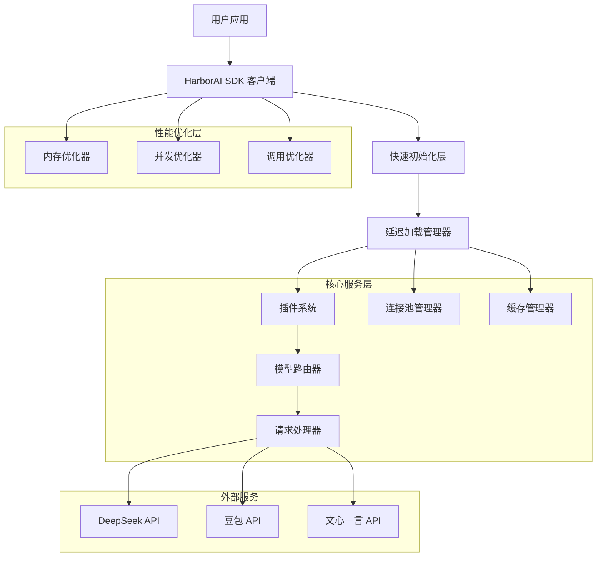
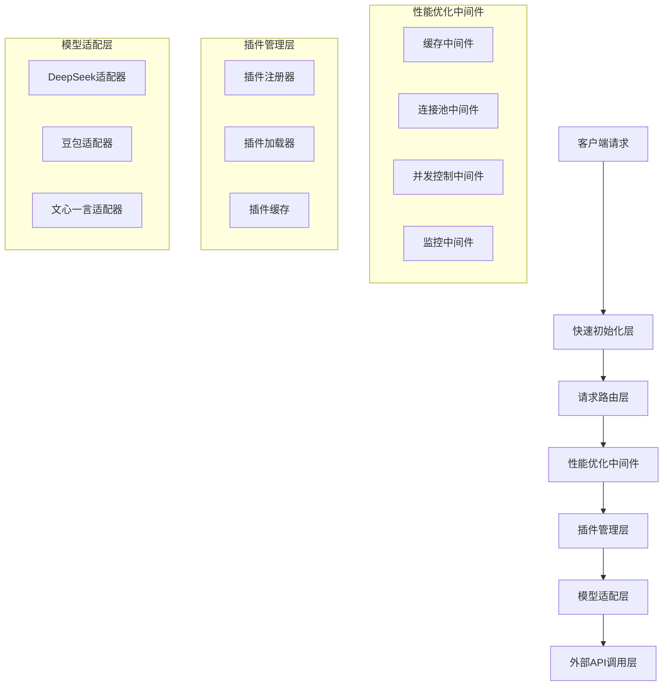
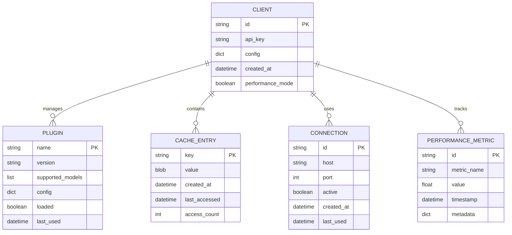

# HarborAI SDK优化架构设计文档
================================================================================

## 1. 架构设计



## 2. 技术描述

- **前端**: Python SDK + 异步支持
- **核心**: 延迟加载 + 内存优化 + 并发优化
- **缓存**: LRU缓存 + 对象池 + 智能清理
- **连接**: 异步连接池 + 连接复用
- **监控**: 性能监控 + 指标收集

## 3. 路由定义

| 组件路径 | 用途 |
|----------|------|
| /client | 主客户端入口，快速初始化 |
| /client/chat | 聊天接口，支持流式和非流式 |
| /client/models | 模型管理，延迟加载可用模型 |
| /client/plugins | 插件管理，按需加载插件 |
| /performance | 性能监控，实时指标收集 |

## 4. API定义

### 4.1 核心API

**客户端初始化**
```python
# 快速初始化模式
client = HarborAI(
    api_key="your-api-key",
    performance_mode="optimized"  # 启用性能优化
)
```

**聊天完成接口**
```python
# 同步调用 - DeepSeek模型
response = client.chat.completions.create(
    model="deepseek-chat",
    messages=[{"role": "user", "content": "Hello"}],
    stream=False
)

# 异步调用 - 豆包模型
response = await client.chat.completions.acreate(
    model="doubao-1-5-pro-32k-character-250715", 
    messages=[{"role": "user", "content": "Hello"}],
    stream=False
)
```

**性能监控接口**
```python
# 获取性能指标
metrics = client.performance.get_metrics()

# 性能配置
client.performance.configure(
    enable_caching=True,
    cache_size=1000,
    connection_pool_size=50
)
```

### 4.2 优化配置API

**延迟加载配置**
```python
# 配置延迟加载
client.configure_lazy_loading(
    enable_plugin_lazy_load=True,
    plugin_cache_size=100,
    model_cache_ttl=3600
)
```

**内存优化配置**
```python
# 内存优化设置
client.configure_memory_optimization(
    enable_object_pool=True,
    max_cache_size=1000,
    gc_threshold=0.8
)
```

**并发优化配置**
```python
# 并发设置
client.configure_concurrency(
    max_connections=100,
    max_connections_per_host=30,
    connection_timeout=30
)
```

## 5. 服务器架构图



## 6. 数据模型

### 6.1 数据模型定义



### 6.2 数据定义语言

**性能指标表 (performance_metrics)**
```sql
-- 创建性能指标表
CREATE TABLE performance_metrics (
    id UUID PRIMARY KEY DEFAULT gen_random_uuid(),
    client_id VARCHAR(255) NOT NULL,
    metric_name VARCHAR(100) NOT NULL,
    metric_value FLOAT NOT NULL,
    timestamp TIMESTAMP WITH TIME ZONE DEFAULT NOW(),
    metadata JSONB,
    created_at TIMESTAMP WITH TIME ZONE DEFAULT NOW()
);

-- 创建索引
CREATE INDEX idx_performance_metrics_client_id ON performance_metrics(client_id);
CREATE INDEX idx_performance_metrics_name ON performance_metrics(metric_name);
CREATE INDEX idx_performance_metrics_timestamp ON performance_metrics(timestamp DESC);

-- 初始化数据
INSERT INTO performance_metrics (client_id, metric_name, metric_value, metadata) VALUES
('default', 'initialization_time_ms', 0.0, '{"baseline": true}'),
('default', 'memory_usage_mb', 0.0, '{"baseline": true}'),
('default', 'concurrent_throughput_ops', 0.0, '{"baseline": true}'),
('default', 'method_call_overhead_us', 0.0, '{"baseline": true}');
```

**插件缓存表 (plugin_cache)**
```sql
-- 创建插件缓存表
CREATE TABLE plugin_cache (
    plugin_name VARCHAR(255) PRIMARY KEY,
    plugin_data JSONB NOT NULL,
    version VARCHAR(50) NOT NULL,
    loaded BOOLEAN DEFAULT FALSE,
    last_used TIMESTAMP WITH TIME ZONE DEFAULT NOW(),
    access_count INTEGER DEFAULT 0,
    created_at TIMESTAMP WITH TIME ZONE DEFAULT NOW()
);

-- 创建索引
CREATE INDEX idx_plugin_cache_last_used ON plugin_cache(last_used DESC);
CREATE INDEX idx_plugin_cache_loaded ON plugin_cache(loaded);

-- 初始化插件数据
INSERT INTO plugin_cache (plugin_name, plugin_data, version) VALUES
('deepseek', '{"supported_models": ["deepseek-chat", "deepseek-reasoner"], "config": {}}', '1.0.0'),
('doubao', '{"supported_models": ["doubao-1-5-pro-32k-character-250715", "doubao-seed-1-6-250615"], "config": {}}', '1.0.0'),
('wenxin', '{"supported_models": ["ernie-3.5-8k", "ernie-4.0-turbo-8k", "ernie-x1-turbo-32k"], "config": {}}', '1.0.0');
```

**连接池状态表 (connection_pool)**
```sql
-- 创建连接池状态表
CREATE TABLE connection_pool (
    id UUID PRIMARY KEY DEFAULT gen_random_uuid(),
    host VARCHAR(255) NOT NULL,
    port INTEGER NOT NULL,
    active_connections INTEGER DEFAULT 0,
    max_connections INTEGER DEFAULT 100,
    created_at TIMESTAMP WITH TIME ZONE DEFAULT NOW(),
    last_updated TIMESTAMP WITH TIME ZONE DEFAULT NOW()
);

-- 创建索引
CREATE INDEX idx_connection_pool_host ON connection_pool(host);

-- 初始化连接池数据
INSERT INTO connection_pool (host, port, max_connections) VALUES
('api.deepseek.com', 443, 50),
('ark.cn-beijing.volces.com', 443, 30),
('aip.baidubce.com', 443, 40);
```

**缓存统计表 (cache_statistics)**
```sql
-- 创建缓存统计表
CREATE TABLE cache_statistics (
    id UUID PRIMARY KEY DEFAULT gen_random_uuid(),
    cache_type VARCHAR(100) NOT NULL,
    total_entries INTEGER DEFAULT 0,
    hit_count INTEGER DEFAULT 0,
    miss_count INTEGER DEFAULT 0,
    eviction_count INTEGER DEFAULT 0,
    memory_usage_mb FLOAT DEFAULT 0.0,
    last_updated TIMESTAMP WITH TIME ZONE DEFAULT NOW()
);

-- 创建索引
CREATE INDEX idx_cache_statistics_type ON cache_statistics(cache_type);

-- 初始化缓存统计
INSERT INTO cache_statistics (cache_type) VALUES
('plugin_cache'),
('model_cache'),
('response_cache'),
('connection_cache');
```