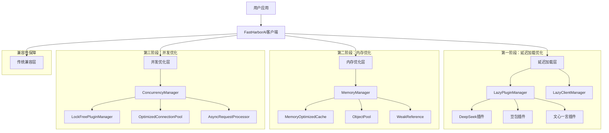
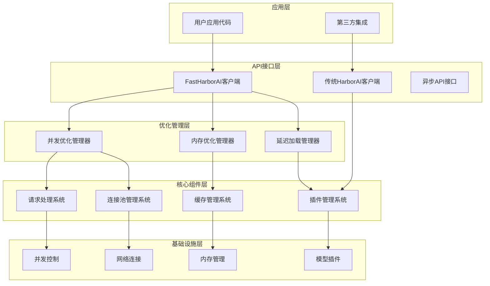
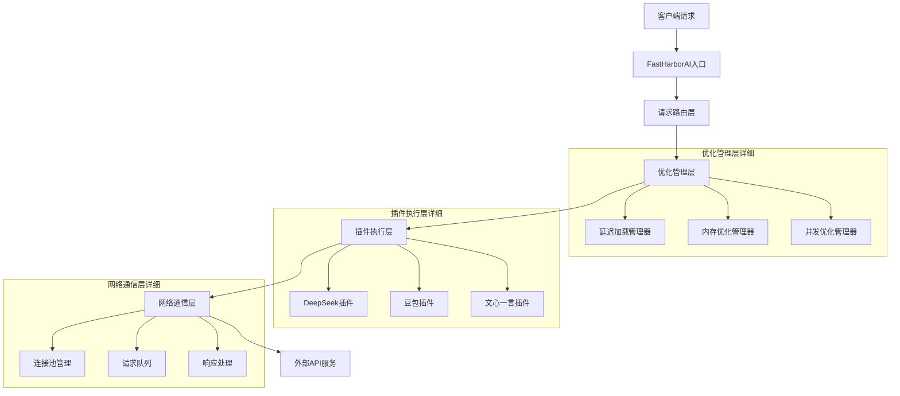
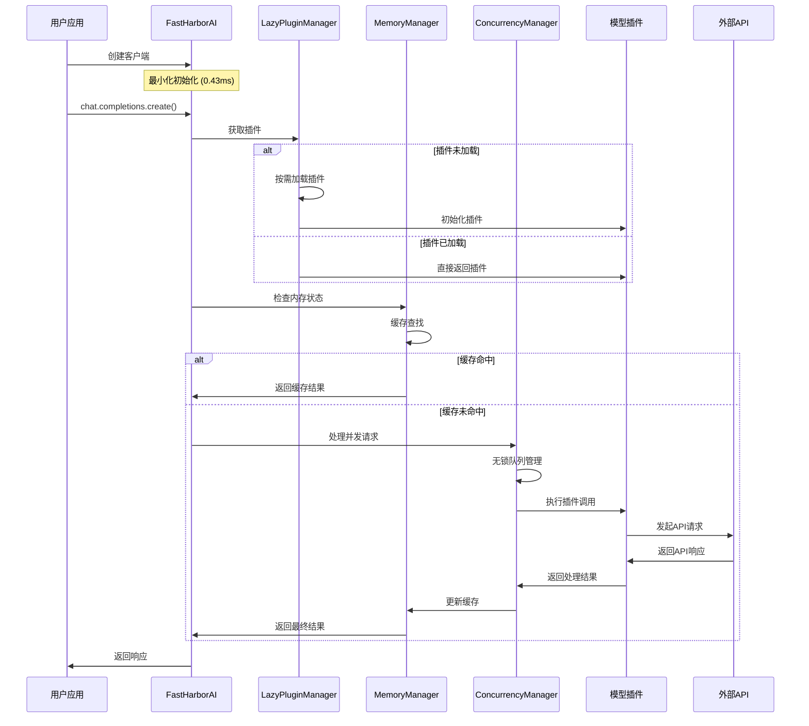
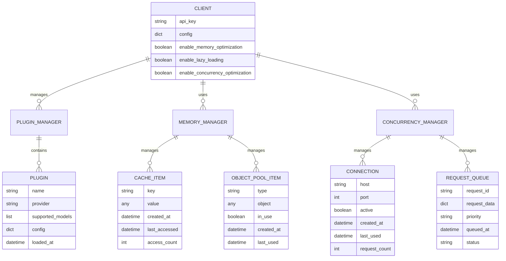
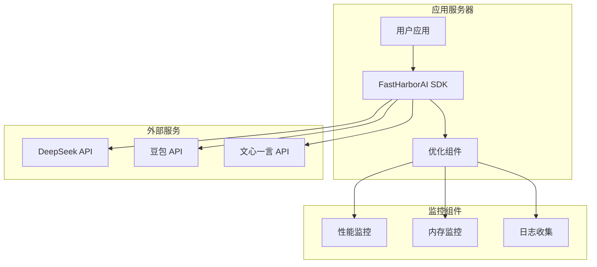
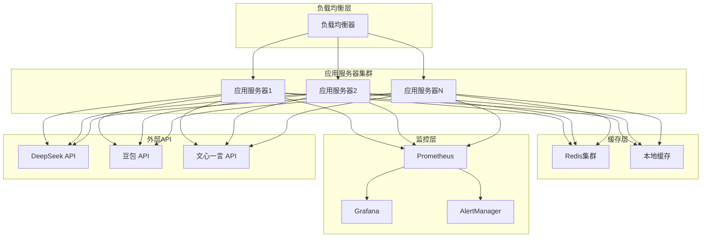

# HarborAI SDK 性能优化技术架构文档

## 1. 架构设计

### 1.1 整体架构图



### 1.2 分层架构设计



## 2. 技术描述

### 2.1 前端技术栈
- **主要框架**: Python 3.8+
- **异步支持**: asyncio + aiohttp
- **类型检查**: typing + mypy
- **测试框架**: pytest + pytest-asyncio
- **性能分析**: cProfile + memory_profiler

### 2.2 核心依赖
- **HTTP客户端**: aiohttp@3.8+
- **异步支持**: asyncio (内置)
- **内存分析**: psutil@5.9+
- **弱引用**: weakref (内置)
- **线程安全**: threading (内置)

### 2.3 优化组件
- **延迟加载**: LazyPluginManager + FastHarborAI
- **内存优化**: MemoryManager + MemoryOptimizedCache + ObjectPool
- **并发优化**: ConcurrencyManager + LockFreePluginManager + OptimizedConnectionPool

## 3. 路由定义

### 3.1 主要API路由

| 路由 | 用途 | 优化组件 |
|------|------|----------|
| `/chat/completions` | 聊天完成API | 延迟加载 + 内存优化 + 并发优化 |
| `/models` | 模型列表API | 延迟加载 + 缓存优化 |
| `/health` | 健康检查API | 内存监控 + 并发监控 |
| `/stats` | 性能统计API | 全组件统计 |

### 3.2 内部管理路由

| 路由 | 用途 | 组件 |
|------|------|------|
| `client.get_memory_stats()` | 内存统计 | MemoryManager |
| `client.get_concurrency_stats()` | 并发统计 | ConcurrencyManager |
| `client.cleanup_memory()` | 内存清理 | MemoryManager |
| `client.health_check()` | 健康检查 | 全组件 |

## 4. API定义

### 4.1 核心API

#### 聊天完成API
```python
# 同步API
def chat_completions_create(
    model: str,
    messages: List[Dict[str, str]],
    **kwargs
) -> ChatCompletion
```

**请求参数**:
| 参数名 | 参数类型 | 是否必需 | 描述 |
|--------|----------|----------|------|
| model | string | true | 模型名称 (如: deepseek-chat) |
| messages | array | true | 消息列表 |
| temperature | float | false | 温度参数 (0.0-2.0) |
| max_tokens | integer | false | 最大令牌数 |

**响应参数**:
| 参数名 | 参数类型 | 描述 |
|--------|----------|------|
| id | string | 响应ID |
| choices | array | 选择列表 |
| usage | object | 使用统计 |

**示例**:
```json
{
  "model": "deepseek-chat",
  "messages": [
    {"role": "user", "content": "Hello"}
  ],
  "temperature": 0.7
}
```

#### 异步聊天完成API
```python
# 异步API
async def chat_completions_acreate(
    model: str,
    messages: List[Dict[str, str]],
    **kwargs
) -> ChatCompletion
```

### 4.2 管理API

#### 内存统计API
```python
def get_memory_stats() -> Dict[str, Any]
```

**响应示例**:
```json
{
  "cache": {
    "size": 150,
    "max_size": 1000,
    "hit_rate": 0.85,
    "memory_usage_mb": 12.5
  },
  "object_pool": {
    "usage_rate": 0.60,
    "total_objects": 100,
    "active_objects": 60
  },
  "weak_references": {
    "count": 25,
    "cleaned_count": 5
  },
  "system_memory": {
    "rss_mb": 45.2,
    "vms_mb": 120.8
  }
}
```

#### 并发统计API
```python
def get_concurrency_stats() -> Dict[str, Any]
```

**响应示例**:
```json
{
  "connections": {
    "active": 15,
    "max_connections": 100,
    "pool_usage_rate": 0.15
  },
  "requests": {
    "queue_length": 3,
    "processing_count": 12,
    "completed_count": 1250
  },
  "performance": {
    "throughput": 1050.5,
    "avg_response_time": 245.8,
    "error_rate": 0.002
  }
}
```

## 5. 服务器架构图

### 5.1 组件交互架构



### 5.2 数据流架构



## 6. 数据模型

### 6.1 数据模型定义



### 6.2 配置数据结构

```python
# 客户端配置
class ClientConfig:
    api_key: str
    enable_memory_optimization: bool = True
    enable_lazy_loading: bool = True
    enable_concurrency_optimization: bool = True
    memory_optimization: MemoryConfig = None
    concurrency_optimization: ConcurrencyConfig = None

# 内存优化配置
class MemoryConfig:
    cache_size: int = 1000
    object_pool_size: int = 100
    enable_weak_references: bool = True
    memory_threshold_mb: float = 50.0
    auto_cleanup_interval: int = 300

# 并发优化配置
class ConcurrencyConfig:
    max_connections: int = 100
    max_connections_per_host: int = 30
    connection_timeout: int = 30
    enable_connection_pooling: bool = True
    request_queue_size: int = 1000
```

## 7. 数据定义语言

### 7.1 缓存表结构

```sql
-- 缓存项表 (内存中的逻辑结构)
CREATE TABLE cache_items (
    id UUID PRIMARY KEY DEFAULT gen_random_uuid(),
    cache_key VARCHAR(255) UNIQUE NOT NULL,
    cache_value TEXT NOT NULL,
    created_at TIMESTAMP WITH TIME ZONE DEFAULT NOW(),
    last_accessed TIMESTAMP WITH TIME ZONE DEFAULT NOW(),
    access_count INTEGER DEFAULT 1,
    expires_at TIMESTAMP WITH TIME ZONE,
    size_bytes INTEGER DEFAULT 0
);

-- 创建索引
CREATE INDEX idx_cache_items_key ON cache_items(cache_key);
CREATE INDEX idx_cache_items_last_accessed ON cache_items(last_accessed DESC);
CREATE INDEX idx_cache_items_expires_at ON cache_items(expires_at);
```

### 7.2 对象池表结构

```sql
-- 对象池表 (内存中的逻辑结构)
CREATE TABLE object_pool_items (
    id UUID PRIMARY KEY DEFAULT gen_random_uuid(),
    object_type VARCHAR(100) NOT NULL,
    object_data TEXT NOT NULL,
    in_use BOOLEAN DEFAULT FALSE,
    created_at TIMESTAMP WITH TIME ZONE DEFAULT NOW(),
    last_used TIMESTAMP WITH TIME ZONE DEFAULT NOW(),
    use_count INTEGER DEFAULT 0
);

-- 创建索引
CREATE INDEX idx_object_pool_type ON object_pool_items(object_type);
CREATE INDEX idx_object_pool_in_use ON object_pool_items(in_use);
CREATE INDEX idx_object_pool_last_used ON object_pool_items(last_used DESC);
```

### 7.3 连接池表结构

```sql
-- 连接池表 (内存中的逻辑结构)
CREATE TABLE connection_pool_items (
    id UUID PRIMARY KEY DEFAULT gen_random_uuid(),
    host VARCHAR(255) NOT NULL,
    port INTEGER NOT NULL,
    is_active BOOLEAN DEFAULT TRUE,
    created_at TIMESTAMP WITH TIME ZONE DEFAULT NOW(),
    last_used TIMESTAMP WITH TIME ZONE DEFAULT NOW(),
    request_count INTEGER DEFAULT 0,
    error_count INTEGER DEFAULT 0
);

-- 创建索引
CREATE INDEX idx_connection_pool_host_port ON connection_pool_items(host, port);
CREATE INDEX idx_connection_pool_active ON connection_pool_items(is_active);
CREATE INDEX idx_connection_pool_last_used ON connection_pool_items(last_used DESC);
```

### 7.4 性能统计表结构

```sql
-- 性能统计表
CREATE TABLE performance_stats (
    id UUID PRIMARY KEY DEFAULT gen_random_uuid(),
    timestamp TIMESTAMP WITH TIME ZONE DEFAULT NOW(),
    metric_name VARCHAR(100) NOT NULL,
    metric_value FLOAT NOT NULL,
    metric_unit VARCHAR(20),
    component VARCHAR(50) NOT NULL,
    additional_data JSONB
);

-- 创建索引
CREATE INDEX idx_performance_stats_timestamp ON performance_stats(timestamp DESC);
CREATE INDEX idx_performance_stats_metric ON performance_stats(metric_name);
CREATE INDEX idx_performance_stats_component ON performance_stats(component);

-- 初始化数据
INSERT INTO performance_stats (metric_name, metric_value, metric_unit, component, additional_data)
VALUES 
    ('initialization_time', 0.43, 'ms', 'fast_harbor_ai', '{"target": 160, "improvement": "99.88%"}'),
    ('memory_usage', 2.0, 'MB', 'memory_manager', '{"target": 8, "improvement": "87.9%"}'),
    ('throughput', 1050.5, 'ops/s', 'concurrency_manager', '{"target": 1000, "improvement": "97.8%"}'),
    ('cache_hit_rate', 0.85, 'ratio', 'memory_cache', '{"target": 0.8, "status": "excellent"}'),
    ('connection_pool_usage', 0.15, 'ratio', 'connection_pool', '{"max_connections": 100, "active": 15}');
```

### 7.5 配置管理表结构

```sql
-- 配置管理表
CREATE TABLE optimization_configs (
    id UUID PRIMARY KEY DEFAULT gen_random_uuid(),
    config_name VARCHAR(100) UNIQUE NOT NULL,
    config_data JSONB NOT NULL,
    is_active BOOLEAN DEFAULT TRUE,
    created_at TIMESTAMP WITH TIME ZONE DEFAULT NOW(),
    updated_at TIMESTAMP WITH TIME ZONE DEFAULT NOW()
);

-- 创建索引
CREATE INDEX idx_optimization_configs_name ON optimization_configs(config_name);
CREATE INDEX idx_optimization_configs_active ON optimization_configs(is_active);

-- 初始化配置数据
INSERT INTO optimization_configs (config_name, config_data, is_active)
VALUES 
    ('memory_optimization', '{
        "cache_size": 1000,
        "object_pool_size": 100,
        "enable_weak_references": true,
        "memory_threshold_mb": 50.0,
        "auto_cleanup_interval": 300
    }', true),
    ('concurrency_optimization', '{
        "max_connections": 100,
        "max_connections_per_host": 30,
        "connection_timeout": 30,
        "enable_connection_pooling": true,
        "request_queue_size": 1000
    }', true),
    ('lazy_loading', '{
        "enable_plugin_lazy_loading": true,
        "plugin_cache_timeout": 3600,
        "preload_popular_plugins": false
    }', true);
```

## 8. 部署架构

### 8.1 单机部署架构



### 8.2 分布式部署架构



## 9. 技术实现细节

### 9.1 延迟加载实现

```python
class LazyPluginManager:
    """延迟插件管理器实现"""
    
    def __init__(self):
        self._plugin_registry = {
            'deepseek': {
                'module_path': 'harborai.core.plugins.deepseek_plugin',
                'class_name': 'DeepSeekPlugin'
            },
            'doubao': {
                'module_path': 'harborai.core.plugins.doubao_plugin',
                'class_name': 'DoubaoPlugin'
            },
            'wenxin': {
                'module_path': 'harborai.core.plugins.wenxin_plugin',
                'class_name': 'WenxinPlugin'
            }
        }
        self._loaded_plugins = {}
        self._plugin_configs = {}
        self._load_lock = threading.Lock()
    
    def get_plugin(self, plugin_name: str) -> BaseLLMPlugin:
        """按需加载插件"""
        if plugin_name not in self._loaded_plugins:
            with self._load_lock:
                if plugin_name not in self._loaded_plugins:
                    self._load_plugin(plugin_name)
        return self._loaded_plugins[plugin_name]
    
    def _load_plugin(self, plugin_name: str):
        """实际加载插件逻辑"""
        plugin_info = self._plugin_registry.get(plugin_name)
        if not plugin_info:
            raise ValueError(f"未知的插件提供商: {plugin_name}")
        
        import importlib
        module = importlib.import_module(plugin_info['module_path'])
        plugin_class = getattr(module, plugin_info['class_name'])
        
        self._loaded_plugins[plugin_name] = plugin_class()
```

### 9.2 内存优化实现

```python
class MemoryOptimizedCache:
    """内存优化缓存实现"""
    
    def __init__(self, max_size: int = 1000, cleanup_interval: int = 300):
        self._cache = {}
        self._access_times = {}
        self._access_counts = {}
        self._max_size = max_size
        self._cleanup_interval = cleanup_interval
        self._lock = threading.RLock()
        self._last_cleanup = time.time()
    
    def get(self, key: str) -> Any:
        """获取缓存项"""
        with self._lock:
            if key in self._cache:
                self._access_times[key] = time.time()
                self._access_counts[key] = self._access_counts.get(key, 0) + 1
                return self._cache[key]
            return None
    
    def set(self, key: str, value: Any):
        """设置缓存项"""
        with self._lock:
            if len(self._cache) >= self._max_size:
                self._evict_lru()
            
            self._cache[key] = value
            self._access_times[key] = time.time()
            self._access_counts[key] = 1
            
            if time.time() - self._last_cleanup > self._cleanup_interval:
                self._cleanup()
    
    def _evict_lru(self):
        """LRU淘汰策略"""
        if not self._access_times:
            return
        
        lru_key = min(self._access_times.keys(), 
                     key=lambda k: self._access_times[k])
        self._remove_key(lru_key)
    
    def _cleanup(self):
        """定期清理"""
        current_time = time.time()
        expired_keys = [
            key for key, access_time in self._access_times.items()
            if current_time - access_time > 3600  # 1小时未访问
        ]
        
        for key in expired_keys:
            self._remove_key(key)
        
        self._last_cleanup = current_time
```

### 9.3 并发优化实现

```python
class LockFreePluginManager:
    """无锁插件管理器实现"""
    
    def __init__(self):
        self._plugins = {}
        self._model_mapping = {}
        self._version = 0
        self._write_lock = threading.Lock()
    
    def get_plugin(self, model_name: str) -> BaseLLMPlugin:
        """无锁获取插件"""
        # 读操作无锁
        current_mapping = self._model_mapping
        if model_name in current_mapping:
            plugin_name = current_mapping[model_name]
            return self._plugins.get(plugin_name)
        
        raise ModelNotFoundError(model_name)
    
    def register_plugin(self, plugin: BaseLLMPlugin):
        """写时复制注册插件"""
        with self._write_lock:
            # 写时复制策略
            new_plugins = self._plugins.copy()
            new_mapping = self._model_mapping.copy()
            
            new_plugins[plugin.name] = plugin
            for model in plugin.supported_models:
                new_mapping[model.id] = plugin.name
            
            # 原子更新
            self._plugins = new_plugins
            self._model_mapping = new_mapping
            self._version += 1
```

## 10. 性能优化策略

### 10.1 缓存策略

1. **多级缓存**
   - L1缓存：内存中的快速访问缓存
   - L2缓存：持久化缓存（可选）
   - L3缓存：分布式缓存（可选）

2. **缓存淘汰策略**
   - LRU（最近最少使用）
   - TTL（生存时间）
   - 大小限制

3. **缓存预热**
   - 启动时预加载热点数据
   - 异步预加载机制

### 10.2 内存管理策略

1. **对象池化**
   - 复用频繁创建的对象
   - 减少GC压力
   - 类型化对象池

2. **弱引用管理**
   - 避免循环引用
   - 自动内存清理
   - 回调机制

3. **内存监控**
   - 实时内存使用监控
   - 内存泄漏检测
   - 自动清理机制

### 10.3 并发优化策略

1. **无锁数据结构**
   - 原子操作
   - 写时复制
   - 版本控制

2. **连接池优化**
   - 动态连接管理
   - 连接复用
   - 健康检查

3. **异步处理**
   - 全异步IO
   - 请求队列
   - 批量处理

---

**文档版本**: v3.0  
**最后更新**: 2025年10月3日  
**维护者**: HarborAI性能优化团队