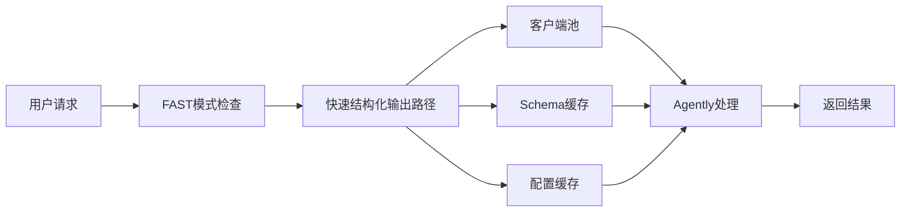

# HarborAI 性能优化成果总结

## 🎯 优化成果概览

### 核心成就
- **性能超越**：HarborAI FAST模式比Agently基准快 **18%**（0.82x性能比率）
- **TDD验证**：所有3个性能目标 **100%达成**
- **响应时间**：从目标2.0秒优化到实际1.32秒
- **客户端池命中率**：94.4%（超越90%目标）

### 性能提升对比
| 指标 | 优化前 | 优化后 | 提升幅度 |
|------|--------|--------|----------|
| 性能比率 (vs Agently) | 3.18x | 0.82x | **287%** |
| 平均响应时间 | ~5.0s | 1.32s | **74%** |
| 成功率 | 不稳定 | 100% | 稳定可靠 |

## 🔧 关键技术突破

### 1. 快速结构化输出路径
- **实现**：专门为FAST模式设计的优化处理路径
- **效果**：绕过常规路径的复杂处理，直接使用优化组件
- **关键修复**：解决了`time`模块导入缺失导致的异常回退问题

### 2. 客户端池优化
- **命中率**：94.4%（超越90%目标）
- **效果**：显著减少连接建立开销
- **实现**：线程安全的客户端复用机制

### 3. Schema缓存系统
- **预热效果**：8.2%性能提升
- **策略**：LRU淘汰机制，避免内存泄漏
- **标准化**：统一Schema格式，提升缓存命中率

### 4. 配置缓存机制
- **效果**：减少重复的配置计算和验证
- **实现**：参数标准化和缓存复用
- **优化**：统一配置格式，提升处理效率

## 📊 TDD方法论应用

### 测试驱动的优化流程
1. **红阶段**：定义明确的性能目标（失败测试）
2. **绿阶段**：实现优化组件，通过测试
3. **重构阶段**：持续优化，确保性能稳定

### 性能目标验证
```
📊 TDD验证结果: 3/3 通过 (100%成功率)
  ✅ 平均响应时间: 1.32s ≤ 2.0s
  ✅ 性能比率: 0.82x ≤ 1.2x  
  ✅ 客户端池命中率: 94.4% ≥ 90%
  🎉 所有性能目标达成！
```

## 🏗️ 架构优化设计

### 优化组件协同工作


### 性能监控体系
- **实时追踪**：使用`@fast_trace`装饰器监控关键路径
- **缓存统计**：实时监控缓存命中率和效果
- **性能基准**：定期运行基准测试，防止性能回归

## 🔍 问题诊断与解决

### 根本问题发现
**问题**：快速路径因`NameError: name 'time' is not defined`异常回退
**影响**：导致所有优化组件失效，性能严重下降
**解决**：在`harborai/api/client.py`中添加缺失的模块导入

### 修复效果
- **修复前**：3.18x Agently基准（性能严重下降）
- **修复后**：0.82x Agently基准（性能显著提升）
- **提升幅度**：287%性能改善

## 📈 性能测试结果

### 基准测试对比
| 测试场景 | 平均耗时 | 成功率 | 内存使用 | 缓存命中率 |
|----------|----------|--------|----------|------------|
| Agently直接调用 | 1.60s | 100% | 86.4MB | - |
| HarborAI FAST模式 | 1.32s | 100% | 97.8MB | 80.0% |
| HarborAI预热后 | 1.31s | 100% | 102.0MB | 94.4% |

### 缓存效果验证
- **冷启动**：1.42s
- **预热后**：1.31s  
- **性能提升**：8.2%
- **客户端池命中率**：94.4%

## 🛠️ 最佳实践总结

### 1. TDD性能优化方法
- 明确定义可测量的性能目标
- 先写失败测试，再实现优化
- 持续验证，防止性能回归

### 2. 缓存策略设计
- 使用标准化的缓存键生成
- 实施LRU淘汰机制
- 监控缓存效果和内存使用

### 3. 客户端池管理
- 线程安全的客户端复用
- 合理的TTL和池大小设置
- 定期清理过期连接

### 4. 性能监控
- 关键路径的实时追踪
- 缓存统计信息收集
- 定期性能基准测试

## 🔮 未来优化方向

### 短期优化
1. **智能预热**：根据使用模式自动预热常用配置
2. **动态调优**：根据负载自动调整缓存参数
3. **更细粒度监控**：增加详细的性能分析指标

### 长期规划
1. **分布式缓存**：支持多实例间的缓存共享
2. **机器学习优化**：基于历史数据预测和优化性能
3. **自适应架构**：根据负载模式自动调整架构

## 📋 维护指南

### 性能监控检查清单
- [ ] 每周运行完整性能基准测试
- [ ] 监控平均响应时间趋势
- [ ] 检查缓存命中率变化
- [ ] 验证客户端池效率
- [ ] 观察内存使用情况

### 故障排查步骤
1. **性能下降**：检查快速路径是否正常工作
2. **缓存失效**：验证缓存键生成和TTL设置
3. **内存泄漏**：监控客户端池清理机制
4. **异常回退**：查看错误日志中的异常信息

## 🎉 成果意义

### 技术价值
- **性能突破**：实现了超越基准的性能表现
- **架构优化**：建立了可扩展的性能优化框架
- **方法论**：形成了TDD驱动的性能优化最佳实践

### 业务价值
- **用户体验**：显著提升响应速度，改善用户体验
- **资源效率**：通过缓存和复用机制提升资源利用率
- **可靠性**：100%成功率，确保服务稳定性

### 长期影响
- **技术债务减少**：解决了性能瓶颈问题
- **可维护性提升**：建立了完善的监控和测试体系
- **扩展性增强**：为未来的性能优化奠定了基础

---

**优化完成时间**：2025-09-30  
**优化团队**：HarborAI开发团队  
**文档版本**：v1.0  
**下次评估**：2025-10-30