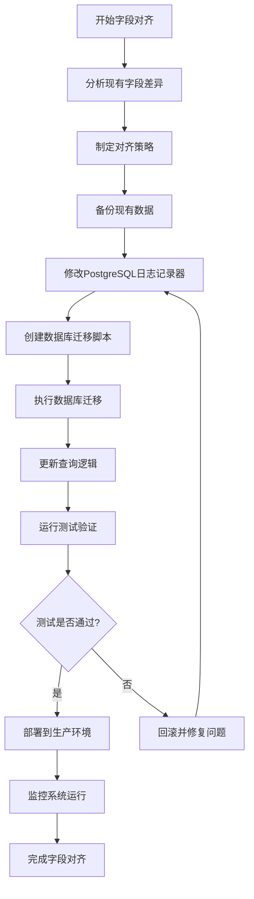
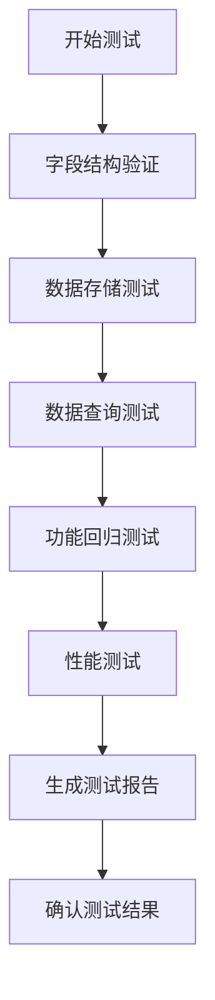

# HarborAI 日志字段对齐产品需求文档

## 1. 产品概述

HarborAI项目当前存在文件日志和PostgreSQL日志字段不一致的问题，需要进行字段对齐优化，确保两种日志存储方式的数据结构完全一致，提升日志查询和分析的准确性。

本次优化以文件日志为标准，调整PostgreSQL日志字段，确保数据一致性和系统稳定性。

## 2. 核心Features

### 2.1 用户角色

| 角色 | 使用场景 | 核心权限 |
|------|----------|----------|
| 开发者 | 日志调试、性能分析 | 可查看所有日志字段，进行日志查询和分析 |
| 运维人员 | 系统监控、故障排查 | 可查看系统日志，监控日志存储状态 |
| 数据分析师 | 数据分析、报表生成 | 可查询历史日志数据，生成统计报表 |

### 2.2 Feature Module

本次优化涉及以下核心模块：

1. **日志存储模块**：文件日志存储和PostgreSQL日志存储的字段对齐
2. **日志查询模块**：统一查询接口，确保返回数据格式一致
3. **数据库迁移模块**：安全地更新数据库表结构
4. **测试验证模块**：验证字段对齐后的功能完整性

### 2.3 Page Details

| Page Name | Module Name | Feature description |
|-----------|-------------|---------------------|
| 日志存储系统 | 文件日志记录器 | 维持现有字段结构作为标准，确保日志完整性和脱敏处理 |
| 日志存储系统 | PostgreSQL日志记录器 | 调整字段结构与文件日志对齐，移除额外字段，统一数据格式 |
| 数据库管理 | 表结构迁移 | 创建安全的数据库迁移脚本，添加缺失字段，调整字段类型 |
| 日志查询系统 | 统一查询接口 | 更新查询逻辑，确保文件日志和PostgreSQL日志返回相同格式数据 |
| 测试验证系统 | 字段一致性测试 | 创建自动化测试，验证两种日志系统字段完全一致 |
| 测试验证系统 | 功能回归测试 | 验证现有功能不受影响，确保系统稳定性 |

## 3. 核心Process

### 3.1 字段对齐流程

### 3.2 测试验证流程

## 4. User Interface Design

### 4.1 Design Style

- **主色调**：保持现有系统风格，以蓝色(#2563eb)为主色调
- **辅助色**：绿色(#16a34a)表示成功，红色(#dc2626)表示错误，黄色(#ca8a04)表示警告
- **字体**：使用系统默认等宽字体显示日志内容，确保格式对齐
- **布局风格**：采用表格布局展示日志字段对比，使用卡片式布局展示测试结果
- **图标风格**：使用简洁的线性图标，与现有系统保持一致

### 4.2 Page Design Overview

| Page Name | Module Name | UI Elements |
|-----------|-------------|-------------|
| 字段对比页面 | 字段差异展示 | 双列对比表格，左侧显示文件日志字段，右侧显示PostgreSQL日志字段，差异字段高亮显示 |
| 迁移进度页面 | 迁移状态监控 | 进度条显示迁移进度，状态卡片显示各步骤执行情况，日志输出区域显示详细信息 |
| 测试结果页面 | 测试报告展示 | 测试用例列表，每个用例显示执行状态（成功/失败），详细错误信息折叠展示 |
| 日志查询页面 | 统一查询界面 | 查询条件表单，结果表格显示统一格式的日志数据，支持字段筛选和排序 |

### 4.3 Responsiveness

本次优化主要涉及后端逻辑和数据结构调整，前端界面保持现有的响应式设计：
- 桌面优先设计，支持移动端适配
- 表格在小屏幕上支持横向滚动
- 关键操作按钮在移动端保持易点击的尺寸

## 5. 技术实现要点

### 5.1 字段标准化

以文件日志字段为标准，确保以下字段在两种存储方式中完全一致：

**核心字段**：
- `trace_id`: 追踪标识符
- `timestamp`: 时间戳（ISO格式）
- `type`: 日志类型（request/response）
- `model`: 模型名称
- `success`: 操作是否成功（仅response）
- `latency`: 响应延迟（仅response）
- `error`: 错误信息（可选）

**提供商字段**：
- `provider`: 底层API提供商（openai、anthropic、azure等）
- `structured_provider`: 结构化输出处理框架（agently、instructor等）

**数据字段**：
- `messages`: 消息内容（仅request，已脱敏）
- `parameters`: 请求参数（仅request，已脱敏）
- `tokens`: Token使用情况（仅response）
- `cost`: 成本信息（仅response）
- `response_summary`: 响应摘要（仅response）

**元数据字段**：
- `reasoning_content_present`: 是否包含推理内容

### 5.2 字段语义说明

**provider vs structured_provider 区别**：
- `provider`: 标识实际调用的API提供商，如openai、anthropic、azure等
- `structured_provider`: 标识处理结构化输出的框架，如agently、instructor等
- 两个字段服务于不同的用途，在结构化输出场景下都需要记录
- 示例：使用agently框架调用OpenAI API时，provider="openai"，structured_provider="agently"

### 5.3 数据迁移策略

1. **向后兼容**：保留现有数据，新增字段设置默认值
2. **渐进式迁移**：分批处理历史数据，避免长时间锁表
3. **数据验证**：迁移后验证数据完整性和一致性

### 5.4 测试覆盖

1. **单元测试**：验证字段映射和数据转换逻辑
2. **集成测试**：验证文件日志和PostgreSQL日志的存储查询一致性
3. **性能测试**：确保优化后性能不下降
4. **回归测试**：验证现有功能不受影响

## 6. 验收标准

### 6.1 功能验收

- [ ] 文件日志和PostgreSQL日志字段结构完全一致
- [ ] 所有日志查询接口返回统一格式数据
- [ ] 数据库迁移成功，无数据丢失
- [ ] 现有功能正常运行，无回归问题

### 6.2 性能验收

- [ ] 日志写入性能不低于优化前
- [ ] 日志查询响应时间不超过优化前的110%
- [ ] 数据库存储空间使用合理

### 6.3 质量验收

- [ ] 代码覆盖率不低于90%
- [ ] 所有自动化测试通过
- [ ] 代码审查通过，符合项目规范

## 7. 风险控制

### 7.1 技术风险

- **数据丢失风险**：通过完整备份和分阶段迁移降低风险
- **性能下降风险**：通过性能测试和监控及时发现问题
- **兼容性风险**：保持向后兼容，渐进式升级

### 7.2 业务风险

- **服务中断风险**：选择低峰期执行迁移，准备快速回滚方案
- **数据不一致风险**：通过严格的测试验证确保数据一致性

## 8. 项目时间线

### 8.1 开发阶段（预计3-5天）

- Day 1: 代码修改和数据库迁移脚本开发
- Day 2-3: 测试用例开发和功能测试
- Day 4: 性能测试和优化
- Day 5: 文档更新和代码审查

### 8.2 部署阶段（预计1-2天）

- 生产环境数据备份
- 迁移脚本执行
- 功能验证和监控

## 9. 成功指标

- 字段一致性达到100%
- 功能回归测试通过率100%
- 性能下降幅度小于10%
- 零数据丢失
- 用户体验无明显变化