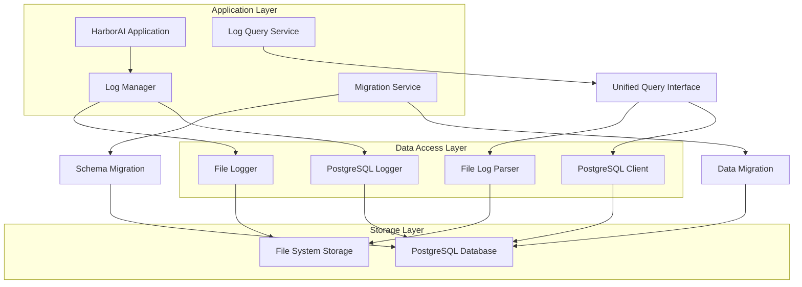
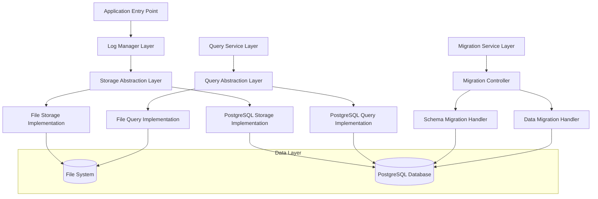
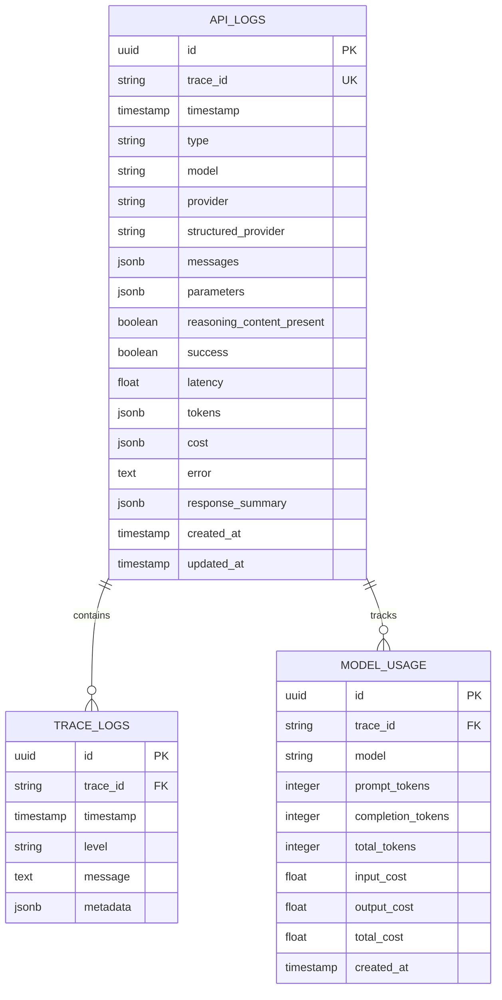

# HarborAI 日志字段对齐技术架构文档

## 1. Architecture design



## 2. Technology Description

- Frontend: 无前端界面变更
- Backend: Python 3.8+ + asyncio + PostgreSQL
- Database: PostgreSQL (本地Docker容器)
- Testing: pytest + asyncio testing
- Migration: 自定义迁移脚本

## 3. Route definitions

本次优化主要涉及后端API，不涉及前端路由变更：

| Route | Purpose |
|-------|---------|
| 内部API | 日志存储接口，用于记录API调用日志 |
| 内部API | 日志查询接口，用于检索和分析日志数据 |
| 内部API | 系统健康检查，验证日志系统状态 |

## 4. API definitions

### 4.1 Core API

#### 日志存储API

**文件日志存储**
```python
# FileLogger.log_request()
def log_request(trace_id: str, model: str, messages: List[Dict], 
                parameters: Dict, reasoning_content_present: bool,
                provider: str, structured_provider: str) -> None
```

**PostgreSQL日志存储**
```python
# PostgreSQLLogger.log_request()
def log_request(trace_id: str, model: str, messages: List[Dict], 
                parameters: Dict, reasoning_content_present: bool,
                provider: str, structured_provider: str) -> None
```

#### 日志查询API

**统一查询接口**
```python
# 查询参数
class QueryParams:
    trace_id: Optional[str]
    start_time: Optional[datetime]
    end_time: Optional[datetime]
    model: Optional[str]
    success: Optional[bool]
    limit: int = 100
    offset: int = 0

# 查询结果
class QueryResult:
    logs: List[Dict[str, Any]]
    total_count: int
    has_more: bool
```

#### 数据迁移API

**迁移状态查询**
```python
class MigrationStatus:
    status: str  # "pending", "running", "completed", "failed"
    progress: float  # 0.0 - 1.0
    message: str
    started_at: Optional[datetime]
    completed_at: Optional[datetime]
```

## 5. Server architecture diagram



## 6. Data model

### 6.1 字段语义说明

#### 提供商字段区分

系统中存在两个不同的提供商字段，用于记录不同层面的信息：

**provider字段**
- **用途**: 标识底层API提供商
- **取值**: openai、anthropic、azure、google等
- **说明**: 记录实际调用的AI服务提供商

**structured_provider字段**  
- **用途**: 标识结构化输出处理框架
- **取值**: agently、instructor、langchain等
- **说明**: 记录使用的结构化输出处理工具

#### 使用场景示例

```python
# 场景1: 直接调用OpenAI API
{
    "provider": "openai",
    "structured_provider": null
}

# 场景2: 通过Agently框架调用OpenAI API
{
    "provider": "openai", 
    "structured_provider": "agently"
}

# 场景3: 通过Instructor框架调用Anthropic API
{
    "provider": "anthropic",
    "structured_provider": "instructor"
}
```

### 6.2 Data model definition



### 6.3 Data Definition Language

#### 主要日志表 (api_logs)

```sql
-- 创建主要日志表
CREATE TABLE IF NOT EXISTS api_logs (
    id UUID PRIMARY KEY DEFAULT gen_random_uuid(),
    trace_id VARCHAR(255) UNIQUE NOT NULL,
    timestamp TIMESTAMP WITH TIME ZONE NOT NULL,
    type VARCHAR(50) NOT NULL CHECK (type IN ('request', 'response')),
    model VARCHAR(255),
    provider VARCHAR(255),
    structured_provider VARCHAR(255),
    messages JSONB,
    parameters JSONB,
    reasoning_content_present BOOLEAN DEFAULT FALSE,
    success BOOLEAN,
    latency FLOAT,
    tokens JSONB,
    cost JSONB,
    error TEXT,
    response_summary JSONB,
    created_at TIMESTAMP WITH TIME ZONE DEFAULT NOW(),
    updated_at TIMESTAMP WITH TIME ZONE DEFAULT NOW()
);

-- 创建索引
CREATE INDEX IF NOT EXISTS idx_api_logs_trace_id ON api_logs(trace_id);
CREATE INDEX IF NOT EXISTS idx_api_logs_timestamp ON api_logs(timestamp DESC);
CREATE INDEX IF NOT EXISTS idx_api_logs_model ON api_logs(model);
CREATE INDEX IF NOT EXISTS idx_api_logs_provider ON api_logs(provider);
CREATE INDEX IF NOT EXISTS idx_api_logs_structured_provider ON api_logs(structured_provider);
CREATE INDEX IF NOT EXISTS idx_api_logs_type ON api_logs(type);
CREATE INDEX IF NOT EXISTS idx_api_logs_success ON api_logs(success);

-- 创建复合索引
CREATE INDEX IF NOT EXISTS idx_api_logs_model_timestamp ON api_logs(model, timestamp DESC);
CREATE INDEX IF NOT EXISTS idx_api_logs_type_timestamp ON api_logs(type, timestamp DESC);
```

#### 追踪日志表 (trace_logs)

```sql
-- 创建追踪日志表
CREATE TABLE IF NOT EXISTS trace_logs (
    id UUID PRIMARY KEY DEFAULT gen_random_uuid(),
    trace_id VARCHAR(255) NOT NULL,
    timestamp TIMESTAMP WITH TIME ZONE NOT NULL,
    level VARCHAR(20) NOT NULL,
    message TEXT NOT NULL,
    metadata JSONB,
    created_at TIMESTAMP WITH TIME ZONE DEFAULT NOW()
);

-- 创建索引
CREATE INDEX IF NOT EXISTS idx_trace_logs_trace_id ON trace_logs(trace_id);
CREATE INDEX IF NOT EXISTS idx_trace_logs_timestamp ON trace_logs(timestamp DESC);
CREATE INDEX IF NOT EXISTS idx_trace_logs_level ON trace_logs(level);
```

#### 模型使用统计表 (model_usage)

```sql
-- 创建模型使用统计表
CREATE TABLE IF NOT EXISTS model_usage (
    id UUID PRIMARY KEY DEFAULT gen_random_uuid(),
    trace_id VARCHAR(255) NOT NULL,
    model VARCHAR(255) NOT NULL,
    prompt_tokens INTEGER DEFAULT 0,
    completion_tokens INTEGER DEFAULT 0,
    total_tokens INTEGER DEFAULT 0,
    input_cost DECIMAL(10, 6) DEFAULT 0.0,
    output_cost DECIMAL(10, 6) DEFAULT 0.0,
    total_cost DECIMAL(10, 6) DEFAULT 0.0,
    created_at TIMESTAMP WITH TIME ZONE DEFAULT NOW()
);

-- 创建索引
CREATE INDEX IF NOT EXISTS idx_model_usage_trace_id ON model_usage(trace_id);
CREATE INDEX IF NOT EXISTS idx_model_usage_model ON model_usage(model);
CREATE INDEX IF NOT EXISTS idx_model_usage_created_at ON model_usage(created_at DESC);
```

#### 数据迁移脚本

```sql
-- 数据迁移：添加缺失字段
ALTER TABLE api_logs 
ADD COLUMN IF NOT EXISTS reasoning_content_present BOOLEAN DEFAULT FALSE,
ADD COLUMN IF NOT EXISTS structured_provider VARCHAR(255);

-- 数据迁移：更新现有数据
UPDATE api_logs 
SET reasoning_content_present = FALSE 
WHERE reasoning_content_present IS NULL;

UPDATE api_logs 
SET structured_provider = 'unknown' 
WHERE structured_provider IS NULL AND type = 'response';

-- 数据验证：检查字段一致性
SELECT 
    COUNT(*) as total_records,
    COUNT(CASE WHEN reasoning_content_present IS NOT NULL THEN 1 END) as has_reasoning_flag,
    COUNT(CASE WHEN structured_provider IS NOT NULL THEN 1 END) as has_provider
FROM api_logs;
```

#### 权限设置

```sql
-- 设置表权限
GRANT SELECT, INSERT, UPDATE ON api_logs TO authenticated;
GRANT SELECT, INSERT, UPDATE ON trace_logs TO authenticated;
GRANT SELECT, INSERT, UPDATE ON model_usage TO authenticated;

-- 设置基本读取权限
GRANT SELECT ON api_logs TO anon;
GRANT SELECT ON trace_logs TO anon;
GRANT SELECT ON model_usage TO anon;
```

#### 初始化数据

```sql
-- 插入测试数据
INSERT INTO api_logs (
    trace_id, timestamp, type, model, messages, parameters,
    reasoning_content_present, structured_provider, success,
    latency, tokens, cost, response_summary
) VALUES (
    'test-trace-001',
    NOW(),
    'request',
    'gpt-4',
    '{"messages": [{"role": "user", "content": "Hello"}]}',
    '{"temperature": 0.7, "max_tokens": 100}',
    false,
    'openai',
    true,
    1.5,
    '{"prompt_tokens": 10, "completion_tokens": 20, "total_tokens": 30}',
    '{"input_cost": 0.001, "output_cost": 0.002, "total_cost": 0.003}',
    '{"summary": "Simple greeting response"}'
);
```

## 7. 实现细节

### 7.1 字段映射策略

**标准化字段定义**：
```python
@dataclass
class StandardLogEntry:
    trace_id: str
    timestamp: datetime
    type: Literal["request", "response"]
    model: Optional[str] = None
    messages: Optional[List[Dict]] = None  # 仅request
    parameters: Optional[Dict] = None      # 仅request
    reasoning_content_present: bool = False
    structured_provider: Optional[str] = None
    success: Optional[bool] = None         # 仅response
    latency: Optional[float] = None        # 仅response
    tokens: Optional[Dict] = None          # 仅response
    cost: Optional[Dict] = None            # 仅response
    error: Optional[str] = None
    response_summary: Optional[Dict] = None # 仅response
```

### 7.2 迁移执行策略

1. **预迁移检查**：验证数据完整性和表结构
2. **增量迁移**：分批处理历史数据，避免长时间锁表
3. **数据验证**：迁移后验证字段一致性
4. **回滚准备**：保留原始数据备份

### 7.3 测试验证策略

```python
# 字段一致性测试
async def test_field_consistency():
    # 测试文件日志和PostgreSQL日志字段一致性
    file_log_fields = get_file_log_fields()
    postgres_log_fields = get_postgres_log_fields()
    assert file_log_fields == postgres_log_fields

# 数据存储测试
async def test_log_storage():
    # 测试相同数据在两种存储方式下的一致性
    test_data = create_test_log_entry()
    await file_logger.log_request(**test_data)
    await postgres_logger.log_request(**test_data)
    
    file_result = await query_file_logs(test_data['trace_id'])
    postgres_result = await query_postgres_logs(test_data['trace_id'])
    assert normalize_log_data(file_result) == normalize_log_data(postgres_result)
```

### 7.4 监控和告警

- **字段一致性监控**：定期检查两种存储方式的字段结构
- **数据完整性监控**：监控日志写入成功率和数据完整性
- **性能监控**：监控日志写入和查询性能
- **错误告警**：字段不一致或数据丢失时及时告警

## 8. 部署和运维

### 8.1 部署流程

1. **代码部署**：更新日志记录器和查询逻辑
2. **数据库迁移**：执行表结构和数据迁移
3. **功能验证**：验证日志存储和查询功能
4. **性能监控**：监控系统性能和稳定性

### 8.2 回滚策略

- **代码回滚**：保留上一版本代码，支持快速回滚
- **数据库回滚**：保留数据备份，支持数据恢复
- **渐进式回滚**：分步骤回滚，最小化影响范围

### 8.3 维护策略

- **定期检查**：定期验证字段一致性和数据完整性
- **性能优化**：根据使用情况优化索引和查询性能
- **容量规划**：监控存储使用情况，及时扩容