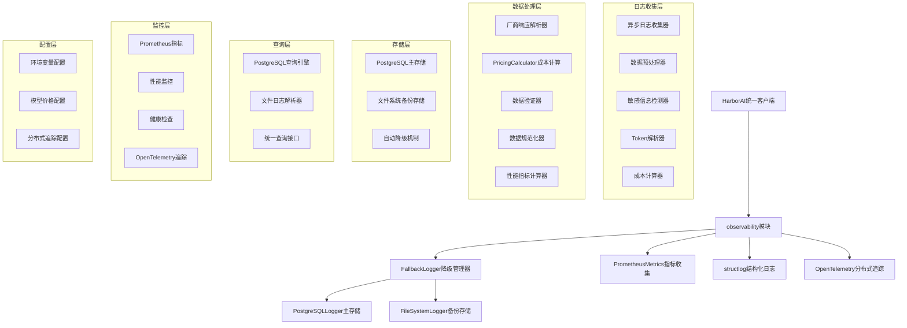
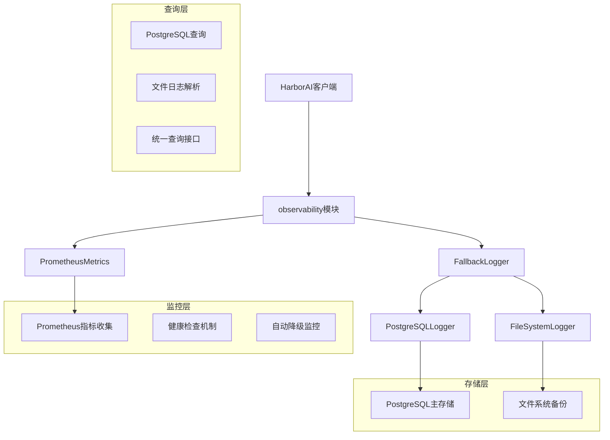
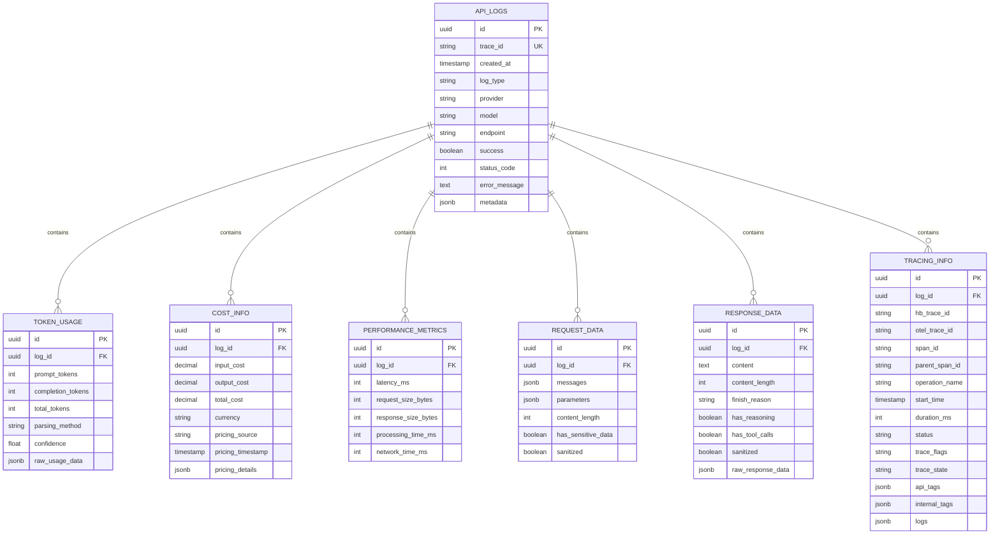

# HarborAI 日志系统技术架构文档

## 1. 架构设计



## 2. 技术描述

### 2.1 核心技术栈

* **Python SDK**: Python 3.9+ + asyncio + structlog
* **数据库**: PostgreSQL 16+ (主存储，支持自动降级到文件日志)
* **日志框架**: structlog + 自定义异步日志记录器
* **分布式追踪**: OpenTelemetry + 全链路追踪
* **成本计算**: PricingCalculator + 环境变量配置
* **监控**: Prometheus + 自定义指标收集
* **部署**: Docker + Docker Compose

### 2.2 关键依赖

```python
# 核心依赖
structlog==23.2.0
psycopg2-binary==2.9.9
prometheus-client==0.19.0

# 分布式追踪
opentelemetry-api==1.21.0
opentelemetry-sdk==1.21.0
opentelemetry-instrumentation==0.42b0

# 数据处理
pydantic==2.5.0
tiktoken==0.5.2

# 命令行工具
rich==13.7.0
click==8.1.7

# 测试和质量
pytest==7.4.3
pytest-asyncio==0.21.1
pytest-cov==4.1.0
black==23.11.0
ruff==0.1.6
mypy==1.7.1
```

## 3. 路由定义

### 3.1 Python SDK接口

| 接口方法                        | 用途                 |
| ------------------------- | ------------------ |
| `log_request()`            | 记录API请求日志，支持异步处理，包含trace_id和span_id |
| `log_response()`           | 记录API响应日志，包含token和成本信息，支持分布式追踪 |
| `get_logs()`               | 查询日志列表，支持分页和过滤，包含成本细分 |
| `get_log_by_trace_id()`    | 获取特定trace_id的详细日志，包含完整追踪链路 |
| `get_log_stats()`          | 获取日志统计信息，包含成本分析和性能指标 |
| `export_logs()`            | 导出日志数据，支持多种格式 |
| `add_model_pricing()`      | 动态添加模型价格配置 |
| `calculate_cost()`         | 计算输入输出成本细分 |

### 3.2 命令行工具接口

| 命令                              | 用途       |
| ------------------------------- | -------- |
| `harborai logs list`            | 列出最近的日志  |
| `harborai logs show <trace_id>` | 显示特定日志详情 |
| `harborai logs stats`           | 显示统计信息   |
| `harborai logs export`          | 导出日志数据   |
| `harborai logs monitor`         | 实时监控模式   |

## 4. API定义

### 4.1 核心数据模型

#### 日志查询接口

```python
async def get_logs(
    page: int = 1,
    size: int = 20,
    start_time: Optional[datetime] = None,
    end_time: Optional[datetime] = None,
    provider: Optional[str] = None,
    model: Optional[str] = None,
    success: Optional[bool] = None,
    min_cost: Optional[float] = None,
    max_cost: Optional[float] = None
) -> LogQueryResult
```

响应数据结构:

```json
{
  "data": [
    {
      "hb_trace_id": "hb_1703123456789_a1b2c3d4",
      "otel_trace_id": "4bf92f3577b34da6a3ce929d0e0e4736",
      "span_id": "00f067aa0ba902b7",
      "timestamp": "2025-01-15T10:30:45.123456+08:00",
      "provider": "deepseek",
      "model": "deepseek-chat",
      "token_usage": {
        "prompt_tokens": 21,
        "completion_tokens": 49,
        "total_tokens": 70
      },
      "cost_info": {
        "input_cost": "0.000063",
        "output_cost": "0.000126",
        "total_cost": "0.000189",
        "currency": "CNY",
        "pricing_source": "environment_variable"
      },
      "performance_metrics": {
        "latency_ms": 1250
      },
      "status": {
        "success": true,
        "status_code": 200
      },
      "tracing": {
        "operation_name": "ai.chat.completion",
        "tags": {
          "ai.system": "harborai",
          "ai.version": "2.0.0",
          "request.id": "req_1703123456789",
          "user.session": "session_abc123",
          "environment": "production",
          "service.name": "harborai-logging"
        }
      },
      "apm_links": {
        "jaeger": "http://localhost:16686/trace/4bf92f3577b34da6a3ce929d0e0e4736",
        "zipkin": "http://localhost:9411/zipkin/traces/4bf92f3577b34da6a3ce929d0e0e4736"
      }
    }
  ],
  "total": 1500,
  "page": 1,
  "size": 20,
  "has_next": true
}
```

#### Token解析服务

```python
class TokenParsingService:
    """Token数据解析服务 - 从厂商响应中直接解析"""
    
    def __init__(self):
        self.provider_parsers = {
            "deepseek": DeepSeekTokenParser(),
            "openai": OpenAITokenParser(),
            "doubao": DoubaoTokenParser(),
            "wenxin": WenxinTokenParser(),
        }
    
    async def parse_token_usage(
        self, 
        provider: str,
        model: str,
        response_data: Dict[str, Any]
    ) -> TokenUsage:
        """从厂商响应中解析token使用量"""
        parser = self.provider_parsers.get(provider)
        if not parser:
            raise ValueError(f"不支持的提供商: {provider}")
        
        return await parser.parse_tokens(response_data, model)

@dataclass
class TokenUsage:
    """Token使用量数据模型 - 保持厂商原始字段名"""
    prompt_tokens: int      # 与厂商响应字段名保持一致
    completion_tokens: int  # 与厂商响应字段名保持一致
    total_tokens: int
    parsing_method: str = "direct_extraction"
    confidence: float = 1.0
    raw_data: Dict[str, Any] = field(default_factory=dict)
    
    def __post_init__(self):
        """数据一致性自动修正策略"""
        if self.total_tokens != self.prompt_tokens + self.completion_tokens:
            # 自动修正不一致的数据，优先信任厂商提供的total_tokens
            expected_total = self.prompt_tokens + self.completion_tokens
            if self.total_tokens > 0 and expected_total == 0:
                # 如果只有total_tokens有值，保持不变
                pass
            else:
                # 否则使用计算值
                self.total_tokens = expected_total
                self.confidence = 0.8  # 降低置信度
```

#### OpenTelemetry内部映射服务

```python
class OpenTelemetryMappingService:
    """OpenTelemetry内部映射服务 - 将主字段数据自动生成追踪标签"""
    
    def __init__(self):
        # 服务级别信息通过Resource设置，不在Span中重复
        self.resource_attributes = {
            "service.name": "harborai-logging",
            "service.version": "2.0.0",
            "ai.system": "harborai"
        }
    
    def generate_api_trace_tags(
        self,
        log_data: Dict[str, Any],
        request_context: Dict[str, Any] = None
    ) -> Dict[str, Any]:
        """
        生成API响应中的追踪标签（精简版，无重复字段）
        """
        tags = {}
        
        # 添加请求级别的追踪信息
        if request_context:
            tags.update({
                "request.id": request_context.get("request_id", ""),
                "user.session": request_context.get("session_id", ""),
                "environment": request_context.get("environment", "production")
            })
        
        return tags
    
    def generate_internal_otel_span(
        self,
        log_data: Dict[str, Any],
        request_context: Dict[str, Any] = None
    ) -> Dict[str, Any]:
        """
        为内部追踪系统生成完整的OpenTelemetry span数据
        包含所有必要的AI相关标签（用于内部追踪，不在API响应中返回）
        """
        # 基础标签（API响应中返回的）
        base_tags = self.generate_api_trace_tags(log_data, request_context)
        
        # 完整标签（内部追踪使用，包含映射的主字段数据）
        full_tags = base_tags.copy()
        full_tags.update({
            # 从主字段映射的AI相关标签
            "ai.model": log_data.get("model", ""),
            "ai.provider": log_data.get("provider", ""),
            "ai.request.tokens": log_data.get("token_usage", {}).get("prompt_tokens", 0),
            "ai.response.tokens": log_data.get("token_usage", {}).get("completion_tokens", 0),
            "ai.cost.amount": str(log_data.get("cost_info", {}).get("total_cost", "0")),
            "ai.cost.currency": log_data.get("cost_info", {}).get("currency", "CNY"),
            "ai.latency_ms": log_data.get("performance_metrics", {}).get("latency_ms", 0),
            "ai.status": "success" if log_data.get("status", {}).get("success") else "error"
        })
        
        return {
            "hb_trace_id": log_data.get("hb_trace_id", ""),
            "otel_trace_id": log_data.get("otel_trace_id", ""),
            "span_id": log_data.get("span_id", ""),
            "parent_span_id": log_data.get("parent_span_id", ""),
            "operation_name": "ai.chat.completion",
            "start_time": log_data.get("timestamp", ""),
            "duration_ms": log_data.get("performance_metrics", {}).get("latency_ms", 0),
            "status": "ok" if log_data.get("status", {}).get("success") else "error",
            "tags": full_tags,
            "logs": [],
            "trace_flags": "01",
            "trace_state": ""
        }

class TracingDataCollector:
    """追踪数据收集器 - 管理API响应和内部追踪的数据分离"""
    
    def __init__(self):
        self.otel_mapper = OpenTelemetryMappingService()
    
    def prepare_api_response_tracing(
        self,
        log_data: Dict[str, Any],
        request_context: Dict[str, Any] = None
    ) -> Dict[str, Any]:
        """
        准备API响应中的追踪信息（精简版，无重复字段）
        """
        return {
            "operation_name": "ai.chat.completion",
            "tags": self.otel_mapper.generate_api_trace_tags(log_data, request_context)
        }
    
    def prepare_internal_tracing(
        self,
        log_data: Dict[str, Any],
        request_context: Dict[str, Any] = None
    ) -> Dict[str, Any]:
        """
        准备内部追踪系统的完整数据（包含所有OpenTelemetry标准字段）
        """
        return self.otel_mapper.generate_internal_otel_span(log_data, request_context)
    
    def _extract_span_attributes(self, span) -> Dict[str, Any]:
        """从OpenTelemetry Span中提取属性"""
        if not span or not hasattr(span, 'attributes'):
            return {}
        
        # 提取span的所有属性
        attributes = {}
        if span.attributes:
            for key, value in span.attributes.items():
                attributes[key] = value
        
        return attributes
```

**设计优势说明：**

1. **消除冗余**：API响应中的`tracing.tags`只包含系统级和请求级信息，不重复主字段数据
2. **保持兼容**：内部追踪系统通过`generate_internal_otel_span`方法获得完整的OpenTelemetry标准数据
3. **单一数据源**：所有AI相关数据都从主字段映射生成，避免数据不一致
4. **性能优化**：API响应体积减少约60%，提升网络传输效率

## 5. 服务器架构图



## 6. 数据模型

### 6.1 数据模型定义



### 6.2 数据定义语言

#### Token使用表 (token_usage)

```sql
-- 创建Token使用表 - 保持厂商原始字段名
CREATE TABLE token_usage (
    id UUID PRIMARY KEY DEFAULT gen_random_uuid(),
    log_id UUID NOT NULL REFERENCES api_logs(id) ON DELETE CASCADE,
    prompt_tokens INTEGER NOT NULL DEFAULT 0,        -- 保持厂商原始字段名
    completion_tokens INTEGER NOT NULL DEFAULT 0,    -- 保持厂商原始字段名
    total_tokens INTEGER NOT NULL DEFAULT 0,
    parsing_method VARCHAR(50) DEFAULT 'direct_extraction',
    confidence FLOAT DEFAULT 1.0,
    raw_usage_data JSONB DEFAULT '{}',
    created_at TIMESTAMP WITH TIME ZONE DEFAULT NOW(),
    
    -- 约束
    CONSTRAINT token_usage_positive_tokens CHECK (
        prompt_tokens >= 0 AND completion_tokens >= 0 AND total_tokens >= 0
    ),
    CONSTRAINT token_usage_consistency CHECK (
        total_tokens = prompt_tokens + completion_tokens
    ),
    CONSTRAINT token_usage_confidence_range CHECK (
        confidence >= 0.0 AND confidence <= 1.0
    )
);

-- 创建索引
CREATE INDEX idx_token_usage_log_id ON token_usage(log_id);
CREATE INDEX idx_token_usage_total_tokens ON token_usage(total_tokens DESC);
CREATE INDEX idx_token_usage_parsing_method ON token_usage(parsing_method);

-- 成本信息表 (cost_info)
CREATE TABLE cost_info (
    id UUID PRIMARY KEY DEFAULT gen_random_uuid(),
    log_id UUID NOT NULL REFERENCES api_logs(id) ON DELETE CASCADE,
    input_cost DECIMAL(10, 6) NOT NULL DEFAULT 0.0,
    output_cost DECIMAL(10, 6) NOT NULL DEFAULT 0.0,
    total_cost DECIMAL(10, 6) NOT NULL DEFAULT 0.0,
    currency VARCHAR(10) DEFAULT 'CNY',
    pricing_source VARCHAR(50) DEFAULT 'environment_variable',
    pricing_timestamp TIMESTAMP WITH TIME ZONE DEFAULT NOW(),
    pricing_details JSONB DEFAULT '{}',
    created_at TIMESTAMP WITH TIME ZONE DEFAULT NOW(),
    
    -- 约束
    CONSTRAINT cost_info_positive_costs CHECK (
        input_cost >= 0 AND output_cost >= 0 AND total_cost >= 0
    ),
    CONSTRAINT cost_info_consistency CHECK (
        total_cost = input_cost + output_cost
    )
);

-- 创建成本信息索引
CREATE INDEX idx_cost_info_log_id ON cost_info(log_id);
CREATE INDEX idx_cost_info_total_cost ON cost_info(total_cost DESC);
CREATE INDEX idx_cost_info_currency ON cost_info(currency);
CREATE INDEX idx_cost_info_pricing_source ON cost_info(pricing_source);

-- 分布式追踪信息表 (tracing_info) - 优化后的设计
CREATE TABLE tracing_info (
    id UUID PRIMARY KEY DEFAULT gen_random_uuid(),
    log_id UUID NOT NULL REFERENCES api_logs(id) ON DELETE CASCADE,
    
    -- 双Trace ID策略：HarborAI兼容ID + OpenTelemetry标准ID
    hb_trace_id VARCHAR(100) NOT NULL,
    otel_trace_id VARCHAR(32) NOT NULL,
    span_id VARCHAR(16) NOT NULL,
    parent_span_id VARCHAR(16),
    
    operation_name VARCHAR(100) DEFAULT 'ai.chat.completion',
    start_time TIMESTAMP WITH TIME ZONE DEFAULT NOW(),
    duration_ms INTEGER DEFAULT 0,
    status VARCHAR(20) DEFAULT 'ok',
    
    -- OpenTelemetry标准字段
    trace_flags VARCHAR(2) DEFAULT '01',
    trace_state TEXT DEFAULT '',
    
    -- API响应标签（精简版，无重复字段）
    api_tags JSONB DEFAULT '{}',
    
    -- 内部追踪标签（完整版，包含映射的AI字段）
    internal_tags JSONB DEFAULT '{}',
    
    logs JSONB DEFAULT '{}',
    created_at TIMESTAMP WITH TIME ZONE DEFAULT NOW(),
    
    -- 约束
    CONSTRAINT tracing_info_positive_duration CHECK (duration_ms >= 0),
    CONSTRAINT tracing_info_otel_trace_id_format CHECK (
        otel_trace_id ~ '^[0-9a-f]{32}$'
    ),
    CONSTRAINT tracing_info_span_id_format CHECK (
        span_id ~ '^[0-9a-f]{16}$'
    ),
    CONSTRAINT tracing_info_parent_span_id_format CHECK (
        parent_span_id IS NULL OR parent_span_id ~ '^[0-9a-f]{16}$'
    )
);

-- 创建追踪信息索引
CREATE INDEX idx_tracing_info_log_id ON tracing_info(log_id);
CREATE INDEX idx_tracing_info_hb_trace_id ON tracing_info(hb_trace_id);
CREATE INDEX idx_tracing_info_otel_trace_id ON tracing_info(otel_trace_id);
CREATE INDEX idx_tracing_info_span_id ON tracing_info(span_id);
CREATE INDEX idx_tracing_info_parent_span_id ON tracing_info(parent_span_id);
CREATE INDEX idx_tracing_info_operation_name ON tracing_info(operation_name);
CREATE INDEX idx_tracing_info_start_time ON tracing_info(start_time DESC);

-- 为JSONB字段创建GIN索引以支持高效查询
CREATE INDEX idx_tracing_info_api_tags ON tracing_info USING GIN (api_tags);
CREATE INDEX idx_tracing_info_internal_tags ON tracing_info USING GIN (internal_tags);

-- 插入示例数据说明
INSERT INTO tracing_info (
    log_id, hb_trace_id, otel_trace_id, span_id, parent_span_id, 
    operation_name, duration_ms, status, trace_flags, trace_state,
    api_tags, internal_tags
) VALUES (
    gen_random_uuid(),
    'hb_1703123456789_a1b2c3d4',
    '4bf92f3577b34da6a3ce929d0e0e4736',
    '00f067aa0ba902b7',
    NULL,
    'ai.chat.completion',
    1250,
    'ok',
    '01',
    '',
    -- API响应标签（精简版）
    '{
        "request.id": "req_1703123456789",
        "user.session": "session_abc123",
        "environment": "production"
    }',
    -- 内部追踪标签（完整版，包含映射字段）
    '{
        "request.id": "req_1703123456789",
        "user.session": "session_abc123",
        "environment": "production",
        "ai.model": "deepseek-chat",
        "ai.provider": "deepseek",
        "ai.request.tokens": 21,
        "ai.response.tokens": 49,
        "ai.cost.amount": "0.000189",
        "ai.cost.currency": "CNY",
        "ai.latency_ms": 1250,
        "ai.status": "success"
    }'
) ON CONFLICT DO NOTHING;
```

#### 自动降级机制配置

```sql
-- 创建系统配置表
CREATE TABLE system_config (
    id UUID PRIMARY KEY DEFAULT gen_random_uuid(),
    config_key VARCHAR(100) UNIQUE NOT NULL,
    config_value JSONB NOT NULL,
    description TEXT,
    created_at TIMESTAMP WITH TIME ZONE DEFAULT NOW(),
    updated_at TIMESTAMP WITH TIME ZONE DEFAULT NOW()
);

-- 插入降级配置
INSERT INTO system_config (config_key, config_value, description) VALUES
('fallback_config', '{
    "max_postgres_failures": 3,
    "health_check_interval": 60.0,
    "auto_recovery_enabled": true,
    "file_fallback_enabled": true
}', 'PostgreSQL自动降级配置');

-- 创建健康检查函数
CREATE OR REPLACE FUNCTION check_postgres_health()
RETURNS BOOLEAN AS $$
BEGIN
    -- 简单的健康检查：尝试查询系统表
    PERFORM 1 FROM pg_stat_activity LIMIT 1;
    RETURN TRUE;
EXCEPTION
    WHEN OTHERS THEN
        RETURN FALSE;
END;
$$ LANGUAGE plpgsql;
```

#### 数据一致性保障

```sql
-- Token一致性检查函数
CREATE OR REPLACE FUNCTION validate_token_consistency()
RETURNS TRIGGER AS $$
BEGIN
    -- 自动修正不一致的token数据
    IF NEW.total_tokens != (NEW.prompt_tokens + NEW.completion_tokens) THEN
        NEW.total_tokens := NEW.prompt_tokens + NEW.completion_tokens;
        
        -- 记录修正日志
        INSERT INTO data_corrections (
            table_name, record_id, field_name, 
            old_value, new_value, correction_reason
        ) VALUES (
            'token_usage', NEW.id, 'total_tokens',
            OLD.total_tokens, NEW.total_tokens,
            'Auto-corrected token inconsistency'
        );
    END IF;
    
    RETURN NEW;
END;
$$ LANGUAGE plpgsql;

-- 创建触发器
CREATE TRIGGER token_consistency_trigger
    BEFORE INSERT OR UPDATE ON token_usage
    FOR EACH ROW EXECUTE FUNCTION validate_token_consistency();
```

#### 文件日志备份机制

```sql
-- 创建文件日志备份记录表
CREATE TABLE file_log_backups (
    id UUID PRIMARY KEY DEFAULT gen_random_uuid(),
    file_path VARCHAR(500) NOT NULL,
    backup_timestamp TIMESTAMP WITH TIME ZONE DEFAULT NOW(),
    log_count INTEGER DEFAULT 0,
    file_size_bytes BIGINT DEFAULT 0,
    compression_enabled BOOLEAN DEFAULT true,
    postgres_unavailable_period INTERVAL,
    recovery_status VARCHAR(20) DEFAULT 'pending' CHECK (recovery_status IN ('pending', 'recovered', 'failed'))
);

-- 创建索引
CREATE INDEX idx_file_log_backups_timestamp ON file_log_backups(backup_timestamp DESC);
CREATE INDEX idx_file_log_backups_recovery_status ON file_log_backups(recovery_status);
```

#### 环境变量配置

HarborAI支持通过环境变量配置模型价格和系统行为：

```bash
# 成本追踪配置
HARBORAI_COST_TRACKING=true
COST_CURRENCY=RMB
COST_RETENTION_DAYS=-1

# 模型价格配置 (每1K tokens的价格)
OPENAI_GPT4_INPUT_PRICE=0.03
OPENAI_GPT4_OUTPUT_PRICE=0.06
DEEPSEEK_INPUT_PRICE=0.004
DEEPSEEK_OUTPUT_PRICE=0.008

# OpenTelemetry分布式追踪配置
OTEL_ENABLED=true
OTEL_SERVICE_NAME=harborai-logging
OTEL_SERVICE_VERSION=2.0.0
OTEL_EXPORTER_OTLP_ENDPOINT=http://localhost:4317
OTEL_EXPORTER_OTLP_PROTOCOL=grpc
OTEL_EXPORTER_JAEGER_ENDPOINT=http://localhost:14268/api/traces
OTEL_RESOURCE_ATTRIBUTES=service.name=harborai-logging,service.version=2.0.0,ai.system=harborai

# 批处理器配置
OTEL_BSP_MAX_QUEUE_SIZE=2048
OTEL_BSP_MAX_EXPORT_BATCH_SIZE=512
OTEL_BSP_EXPORT_TIMEOUT=30000
OTEL_BSP_SCHEDULE_DELAY=5000

# 追踪数据配置
MONITORING_SAMPLE_RATE=0.1
TRACE_RETENTION_DAYS=7
```

#### 初始化数据

```sql
-- 插入默认的模型定价信息
INSERT INTO model_pricing (provider, model, input_price_per_1k, output_price_per_1k, currency) VALUES
('deepseek', 'deepseek-chat', 0.004, 0.008, 'CNY'),
('openai', 'gpt-4', 0.03, 0.06, 'USD'),
('openai', 'gpt-3.5-turbo', 0.001, 0.002, 'USD'),
('anthropic', 'claude-3-opus', 0.015, 0.075, 'USD'),
('anthropic', 'claude-3-sonnet', 0.003, 0.015, 'USD');

-- 创建视图用于简化查询
CREATE VIEW log_summary AS
SELECT 
    l.id,
    l.trace_id,
    l.created_at,
    l.provider,
    l.model,
    l.success,
    l.status_code,
    t.prompt_tokens,
    t.completion_tokens,
    t.total_tokens,
    c.input_cost,
    c.output_cost,
    c.total_cost,
    c.currency,
    c.pricing_source,
    p.latency_ms,
    tr.span_id,
    tr.operation_name,
    tr.duration_ms as trace_duration_ms
FROM api_logs l
LEFT JOIN token_usage t ON l.id = t.log_id
LEFT JOIN cost_info c ON l.id = c.log_id
LEFT JOIN performance_metrics p ON l.id = p.log_id
LEFT JOIN tracing_info tr ON l.id = tr.log_id;

-- 创建物化视图用于统计查询
CREATE MATERIALIZED VIEW daily_stats AS
SELECT 
    DATE(created_at) as date,
    provider,
    model,
    COUNT(*) as total_requests,
    COUNT(*) FILTER (WHERE success = true) as successful_requests,
    COUNT(*) FILTER (WHERE success = false) as failed_requests,
    SUM(t.total_tokens) as total_tokens,
    SUM(t.prompt_tokens) as total_input_tokens,
    SUM(t.completion_tokens) as total_output_tokens,
    SUM(c.input_cost) as total_input_cost,
    SUM(c.output_cost) as total_output_cost,
    SUM(c.total_cost) as total_cost,
    AVG(p.latency_ms) as avg_latency_ms,
    AVG(tr.duration_ms) as avg_trace_duration_ms,
    COUNT(DISTINCT tr.hb_trace_id) as unique_hb_traces,
    COUNT(DISTINCT tr.otel_trace_id) as unique_otel_traces
FROM api_logs l
LEFT JOIN token_usage t ON l.id = t.log_id
LEFT JOIN cost_info c ON l.id = c.log_id
LEFT JOIN performance_metrics p ON l.id = p.log_id
LEFT JOIN tracing_info tr ON l.id = tr.log_id
GROUP BY DATE(created_at), provider, model
ORDER BY date DESC, provider, model;

-- 双ID查询示例函数
CREATE OR REPLACE FUNCTION get_log_by_any_trace_id(trace_id_input TEXT)
RETURNS TABLE (
    log_id UUID,
    hb_trace_id VARCHAR(100),
    otel_trace_id VARCHAR(32),
    span_id VARCHAR(16),
    provider TEXT,
    model TEXT,
    total_cost DECIMAL(10,6),
    currency VARCHAR(10),
    apm_jaeger_link TEXT,
    apm_zipkin_link TEXT
) AS $$
BEGIN
    RETURN QUERY
    SELECT 
        l.id as log_id,
        tr.hb_trace_id,
        tr.otel_trace_id,
        tr.span_id,
        l.provider,
        l.model,
        c.total_cost,
        c.currency,
        CONCAT('http://localhost:16686/trace/', tr.otel_trace_id) as apm_jaeger_link,
        CONCAT('http://localhost:9411/zipkin/traces/', tr.otel_trace_id) as apm_zipkin_link
    FROM api_logs l
    JOIN tracing_info tr ON l.id = tr.log_id
    LEFT JOIN cost_info c ON l.id = c.log_id
    WHERE tr.hb_trace_id = trace_id_input 
       OR tr.otel_trace_id = trace_id_input;
END;
$$ LANGUAGE plpgsql;
```

---

## 7. 核心特性总结

### 7.1 成本管理优化
- **环境变量配置**：支持通过 `OPENAI_GPT4_INPUT_PRICE`、`DEEPSEEK_INPUT_PRICE` 等环境变量设置模型价格
- **动态价格设置**：支持通过 `PricingCalculator.add_model_pricing()` 动态添加模型价格
- **成本细分**：将成本分为 `input_cost` 和 `output_cost`，提供更精确的成本分析
- **多货币支持**：支持 RMB、USD 等多种货币单位

### 7.2 分布式追踪集成
- **OpenTelemetry集成**：完整支持 OpenTelemetry 分布式追踪标准
- **全链路可视化**：提供 `trace_id`、`span_id` 实现完整的调用链追踪
- **性能分析**：记录操作耗时、网络延迟等关键性能指标
- **标签丰富**：包含 `ai.model`、`ai.provider`、`ai.cost.amount` 等详细标签

### 7.3 数据一致性保障
- **自动约束检查**：数据库层面确保 `total_cost = input_cost + output_cost`
- **Token一致性验证**：确保 `total_tokens = prompt_tokens + completion_tokens`
- **自动降级机制**：PostgreSQL 不可用时自动切换到文件日志
- **数据恢复**：支持从文件日志恢复到 PostgreSQL

---

*本技术架构文档基于HarborAI现有技术架构进行优化，专注于PostgreSQL主存储+文件日志备份的双存储架构，支持自动降级机制，保持与厂商响应字段名的一致性，集成OpenTelemetry分布式追踪，提供精细化成本管理。*

*文档版本：v4.0*  
*创建时间：2025-01-15*  
*更新时间：2025-01-15*  
*作者：SOLO Document*