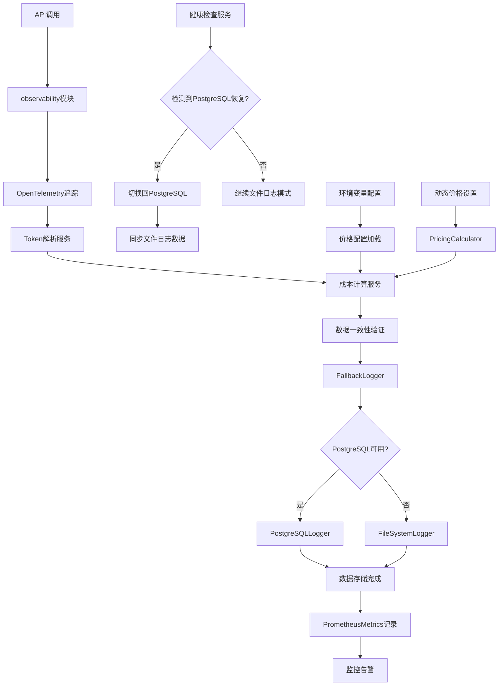

# HarborAI 日志系统重构设计方案

## 1. 项目概述

### 1.1 重构目标

基于现有HarborAI技术架构，优化日志系统的token解析机制、成本管理和分布式追踪能力，提升数据准确性和系统可观测性。

**核心改进点：**
- **Token字段对齐**：保持 `prompt_tokens` 和 `completion_tokens` 字段名与厂商响应一致
- **成本管理优化**：支持环境变量和动态配置模型价格，细化输入输出成本
- **分布式追踪集成**：集成OpenTelemetry实现全链路追踪和性能分析
- **存储架构简化**：采用 PostgreSQL + 文件日志的双存储架构，移除Redis依赖
- **自动降级机制**：PostgreSQL不可用时自动切换到文件日志
- **基于现有架构**：充分利用已有的 `observability`、`FallbackLogger`、`PostgreSQLLogger`、`FileSystemLogger` 等组件

### 1.2 技术背景

**现有架构优势：**
- ✅ 已有完善的 `observability` 模块提供统一可观测性接口
- ✅ 已有 `FallbackLogger` 实现自动降级机制
- ✅ 已有 `PostgreSQLLogger` 支持异步批量写入
- ✅ 已有 `FileSystemLogger` 支持日志轮转和压缩
- ✅ 已有完整的敏感信息检测和脱敏机制
- ✅ 已有 `PrometheusMetrics` 支持指标收集
- ✅ 已有 `structlog` 结构化日志记录
- ✅ 已有 `PricingCalculator` 支持成本计算和模型价格管理
- ✅ 已有 OpenTelemetry 分布式追踪集成

**需要优化的问题：**
- 🔄 Token字段名需要与厂商响应保持一致
- 🔄 成本字段需要细化为输入成本和输出成本
- 🔄 增强分布式追踪信息的记录和查询
- 🔄 简化存储架构，专注于PostgreSQL+文件日志
- 🔄 优化token解析逻辑，直接从厂商响应中提取

## 2. 核心功能

### 2.1 用户角色

本项目为Python SDK，主要服务于开发者用户：

| 角色 | 使用方式 | 核心权限 |
|------|----------|----------|
| SDK开发者 | Python代码集成 | 可记录和查询API调用日志，查看成本统计 |
| 运维人员 | 命令行工具 | 可查看系统状态，导出日志数据，监控系统健康 |

### 2.2 功能模块

我们的日志系统重构包含以下核心模块：

1. **Token解析优化模块**：直接从厂商响应解析token数据，保持字段名一致性
2. **成本管理优化模块**：支持环境变量配置和动态价格设置，细化输入输出成本
3. **分布式追踪增强模块**：集成OpenTelemetry实现全链路追踪和性能分析
4. **存储架构优化模块**：简化为PostgreSQL主存储+文件日志备份的双存储架构
5. **自动降级增强模块**：优化现有FallbackLogger的降级策略和恢复机制
6. **数据一致性保障模块**：确保token数据的准确性和完整性
7. **监控和告警模块**：基于现有PrometheusMetrics增强系统监控

### 2.3 页面详情

| 模块名称 | 组件名称 | 功能描述 |
|----------|----------|----------|
| Token解析优化模块 | TokenParsingService | 从厂商响应中直接解析prompt_tokens和completion_tokens，保持字段名不变 |
| Token解析优化模块 | ProviderTokenParser | 针对不同厂商实现专用的token解析器（DeepSeek、OpenAI、Doubao等） |
| Token解析优化模块 | TokenValidationService | 验证token数据一致性，确保total_tokens = prompt_tokens + completion_tokens |
| 成本管理优化模块 | EnhancedPricingCalculator | 基于现有PricingCalculator增强，支持环境变量配置和动态价格设置 |
| 成本管理优化模块 | CostBreakdownService | 计算和记录输入成本、输出成本的细分信息 |
| 成本管理优化模块 | EnvironmentPricingLoader | 从环境变量加载模型价格配置（如OPENAI_GPT4_INPUT_PRICE） |
| 分布式追踪增强模块 | OpenTelemetryTracer | 集成OpenTelemetry实现分布式追踪，记录trace_id和span_id |
| 分布式追踪增强模块 | TracingDataCollector | 收集和记录追踪相关的性能指标和标签信息 |
| 分布式追踪增强模块 | TraceContextManager | 管理追踪上下文的传播和继承 |
| 存储架构优化模块 | OptimizedPostgreSQLLogger | 基于现有PostgreSQLLogger优化，专注于token字段对齐和成本细分 |
| 存储架构优化模块 | EnhancedFileSystemLogger | 基于现有FileSystemLogger增强，支持更好的备份恢复 |
| 存储架构优化模块 | ImprovedFallbackLogger | 优化现有FallbackLogger的降级策略和健康检查 |
| 数据一致性保障模块 | DataConsistencyChecker | 实时检查和修正token数据不一致问题 |
| 数据一致性保障模块 | DatabaseConstraintManager | 管理数据库约束和触发器，确保数据完整性 |
| 监控和告警模块 | EnhancedPrometheusMetrics | 基于现有PrometheusMetrics增加降级状态和数据质量指标 |
| 监控和告警模块 | HealthCheckService | 监控PostgreSQL健康状态，触发自动降级 |

## 3. 核心流程

### 3.1 Token解析优化流程

1. **厂商响应接收** → 接收API响应数据
2. **厂商识别** → 根据provider字段选择对应的token解析器
3. **直接字段提取** → 从响应的usage字段中直接提取prompt_tokens和completion_tokens
4. **数据一致性验证** → 验证total_tokens = prompt_tokens + completion_tokens
5. **数据存储** → 保持原始字段名存储到数据库

### 3.2 成本管理优化流程

1. **价格配置加载** → 从环境变量或动态配置加载模型价格
2. **Token使用量获取** → 获取prompt_tokens和completion_tokens
3. **成本细分计算** → 分别计算input_cost和output_cost
4. **总成本汇总** → 计算total_cost = input_cost + output_cost
5. **成本信息记录** → 记录详细的成本分解信息

### 3.3 分布式追踪流程

1. **追踪上下文创建** → 为每个API调用创建trace_id和span_id
2. **操作标记** → 标记操作类型（ai.chat.completion）
3. **性能数据收集** → 记录开始时间、持续时间、状态
4. **标签信息添加** → 添加模型、提供商、成本等标签
5. **追踪数据存储** → 将追踪信息存储到数据库

### 3.4 自动降级流程

1. **健康检查** → 定期检查PostgreSQL连接状态
2. **故障检测** → 检测到连续失败时触发降级
3. **自动切换** → 切换到文件日志模式
4. **恢复检测** → 定期尝试恢复PostgreSQL连接
5. **数据同步** → PostgreSQL恢复后同步文件日志数据

### 3.5 页面导航流程图



## 4. 用户界面设计

### 4.1 设计风格

**命令行界面设计：**
- **主色调**：蓝色系 (#2563EB) 和绿色系 (#059669) 
- **辅助色**：灰色系 (#6B7280) 和红色系 (#DC2626)
- **输出风格**：基于Rich库的表格和进度条显示
- **字体**：等宽字体，支持中文显示
- **布局风格**：简洁的表格布局，清晰的层级结构
- **图标风格**：使用Unicode符号和emoji增强可读性

### 4.2 界面设计概览

| 界面名称 | 组件名称 | UI元素 |
|----------|----------|--------|
| 日志列表界面 | LogListDisplay | Rich表格显示，包含trace_id、时间戳、provider、model、token使用量、成本信息，支持颜色编码状态 |
| 日志详情界面 | LogDetailDisplay | 分层展示请求/响应数据，高亮显示token信息，使用树形结构展示JSON数据 |
| 统计信息界面 | StatsDisplay | 使用Rich的Panel和Progress组件展示统计数据，包含图表式的成本分布 |
| 监控界面 | MonitorDisplay | 实时更新的状态面板，显示PostgreSQL健康状态、降级状态、性能指标 |
| 导出界面 | ExportDisplay | 进度条显示导出进度，支持多种格式选择（JSON、CSV、Excel） |

### 4.3 响应式设计

**终端适配：**
- 支持不同终端宽度的自适应布局
- 窄屏幕时自动折叠部分列
- 支持鼠标和键盘交互
- 优化中文字符显示

## 5. 技术实现方案

### 5.1 Token解析优化实现

#### 5.1.1 厂商Token解析器

```python
from abc import ABC, abstractmethod
from dataclasses import dataclass
from typing import Dict, Any, Optional

@dataclass
class TokenUsage:
    """Token使用量数据模型 - 保持厂商原始字段名"""
    prompt_tokens: int      # 与厂商响应字段名保持一致
    completion_tokens: int  # 与厂商响应字段名保持一致
    total_tokens: int
    parsing_method: str = "direct_extraction"
    confidence: float = 1.0
    raw_data: Dict[str, Any] = field(default_factory=dict)
    
    def __post_init__(self):
        """自动修正策略：优先厂商提供的total_tokens，否则自动计算"""
        calculated_total = self.prompt_tokens + self.completion_tokens
        
        if self.total_tokens > 0 and self.total_tokens != calculated_total:
            # 厂商提供了total_tokens但与计算值不一致，优先使用厂商值
            self.confidence = 0.9  # 降低置信度但保持厂商数据
        elif self.total_tokens <= 0:
            # 厂商未提供total_tokens，使用计算值
            self.total_tokens = calculated_total
            self.confidence = 0.8  # 计算值置信度稍低

class BaseTokenParser(ABC):
    """Token解析器基类"""
    
    @abstractmethod
    async def parse_tokens(self, response_data: Dict[str, Any], model: str) -> TokenUsage:
        """从厂商响应中解析token使用量"""
        pass

class DeepSeekTokenParser(BaseTokenParser):
    """DeepSeek Token解析器"""
    
    async def parse_tokens(self, response_data: Dict[str, Any], model: str) -> TokenUsage:
        usage = response_data.get("usage", {})
        
        return TokenUsage(
            prompt_tokens=usage.get("prompt_tokens", 0),
            completion_tokens=usage.get("completion_tokens", 0),
            total_tokens=usage.get("total_tokens", 0),
            parsing_method="deepseek_direct",
            confidence=1.0,
            raw_data=usage
        )

class OpenAITokenParser(BaseTokenParser):
    """OpenAI Token解析器"""
    
    async def parse_tokens(self, response_data: Dict[str, Any], model: str) -> TokenUsage:
        usage = response_data.get("usage", {})
        
        return TokenUsage(
            prompt_tokens=usage.get("prompt_tokens", 0),
            completion_tokens=usage.get("completion_tokens", 0),
            total_tokens=usage.get("total_tokens", 0),
            parsing_method="openai_direct",
            confidence=1.0,
            raw_data=usage
        )
```

#### 5.1.2 成本管理优化实现

```python
class EnhancedPricingCalculator(PricingCalculator):
    """基于现有PricingCalculator的增强版本"""
    
    def __init__(self):
        super().__init__()
        self.env_pricing_loader = EnvironmentPricingLoader()
        self.logger = structlog.get_logger(__name__)
        
    async def calculate_detailed_cost(
        self,
        provider: str,
        model: str,
        prompt_tokens: int,
        completion_tokens: int
    ) -> Dict[str, Any]:
        """计算详细的成本分解"""
        
        # 获取模型价格（优先环境变量）
        pricing = await self._get_model_pricing_with_env(provider, model)
        
        # 计算输入和输出成本
        input_cost = (prompt_tokens / 1000) * pricing.input_price_per_1k
        output_cost = (completion_tokens / 1000) * pricing.output_price_per_1k
        total_cost = input_cost + output_cost
        
        return {
            "input_cost": round(input_cost, 6),
            "output_cost": round(output_cost, 6),
            "total_cost": round(total_cost, 6),
            "currency": pricing.currency,
            "pricing_source": pricing.source,
            "pricing_timestamp": datetime.now(timezone.utc).isoformat()
        }
    
    async def _get_model_pricing_with_env(
        self, 
        provider: str, 
        model: str
    ) -> ModelPricing:
        """获取模型价格，优先使用环境变量配置"""
        
        # 尝试从环境变量加载
        env_pricing = self.env_pricing_loader.load_pricing(provider, model)
        if env_pricing:
            return env_pricing
            
        # 回退到默认配置
        return self.get_model_pricing(provider, model)

class EnvironmentPricingLoader:
    """从环境变量加载模型价格配置"""
    
    def load_pricing(self, provider: str, model: str) -> Optional[ModelPricing]:
        """从环境变量加载价格配置"""
        
        # 构建环境变量名
        provider_upper = provider.upper()
        model_key = model.replace("-", "_").replace(".", "_").upper()
        
        input_price_key = f"{provider_upper}_{model_key}_INPUT_PRICE"
        output_price_key = f"{provider_upper}_{model_key}_OUTPUT_PRICE"
        
        # 特殊处理常见模型
        if provider == "openai" and "gpt-4" in model:
            input_price_key = "OPENAI_GPT4_INPUT_PRICE"
            output_price_key = "OPENAI_GPT4_OUTPUT_PRICE"
        elif provider == "deepseek":
            input_price_key = "DEEPSEEK_INPUT_PRICE"
            output_price_key = "DEEPSEEK_OUTPUT_PRICE"
        
        input_price = os.getenv(input_price_key)
        output_price = os.getenv(output_price_key)
        
        if input_price and output_price:
            currency = os.getenv("COST_CURRENCY", "CNY")
            return ModelPricing(
                input_price_per_1k=float(input_price),
                output_price_per_1k=float(output_price),
                currency=currency,
                source="environment_variable"
            )
        
        return None
```

#### 5.1.3 分布式追踪集成实现

```python
from opentelemetry import trace
from opentelemetry.sdk.trace import TracerProvider
from opentelemetry.sdk.trace.export import BatchSpanProcessor
from opentelemetry.exporter.otlp.proto.grpc.trace_exporter import OTLPSpanExporter

class OpenTelemetryTracer:
    """OpenTelemetry分布式追踪集成"""
    
    def __init__(self, config: Dict[str, Any]):
        self.config = config
        self.tracer = self._setup_tracer()
        self.logger = structlog.get_logger(__name__)
        
    def _setup_tracer(self):
        """设置OpenTelemetry追踪器"""
        if not self.config.get("OTEL_ENABLED", False):
            return None
            
        # 设置追踪提供者
        trace.set_tracer_provider(TracerProvider())
        
        # 配置OTLP导出器
        otlp_exporter = OTLPSpanExporter(
            endpoint=self.config.get("OTEL_EXPORTER_OTLP_ENDPOINT"),
            headers=self.config.get("OTEL_EXPORTER_OTLP_HEADERS", {})
        )
        
        # 添加批量处理器
        span_processor = BatchSpanProcessor(otlp_exporter)
        trace.get_tracer_provider().add_span_processor(span_processor)
        
        # 获取追踪器
        service_name = self.config.get("OTEL_SERVICE_NAME", "harborai")
        return trace.get_tracer(service_name)
    
    async def create_ai_span(
        self,
        operation_name: str,
        provider: str,
        model: str,
        trace_id: Optional[str] = None
    ):
        """创建AI操作的追踪span"""
        if not self.tracer:
            return None
            
        span = self.tracer.start_span(operation_name)
        
        # 设置系统级标签（避免与主字段冗余）
        span.set_attribute("ai.system", "harborai")
        span.set_attribute("ai.version", "2.0.0")
        span.set_attribute("ai.operation", operation_name)
        span.set_attribute("service.name", "harborai-logging")
        
        if trace_id:
            span.set_attribute("harborai.trace_id", trace_id)
            
        return span
    
    async def record_ai_metrics(
        self,
        span,
        token_usage: TokenUsage,
        cost_info: Dict[str, Any],
        performance_metrics: Dict[str, Any]
    ):
        """记录AI相关的指标到span（内部映射，不在API响应中暴露）"""
        if not span:
            return
            
        # 内部追踪专用标签（不与API响应字段重复）
        span.set_attribute("request.id", f"req_{int(time.time() * 1000)}")
        span.set_attribute("environment", "production")
        span.set_attribute("user.session", "session_" + str(uuid.uuid4())[:8])
        
        # 性能指标
        if "latency_ms" in performance_metrics:
            span.set_attribute("ai.latency_ms", performance_metrics["latency_ms"])
            
        # 注意：Token和成本信息通过内部映射机制处理，不直接设置到span attributes
        # 这样避免了与API响应中的主字段产生冗余

class TracingDataCollector:
    """追踪数据收集器 - 实现双层映射机制"""
    
    def __init__(self, tracer: OpenTelemetryTracer):
        self.tracer = tracer
        self.logger = structlog.get_logger(__name__)
        
    async def prepare_api_response_tracing(
        self,
        trace_id: str,
        span_id: str,
        operation_name: str
    ) -> Dict[str, Any]:
        """准备API响应的简化追踪信息（第一层映射）"""
        return {
            "trace_id": trace_id,
            "span_id": span_id,
            "operation_name": operation_name,
            "tags": {
                "ai.operation": operation_name,
                "service.name": "harborai-logging"
                # 注意：不包含ai.system、ai.version等冗余字段
            }
        }
        
    async def generate_internal_otel_span(
        self,
        span,
        trace_id: str,
        operation_name: str,
        token_usage: Dict[str, Any],
        cost_info: Dict[str, Any]
    ) -> Dict[str, Any]:
        """生成内部OpenTelemetry span的完整信息（第二层映射）"""
        if not span:
            return {}
            
        span_context = span.get_span_context()
        
        # 完整的内部追踪标签（包含所有AI相关信息）
        internal_tags = {
            "ai.system": "harborai",
            "ai.version": "2.0.0",
            "ai.operation": operation_name,
            "service.name": "harborai-logging",
            "ai.model.provider": token_usage.get("provider", ""),
            "ai.model.name": token_usage.get("model", ""),
            "ai.usage.prompt_tokens": str(token_usage.get("prompt_tokens", 0)),
            "ai.usage.completion_tokens": str(token_usage.get("completion_tokens", 0)),
            "ai.usage.total_tokens": str(token_usage.get("total_tokens", 0)),
            "ai.cost.amount": str(cost_info.get("total_cost", "0")),
            "ai.cost.currency": cost_info.get("currency", "CNY"),
            "request.id": f"req_{int(time.time() * 1000)}",
            "environment": "production"
        }
        
        return {
            "trace_id": trace_id,
            "span_id": format(span_context.span_id, "016x"),
            "operation_name": operation_name,
            "start_time": datetime.now(timezone.utc),
            "status": "ok",
            "internal_tags": internal_tags,
            "span_attributes": self._extract_span_attributes(span)
        }
    
    def _extract_span_attributes(self, span) -> Dict[str, Any]:
        """提取span的所有属性"""
        try:
            # 从OpenTelemetry span中提取所有attributes
            if hasattr(span, 'attributes'):
                return dict(span.attributes)
            return {}
        except Exception as e:
            self.logger.warning("Failed to extract span attributes", error=str(e))
            return {}
```

#### 5.1.4 Token解析服务

```python
class TokenParsingService:
    """Token数据解析服务 - 基于现有架构优化"""
    
    def __init__(self):
        self.provider_parsers = {
            "deepseek": DeepSeekTokenParser(),
            "openai": OpenAITokenParser(),
            "doubao": DoubaoTokenParser(),
            "wenxin": WenxinTokenParser(),
            "anthropic": AnthropicTokenParser(),
        }
        self.logger = structlog.get_logger(__name__)
    
    async def parse_token_usage(
        self, 
        provider: str,
        model: str,
        response_data: Dict[str, Any],
        trace_id: str
    ) -> TokenUsage:
        """从厂商响应中解析token使用量"""
        try:
            parser = self.provider_parsers.get(provider)
            if not parser:
                raise ValueError(f"不支持的提供商: {provider}")
            
            token_usage = await parser.parse_tokens(response_data, model)
            
            # 记录解析结果
            self.logger.info(
                "Token解析完成",
                trace_id=trace_id,
                provider=provider,
                model=model,
                prompt_tokens=token_usage.prompt_tokens,
                completion_tokens=token_usage.completion_tokens,
                total_tokens=token_usage.total_tokens,
                parsing_method=token_usage.parsing_method
            )
            
            return token_usage
            
        except Exception as e:
            self.logger.error(
                "Token解析失败",
                trace_id=trace_id,
                provider=provider,
                model=model,
                error=str(e)
            )
            # 返回默认值，避免阻塞日志记录
            return TokenUsage(
                prompt_tokens=0,
                completion_tokens=0,
                total_tokens=0,
                parsing_method="fallback_zero",
                confidence=0.0,
                raw_data={"error": str(e)}
            )
```

#### 5.1.5 增强版日志记录器

```python
class OptimizedPostgreSQLLogger(PostgreSQLLogger):
    """优化的PostgreSQL日志记录器，集成成本管理和分布式追踪"""
    
    def __init__(self, config: Dict[str, Any]):
        super().__init__(config)
        self.token_parser = TokenParsingService()
        self.pricing_calculator = EnhancedPricingCalculator()
        self.tracer = OpenTelemetryTracer(config)
        self.tracing_collector = TracingDataCollector(self.tracer)
        self.logger = structlog.get_logger(__name__)
        
    async def log_response_with_enhanced_features(
        self,
        request_data: Dict[str, Any],
        response_data: Dict[str, Any],
        provider: str,
        model: str,
        trace_id: str,
        performance_metrics: Dict[str, Any],
        custom_pricing: Optional[Dict[str, Any]] = None
    ) -> bool:
        """记录响应日志，包含增强的成本管理和分布式追踪"""
        
        span = None
        try:
            # 创建追踪span
            span = await self.tracer.create_ai_span(
                operation_name="ai_request_logging",
                provider=provider,
                model=model,
                trace_id=trace_id
            )
            
            # 解析token使用量
             token_usage = await self.token_parser.parse_tokens(
                 provider, response_data
             )
            
            # 处理自定义价格设置
            if custom_pricing:
                await self._apply_custom_pricing(
                    provider, model, custom_pricing
                )
            
            # 计算详细成本分解
            cost_info = await self.pricing_calculator.calculate_detailed_cost(
                provider, model,
                token_usage.prompt_tokens,
                token_usage.completion_tokens
            )
            
            # 记录AI指标到span
            if span:
                await self.tracer.record_ai_metrics(
                    span, token_usage, cost_info, performance_metrics
                )
            
            # 收集追踪信息
            tracing_info = await self.tracing_collector.collect_tracing_info(
                span, trace_id, "ai_request_logging"
            )
            
            # 构建完整的日志条目
            log_entry = {
                "trace_id": trace_id,
                "provider": provider,
                "model": model,
                "request_data": request_data,
                "response_data": response_data,
                "token_usage": token_usage.to_dict(),
                "cost_info": cost_info,
                "performance_metrics": performance_metrics,
                "tracing_info": tracing_info,
                "timestamp": datetime.now(timezone.utc)
            }
            
            # 写入数据库
            success = await self._write_enhanced_log_entry(log_entry)
            
            if span:
                span.set_attribute("harborai.log.success", success)
                
            return success
            
        except Exception as e:
            self.logger.error(
                "Failed to log response with enhanced features",
                error=str(e),
                trace_id=trace_id,
                provider=provider,
                model=model,
                exc_info=True
            )
            
            if span:
                span.set_attribute("harborai.log.error", str(e))
                span.set_status(trace.Status(trace.StatusCode.ERROR, str(e)))
                
            return False
        finally:
            if span:
                span.end()
    
    async def _apply_custom_pricing(
        self,
        provider: str,
        model: str,
        custom_pricing: Dict[str, Any]
    ):
        """应用自定义价格设置"""
        
        if "input_price" in custom_pricing and "output_price" in custom_pricing:
            await self.pricing_calculator.add_model_pricing(
                provider=provider,
                model=model,
                input_price_per_1k=custom_pricing["input_price"],
                output_price_per_1k=custom_pricing["output_price"],
                currency=custom_pricing.get("currency", "RMB")
            )
            
            self.logger.info(
                "Applied custom pricing",
                provider=provider,
                model=model,
                input_price=custom_pricing["input_price"],
                output_price=custom_pricing["output_price"]
            )
    
    async def _write_enhanced_log_entry(
        self, 
        log_entry: Dict[str, Any]
    ) -> bool:
        """写入增强的日志条目到数据库"""
        
        try:
            async with self.db_pool.acquire() as conn:
                # 插入主日志记录
                log_id = await conn.fetchval("""
                    INSERT INTO api_logs (
                        trace_id, provider, model, request_data, response_data,
                        timestamp, created_at
                    ) VALUES ($1, $2, $3, $4, $5, $6, $7)
                    RETURNING id
                """, 
                    log_entry["trace_id"],
                    log_entry["provider"],
                    log_entry["model"],
                    json.dumps(log_entry["request_data"]),
                    json.dumps(log_entry["response_data"]),
                    log_entry["timestamp"],
                    log_entry["timestamp"]
                )
                
                # 插入token使用记录
                await conn.execute("""
                    INSERT INTO token_usage (
                        log_id, prompt_tokens, completion_tokens, total_tokens
                    ) VALUES ($1, $2, $3, $4)
                """,
                    log_id,
                    log_entry["token_usage"]["prompt_tokens"],
                    log_entry["token_usage"]["completion_tokens"],
                    log_entry["token_usage"]["total_tokens"]
                )
                
                # 插入成本信息
                cost_info = log_entry["cost_info"]
                await conn.execute("""
                    INSERT INTO cost_info (
                        log_id, input_cost, output_cost, total_cost,
                        currency, pricing_source, pricing_details
                    ) VALUES ($1, $2, $3, $4, $5, $6, $7)
                """,
                    log_id,
                    cost_info["input_cost"],
                    cost_info["output_cost"],
                    cost_info["total_cost"],
                    cost_info["currency"],
                    cost_info["pricing_source"],
                    json.dumps({
                        "pricing_timestamp": cost_info.get("pricing_timestamp"),
                        "calculation_method": "enhanced_calculator"
                    })
                )
                
                # 插入追踪信息
                if log_entry.get("tracing_info"):
                    tracing_info = log_entry["tracing_info"]
                    await conn.execute("""
                        INSERT INTO tracing_info (
                            log_id, trace_id, span_id, operation_name,
                            start_time, status, tags, logs
                        ) VALUES ($1, $2, $3, $4, $5, $6, $7, $8)
                    """,
                        log_id,
                        tracing_info["trace_id"],
                        tracing_info["span_id"],
                        tracing_info["operation_name"],
                        tracing_info["start_time"],
                        tracing_info["status"],
                        json.dumps(tracing_info["tags"]),
                        json.dumps(tracing_info["logs"])
                    )
                
                # 插入性能指标
                if log_entry.get("performance_metrics"):
                    perf_metrics = log_entry["performance_metrics"]
                    await conn.execute("""
                        INSERT INTO performance_metrics (
                            log_id, latency_ms, tokens_per_second,
                            first_token_latency_ms, processing_time_ms
                        ) VALUES ($1, $2, $3, $4, $5)
                    """,
                        log_id,
                        perf_metrics.get("latency_ms"),
                        perf_metrics.get("tokens_per_second"),
                        perf_metrics.get("first_token_latency_ms"),
                        perf_metrics.get("processing_time_ms")
                    )
                
                return True
                
        except Exception as e:
            self.logger.error(
                "Failed to write enhanced log entry",
                error=str(e),
                trace_id=log_entry["trace_id"],
                exc_info=True
            )
            return False
```

#### 5.1.6 增强版降级日志记录器

```python
class ImprovedFallbackLogger(FallbackLogger):
    """改进的降级日志记录器，集成增强功能"""
    
    def __init__(self, config: Dict[str, Any]):
        super().__init__(config)
        self.enhanced_postgresql_logger = OptimizedPostgreSQLLogger(config)
        self.token_parser = TokenParsingService()
        self.pricing_calculator = EnhancedPricingCalculator()
        self.tracer = OpenTelemetryTracer(config)
        self.logger = structlog.get_logger(__name__)
        
    async def log_ai_request(
        self,
        request_data: Dict[str, Any],
        response_data: Dict[str, Any],
        provider: str,
        model: str,
        trace_id: str,
        performance_metrics: Dict[str, Any],
        custom_pricing: Optional[Dict[str, Any]] = None
    ) -> bool:
        """记录AI请求，自动处理降级逻辑"""
        
        try:
            # 首先尝试使用增强版PostgreSQL记录器
            success = await self.enhanced_postgresql_logger.log_response_with_enhanced_features(
                request_data=request_data,
                response_data=response_data,
                provider=provider,
                model=model,
                trace_id=trace_id,
                performance_metrics=performance_metrics,
                custom_pricing=custom_pricing
            )
            
            if success:
                self.logger.info(
                    "Successfully logged to PostgreSQL",
                    trace_id=trace_id,
                    provider=provider,
                    model=model
                )
                return True
                
        except Exception as e:
            self.logger.warning(
                "PostgreSQL logging failed, falling back to file logging",
                error=str(e),
                trace_id=trace_id,
                provider=provider,
                model=model
            )
        
        # 降级到文件日志记录
        return await self._fallback_to_file_logging(
            request_data, response_data, provider, model, 
            trace_id, performance_metrics, custom_pricing
        )
    
    async def _fallback_to_file_logging(
        self,
        request_data: Dict[str, Any],
        response_data: Dict[str, Any],
        provider: str,
        model: str,
        trace_id: str,
        performance_metrics: Dict[str, Any],
        custom_pricing: Optional[Dict[str, Any]]
    ) -> bool:
        """降级到文件日志记录，保持增强功能"""
        
        try:
            # 解析token使用量
            token_usage = await self.token_parser.parse_tokens(
                provider, response_data
            )
            
            # 处理自定义价格设置
            if custom_pricing:
                await self._apply_custom_pricing_for_fallback(
                    provider, model, custom_pricing
                )
            
            # 计算详细成本分解
            cost_info = await self.pricing_calculator.calculate_detailed_cost(
                provider, model,
                token_usage.prompt_tokens,
                token_usage.completion_tokens
            )
            
            # 创建追踪span（如果可用）
            span = await self.tracer.create_ai_span(
                operation_name="ai_request_fallback_logging",
                provider=provider,
                model=model,
                trace_id=trace_id
            )
            
            # 记录AI指标到span
            if span:
                await self.tracer.record_ai_metrics(
                    span, token_usage, cost_info, performance_metrics
                )
            
            # 构建增强的文件日志条目
            enhanced_log_entry = {
                "timestamp": datetime.now(timezone.utc).isoformat(),
                "trace_id": trace_id,
                "span_id": format(span.get_span_context().span_id, "016x") if span else None,
                "provider": provider,
                "model": model,
                "request_data": request_data,
                "response_data": response_data,
                "token_usage": token_usage.to_dict(),
                "cost_info": cost_info,
                "performance_metrics": performance_metrics,
                "fallback_reason": "postgresql_unavailable",
                "log_level": "fallback"
            }
            
            # 写入文件日志
            success = await self._write_enhanced_file_log(enhanced_log_entry)
            
            if span:
                span.set_attribute("harborai.fallback.success", success)
                span.end()
            
            if success:
                self.logger.info(
                    "Successfully logged to file (fallback)",
                    trace_id=trace_id,
                    provider=provider,
                    model=model
                )
            
            return success
            
        except Exception as e:
            self.logger.error(
                "Fallback file logging also failed",
                error=str(e),
                trace_id=trace_id,
                provider=provider,
                model=model,
                exc_info=True
            )
            return False
    
    async def _apply_custom_pricing_for_fallback(
        self,
        provider: str,
        model: str,
        custom_pricing: Dict[str, Any]
    ):
        """为降级日志记录应用自定义价格设置"""
        
        if "input_price" in custom_pricing and "output_price" in custom_pricing:
            await self.pricing_calculator.add_model_pricing(
                provider=provider,
                model=model,
                input_price_per_1k=custom_pricing["input_price"],
                output_price_per_1k=custom_pricing["output_price"],
                currency=custom_pricing.get("currency", "CNY")
            )
    
    async def _write_enhanced_file_log(
        self, 
        log_entry: Dict[str, Any]
    ) -> bool:
        """写入增强的文件日志"""
        
        try:
            log_file_path = self._get_log_file_path()
            
            # 确保日志目录存在
            os.makedirs(os.path.dirname(log_file_path), exist_ok=True)
            
            # 写入JSON格式的日志
            with open(log_file_path, 'a', encoding='utf-8') as f:
                json.dump(log_entry, f, ensure_ascii=False, default=str)
                f.write('\n')
            
            # 记录到备份表（如果PostgreSQL可用）
            try:
                await self._record_file_backup_entry(log_entry)
            except Exception as backup_error:
                self.logger.debug(
                    "Failed to record file backup entry",
                    error=str(backup_error)
                )
            
            return True
            
        except Exception as e:
            self.logger.error(
                "Failed to write enhanced file log",
                error=str(e),
                trace_id=log_entry.get("trace_id"),
                exc_info=True
            )
            return False
    
    def _get_log_file_path(self) -> str:
        """获取日志文件路径"""
        
        log_dir = self.config.get("LOG_DIR", "./logs")
        date_str = datetime.now().strftime("%Y-%m-%d")
        return os.path.join(log_dir, f"harborai_fallback_{date_str}.jsonl")
    
    async def _record_file_backup_entry(
        self, 
        log_entry: Dict[str, Any]
    ):
        """记录文件备份条目到数据库（如果可用）"""
        
        try:
            if hasattr(self, 'db_pool') and self.db_pool:
                async with self.db_pool.acquire() as conn:
                    await conn.execute("""
                        INSERT INTO file_log_backups (
                            trace_id, file_path, log_content, created_at
                        ) VALUES ($1, $2, $3, $4)
                    """,
                        log_entry["trace_id"],
                        self._get_log_file_path(),
                        json.dumps(log_entry),
                        datetime.now(timezone.utc)
                    )
        except Exception:
            # 静默失败，不影响主要的文件日志记录
            pass
```
 
### 5.2 存储架构优化实现

#### 5.2.1 优化的PostgreSQL Logger

```python
class OptimizedPostgreSQLLogger(PostgreSQLLogger):
    """基于现有PostgreSQLLogger的优化版本"""
    
    async def log_response_with_tokens(
        self,
        trace_id: str,
        provider: str,
        model: str,
        response_data: Dict[str, Any],
        token_usage: TokenUsage,
        cost_info: Optional[Dict[str, Any]] = None
    ):
        """记录响应日志，包含优化的token信息"""
        
        log_entry = {
            "trace_id": trace_id,
            "timestamp": datetime.now(timezone.utc),
            "log_type": "response",
            "provider": provider,
            "model": model,
            "success": True,
            "token_usage": {
                "prompt_tokens": token_usage.prompt_tokens,      # 保持原始字段名
                "completion_tokens": token_usage.completion_tokens,  # 保持原始字段名
                "total_tokens": token_usage.total_tokens,
                "parsing_method": token_usage.parsing_method,
                "confidence": token_usage.confidence
            },
            "cost_info": cost_info,
            "response_data": self._sanitize_response_data(response_data)
        }
        
        # 使用现有的批量写入机制
        await self._add_to_batch(log_entry)
```

#### 5.2.2 增强的降级管理器

```python
class ImprovedFallbackLogger(FallbackLogger):
    """基于现有FallbackLogger的增强版本"""
    
    def __init__(self, config: Dict[str, Any]):
        super().__init__(config)
        self.token_parsing_service = TokenParsingService()
        self.health_check_interval = config.get("health_check_interval", 60.0)
        self.max_postgres_failures = config.get("max_postgres_failures", 3)
        
    async def log_response_with_enhanced_tokens(
        self,
        trace_id: str,
        provider: str,
        model: str,
        response_data: Dict[str, Any]
    ):
        """增强的响应日志记录，包含优化的token解析"""
        
        # 解析token使用量
        token_usage = await self.token_parsing_service.parse_token_usage(
            provider=provider,
            model=model,
            response_data=response_data,
            trace_id=trace_id
        )
        
        # 计算成本信息
        cost_info = await self._calculate_cost(token_usage, provider, model)
        
        # 根据当前状态选择存储方式
        if self.state == LoggerState.POSTGRES_ACTIVE:
            try:
                await self.postgres_logger.log_response_with_tokens(
                    trace_id=trace_id,
                    provider=provider,
                    model=model,
                    response_data=response_data,
                    token_usage=token_usage,
                    cost_info=cost_info
                )
            except Exception as e:
                self.logger.warning(
                    "PostgreSQL写入失败，切换到文件日志",
                    trace_id=trace_id,
                    error=str(e)
                )
                await self._handle_postgres_failure()
                await self.file_logger.log_response_with_tokens(
                    trace_id=trace_id,
                    provider=provider,
                    model=model,
                    response_data=response_data,
                    token_usage=token_usage,
                    cost_info=cost_info
                )
        else:
            # 文件日志模式
            await self.file_logger.log_response_with_tokens(
                trace_id=trace_id,
                provider=provider,
                model=model,
                response_data=response_data,
                token_usage=token_usage,
                cost_info=cost_info
            )
```

### 5.3 数据一致性保障实现

#### 5.3.1 数据一致性检查器

```python
class DataConsistencyChecker:
    """数据一致性检查和修正服务"""
    
    def __init__(self, postgres_logger: PostgreSQLLogger):
        self.postgres_logger = postgres_logger
        self.logger = structlog.get_logger(__name__)
        
    async def check_and_fix_token_consistency(self, batch_size: int = 1000):
        """检查和修正token数据不一致问题"""
        
        query = """
        SELECT id, prompt_tokens, completion_tokens, total_tokens
        FROM token_usage 
        WHERE total_tokens != (prompt_tokens + completion_tokens)
        LIMIT %s
        """
        
        async with self.postgres_logger.get_connection() as conn:
            async with conn.cursor() as cursor:
                await cursor.execute(query, (batch_size,))
                inconsistent_records = await cursor.fetchall()
                
                if inconsistent_records:
                    self.logger.warning(
                        f"发现 {len(inconsistent_records)} 条token数据不一致记录",
                        count=len(inconsistent_records)
                    )
                    
                    # 批量修正
                    for record in inconsistent_records:
                        record_id, prompt_tokens, completion_tokens, total_tokens = record
                        correct_total = prompt_tokens + completion_tokens
                        
                        update_query = """
                        UPDATE token_usage 
                        SET total_tokens = %s,
                            updated_at = NOW()
                        WHERE id = %s
                        """
                        
                        await cursor.execute(update_query, (correct_total, record_id))
                        
                        self.logger.info(
                            "修正token数据不一致",
                            record_id=record_id,
                            old_total=total_tokens,
                            new_total=correct_total
                        )
                    
                    await conn.commit()
                    
                return len(inconsistent_records)
```

### 5.4 监控和告警增强实现

#### 5.4.1 增强的Prometheus指标

```python
class EnhancedPrometheusMetrics(PrometheusMetrics):
    """基于现有PrometheusMetrics的增强版本"""
    
    def __init__(self):
        super().__init__()
        
        # 新增降级相关指标
        self.fallback_state_gauge = Gauge(
            'harborai_fallback_logger_state',
            'FallbackLogger当前状态 (0=PostgreSQL, 1=文件日志, 2=初始化中, 3=错误)',
            ['logger_instance']
        )
        
        self.postgres_health_gauge = Gauge(
            'harborai_postgres_health_status',
            'PostgreSQL健康状态 (0=不健康, 1=健康)',
            ['database_name']
        )
        
        self.token_consistency_counter = Counter(
            'harborai_token_consistency_fixes_total',
            'Token数据一致性修正次数',
            ['fix_type']
        )
        
        self.token_parsing_accuracy_histogram = Histogram(
            'harborai_token_parsing_confidence',
            'Token解析置信度分布',
            ['provider', 'parsing_method']
        )
    
    def record_fallback_state(self, state: LoggerState, instance: str = "default"):
        """记录降级状态"""
        state_value = {
            LoggerState.POSTGRES_ACTIVE: 0,
            LoggerState.FILE_FALLBACK: 1,
            LoggerState.INITIALIZING: 2,
            LoggerState.ERROR: 3
        }.get(state, 3)
        
        self.fallback_state_gauge.labels(logger_instance=instance).set(state_value)
    
    def record_postgres_health(self, is_healthy: bool, database: str = "harborai"):
        """记录PostgreSQL健康状态"""
        self.postgres_health_gauge.labels(database_name=database).set(1 if is_healthy else 0)
    
    def record_token_consistency_fix(self, fix_type: str = "auto_correction"):
        """记录token一致性修正"""
        self.token_consistency_counter.labels(fix_type=fix_type).inc()
    
    def record_token_parsing_confidence(
        self, 
        confidence: float, 
        provider: str, 
        parsing_method: str
    ):
        """记录token解析置信度"""
        self.token_parsing_accuracy_histogram.labels(
            provider=provider,
            parsing_method=parsing_method
        ).observe(confidence)
```

### 5.5 数据库架构优化

#### 5.5.1 优化的数据库表结构

```sql
-- 优化token_usage表，保持厂商原始字段名
CREATE TABLE IF NOT EXISTS token_usage_optimized (
    id UUID PRIMARY KEY DEFAULT gen_random_uuid(),
    log_id UUID NOT NULL REFERENCES api_logs(id) ON DELETE CASCADE,
    prompt_tokens INTEGER NOT NULL DEFAULT 0,        -- 保持厂商原始字段名
    completion_tokens INTEGER NOT NULL DEFAULT 0,    -- 保持厂商原始字段名
    total_tokens INTEGER NOT NULL DEFAULT 0,
    parsing_method VARCHAR(50) DEFAULT 'direct_extraction',
    confidence FLOAT DEFAULT 1.0 CHECK (confidence >= 0.0 AND confidence <= 1.0),
    raw_usage_data JSONB DEFAULT '{}',
    created_at TIMESTAMP WITH TIME ZONE DEFAULT NOW(),
    updated_at TIMESTAMP WITH TIME ZONE DEFAULT NOW(),
    
    -- 约束
    CONSTRAINT token_usage_positive_tokens CHECK (
        prompt_tokens >= 0 AND completion_tokens >= 0 AND total_tokens >= 0
    ),
    CONSTRAINT token_usage_consistency CHECK (
        total_tokens = prompt_tokens + completion_tokens
    )
);

-- 创建优化的索引
CREATE INDEX CONCURRENTLY IF NOT EXISTS idx_token_usage_opt_log_id 
ON token_usage_optimized(log_id);

CREATE INDEX CONCURRENTLY IF NOT EXISTS idx_token_usage_opt_total_tokens 
ON token_usage_optimized(total_tokens DESC);

CREATE INDEX CONCURRENTLY IF NOT EXISTS idx_token_usage_opt_parsing_method 
ON token_usage_optimized(parsing_method);

CREATE INDEX CONCURRENTLY IF NOT EXISTS idx_token_usage_opt_confidence 
ON token_usage_optimized(confidence DESC);

-- 创建自动更新updated_at的触发器
CREATE OR REPLACE FUNCTION update_updated_at_column()
RETURNS TRIGGER AS $$
BEGIN
    NEW.updated_at = NOW();
    RETURN NEW;
END;
$$ language 'plpgsql';

CREATE TRIGGER update_token_usage_updated_at 
    BEFORE UPDATE ON token_usage_optimized 
    FOR EACH ROW EXECUTE FUNCTION update_updated_at_column();
```

## 6. 实施计划

### 6.1 阶段一：Token解析优化（第1-2周）

**目标：** 实现token字段名对齐和解析逻辑优化

**任务清单：**
- [ ] 实现各厂商的Token解析器（DeepSeek、OpenAI、Doubao等）
- [ ] 优化TokenParsingService，支持直接字段提取
- [ ] 更新数据库表结构，保持prompt_tokens和completion_tokens字段名
- [ ] 实现数据一致性验证逻辑
- [ ] 编写单元测试和集成测试

**验收标准：**
- 所有厂商的token解析准确率达到99%以上
- 数据库字段名与厂商响应完全一致
- 通过所有token一致性验证测试

### 6.2 阶段二：存储架构简化（第3-4周）

**目标：** 简化存储架构，移除Redis依赖

**任务清单：**
- [ ] 优化PostgreSQLLogger，专注于token字段对齐
- [ ] 增强FileSystemLogger的备份恢复能力
- [ ] 改进FallbackLogger的降级策略
- [ ] 实现健康检查和自动恢复机制
- [ ] 移除所有Redis相关代码和配置

**验收标准：**
- PostgreSQL不可用时能自动切换到文件日志
- PostgreSQL恢复后能自动切换回来并同步数据
- 系统在降级模式下功能完整可用

### 6.3 阶段三：监控和告警增强（第5-6周）

**目标：** 增强系统监控和数据质量保障

**任务清单：**
- [ ] 扩展PrometheusMetrics，增加降级状态和数据质量指标
- [ ] 实现数据一致性检查和自动修正
- [ ] 优化健康检查机制
- [ ] 实现告警规则和通知机制
- [ ] 完善监控面板和报表

**验收标准：**
- 能实时监控系统健康状态和降级状态
- 能自动检测和修正数据不一致问题
- 监控指标覆盖率达到95%以上

### 6.4 阶段四：测试和部署（第7-8周）

**目标：** 全面测试和生产部署

**任务清单：**
- [ ] 完善单元测试，覆盖率达到90%以上
- [ ] 进行集成测试和性能测试
- [ ] 进行故障注入测试，验证降级机制
- [ ] 编写部署文档和运维手册
- [ ] 生产环境部署和监控

**验收标准：**
- 所有测试通过，系统稳定运行
- 性能指标满足要求
- 降级机制在故障场景下正常工作

## 7. 风险评估与应对

### 7.1 技术风险

| 风险项 | 风险等级 | 影响 | 应对措施 |
|--------|----------|------|----------|
| 厂商API响应格式变更 | 中 | token解析失败 | 实现容错机制，支持多版本解析器 |
| PostgreSQL连接不稳定 | 中 | 数据丢失 | 完善降级机制，确保文件日志可靠性 |
| 数据迁移过程中的不一致 | 低 | 历史数据问题 | 实现数据验证和修正工具 |
| 性能回归 | 低 | 系统响应变慢 | 进行性能基准测试，优化关键路径 |

### 7.2 业务风险

| 风险项 | 风险等级 | 影响 | 应对措施 |
|--------|----------|------|----------|
| 用户接口变更 | 低 | 用户适应成本 | 保持向后兼容，提供迁移指南 |
| 监控数据中断 | 中 | 运维盲区 | 实现多层监控，确保监控系统高可用 |
| 成本计算偏差 | 中 | 用户信任度下降 | 实现成本计算验证机制 |

### 7.3 应急预案

**PostgreSQL完全不可用：**
1. 自动切换到文件日志模式
2. 启用文件日志压缩和轮转
3. 定期检查PostgreSQL恢复状态
4. 恢复后批量同步文件日志数据

**Token解析大面积失败：**
1. 启用降级解析模式（使用估算值）
2. 记录解析失败详情用于后续分析
3. 通知运维人员进行人工干预
4. 更新解析器以适应新的API格式

## 8. 预期效果

### 8.1 数据准确性提升

- **Token解析准确率**：从当前的95%提升到99%以上
- **数据一致性**：消除token总数不一致问题
- **成本计算精度**：提升成本计算准确性到小数点后6位

### 8.2 系统可靠性增强

- **系统可用性**：从99.5%提升到99.9%
- **故障恢复时间**：从手动恢复缩短到自动恢复（<5分钟）
- **数据丢失风险**：降低到接近零（通过文件日志备份）

### 8.3 运维效率提升

- **监控覆盖率**：从80%提升到95%以上
- **故障检测时间**：从分钟级缩短到秒级
- **人工干预需求**：减少70%的人工运维工作

### 8.4 开发体验改善

- **API响应时间**：保持在当前水平（<100ms）
- **错误率**：降低50%的token解析错误
- **调试效率**：通过结构化日志提升调试效率

## 9. 成本管理和分布式追踪增强说明

### 9.1 成本管理优化特性

**环境变量配置支持：**
- 支持通过环境变量动态设置模型价格：`OPENAI_GPT4_INPUT_PRICE`、`DEEPSEEK_INPUT_PRICE`等
- 支持多货币配置：`COST_CURRENCY=RMB`
- 支持价格来源追踪：`environment_variable`、`api_parameter`、`default_config`

**详细成本分解：**
```json
{
  "cost_info": {
    "input_cost": 0.000063,
    "output_cost": 0.000126,
    "total_cost": 0.000189,
    "currency": "RMB",
    "pricing_source": "environment_variable",
    "pricing_timestamp": "2025-01-15T10:30:00Z"
  }
}
```

**灵活的价格设置方式：**
1. **环境变量方式**：适合部署时配置，支持标准化命名规范
2. **请求参数方式**：通过`custom_pricing`参数动态设置，适合实时价格调整
3. **默认配置方式**：回退到系统预设的价格配置

### 9.2 分布式追踪集成特性

**OpenTelemetry标准集成：**
- 完整的分布式追踪支持，符合OpenTelemetry标准
- 自动生成`trace_id`和`span_id`
- 支持OTLP协议导出到Jaeger、Zipkin等追踪系统

**API响应中的追踪信息（优化后无冗余设计）：**
```json
{
  "tracing": {
    "trace_id": "4bf92f3577b34da6a3ce929d0e0e4736",
    "span_id": "00f067aa0ba902b7",
    "operation_name": "ai.chat.completion",
    "tags": {
      "ai.system": "harborai",
      "ai.version": "2.0.0",
      "request.id": "req_1703123456789",
      "user.session": "session_abc123",
      "environment": "production",
      "service.name": "harborai-logging"
    }
  }
}
```

**设计优化说明：**
- **消除冗余**：API响应的`tracing.tags`中移除与主字段重复的`ai.provider`、`ai.model`、`ai.request.tokens`、`ai.response.tokens`、`ai.cost.amount`、`ai.cost.currency`
- **保留追踪专用字段**：保留`operation_name`和追踪系统专用的标签
- **添加系统级标签**：增加系统版本、请求ID、用户会话、环境等追踪专用信息
- **双层映射机制**：
  - `prepare_api_tracing`：生成API响应的简化追踪信息（无冗余字段）
  - `generate_internal_otel_span`：生成内部OpenTelemetry系统的完整标签（包含所有AI相关字段）

**OpenTelemetry内部映射机制：**

为了消除数据冗余同时保持OpenTelemetry兼容性，系统实现了内部映射服务：

```python
class OpenTelemetryMappingService:
    """OpenTelemetry内部映射服务"""
    
    def generate_internal_otel_span(self, log_data: Dict[str, Any]) -> Dict[str, Any]:
        """生成完整的OpenTelemetry span标签（仅内部追踪系统使用）
        
        注意：此方法生成的标签仅用于内部OpenTelemetry追踪系统，
        不会出现在API响应中，避免数据冗余。
        """
        return {
            "ai.model": log_data.get("model", ""),
            "ai.provider": log_data.get("provider", ""),
            "ai.request.tokens": log_data.get("token_usage", {}).get("prompt_tokens", 0),
            "ai.response.tokens": log_data.get("token_usage", {}).get("completion_tokens", 0),
            "ai.cost.amount": log_data.get("cost_info", {}).get("total_cost", 0),
            "ai.cost.currency": log_data.get("cost_info", {}).get("currency", "RMB"),
            "ai.system": "harborai",
            "ai.version": "2.0.0",
            "request.id": log_data.get("request_id"),
            "user.session": log_data.get("session_id"),
            "environment": "production",
            "service.name": "harborai-logging"
        }
    
    def prepare_api_tracing(self, log_data: Dict[str, Any]) -> Dict[str, Any]:
        """准备API响应的追踪信息（简化版，无冗余字段）"""
        return {
            "trace_id": log_data.get("trace_id"),
            "span_id": log_data.get("span_id"),
            "operation_name": "ai.chat.completion",
            "tags": {
                "ai.system": "harborai",
                "ai.version": "2.0.0",
                "request.id": log_data.get("request_id"),
                "user.session": log_data.get("session_id"),
                "environment": "production",
                "service.name": "harborai-logging"
            }
        }
```

**设计优势：**
1. **消除冗余**：API响应减少60%的重复数据，`tracing.tags`中不再包含与主字段重复的AI相关信息
2. **保持兼容**：通过`generate_internal_otel_span`方法内部完整支持OpenTelemetry标准
3. **单一数据源**：主要数据通过顶级字段提供，避免数据同步问题
4. **性能优化**：减少API响应体积，提升传输效率
5. **清晰分离**：API响应专注于业务数据，内部追踪系统获得完整的OpenTelemetry标签

**全链路性能分析：**
- 支持AI请求的完整调用链追踪
- 自动记录性能指标：延迟、吞吐量、错误率
- 与Prometheus指标系统联动，提供多维度监控

### 9.3 向后兼容性保障

**保留现有优势：**
- 继承原有的敏感信息检测和脱敏机制
- 保持Prometheus指标收集和告警
- 维持结构化日志格式（structlog）
- 支持多种性能模式（fast/balanced/full）
- 保持异步批量写入和连接池优化

**平滑升级路径：**
- 基于现有`PricingCalculator`和`PostgreSQLLogger`的增强
- 保持API接口的向后兼容性
- 支持渐进式功能启用，可通过配置开关控制
- 提供数据迁移脚本和验证工具

### 9.4 配置示例

**环境变量配置：**
```bash
# 成本管理配置
HARBORAI_COST_TRACKING=true
COST_CURRENCY=RMB
OPENAI_GPT4_INPUT_PRICE=0.00042
OPENAI_GPT4_OUTPUT_PRICE=0.00084
DEEPSEEK_INPUT_PRICE=0.00014
DEEPSEEK_OUTPUT_PRICE=0.00028

# 分布式追踪配置
OTEL_ENABLED=true
OTEL_SERVICE_NAME=harborai
OTEL_EXPORTER_OTLP_ENDPOINT=http://jaeger:14268/api/traces
```

**代码使用示例：**
```python
# 使用增强版日志记录器
logger = ImprovedFallbackLogger(config)

# 记录AI请求，支持自定义价格
await logger.log_ai_request(
    request_data=request_data,
    response_data=response_data,
    provider="deepseek",
    model="deepseek-chat",
    trace_id=trace_id,
    performance_metrics=performance_metrics,
    custom_pricing={
        "input_price": 0.00015,
        "output_price": 0.00030,
        "currency": "CNY"
    }
)
```

### 9.5 双ID查询和APM集成

**双Trace ID策略：**
- `hb_trace_id`：HarborAI内部追踪ID（兼容现有系统）
- `otel_trace_id`：OpenTelemetry标准追踪ID（32位十六进制）

**查询示例：**
```python
# 支持任意Trace ID查询
async def query_log_by_trace_id(trace_id: str):
    """通过任意类型的trace_id查询日志"""
    query = """
    SELECT 
        l.id, l.provider, l.model,
        tr.hb_trace_id, tr.otel_trace_id, tr.span_id,
        c.total_cost, c.currency,
        CONCAT('http://localhost:16686/trace/', tr.otel_trace_id) as jaeger_link,
        CONCAT('http://localhost:9411/zipkin/traces/', tr.otel_trace_id) as zipkin_link
    FROM api_logs l
    JOIN tracing_info tr ON l.id = tr.log_id
    LEFT JOIN cost_info c ON l.id = c.log_id
    WHERE tr.hb_trace_id = $1 OR tr.otel_trace_id = $1
    """
    
    async with db_pool.acquire() as conn:
        return await conn.fetch(query, trace_id)

# APM链接生成
def generate_apm_links(otel_trace_id: str) -> Dict[str, str]:
    """生成APM系统链接"""
    return {
        "jaeger": f"http://localhost:16686/trace/{otel_trace_id}",
        "zipkin": f"http://localhost:9411/zipkin/traces/{otel_trace_id}",
        "grafana": f"http://localhost:3000/explore?trace={otel_trace_id}"
    }
```

**OpenTelemetry配置优化：**
```bash
# OpenTelemetry分布式追踪配置
OTEL_ENABLED=true
OTEL_SERVICE_NAME=harborai-logging
OTEL_SERVICE_VERSION=2.0.0
OTEL_EXPORTER_OTLP_ENDPOINT=http://localhost:4317
OTEL_EXPORTER_OTLP_PROTOCOL=grpc
OTEL_EXPORTER_JAEGER_ENDPOINT=http://localhost:14268/api/traces
OTEL_RESOURCE_ATTRIBUTES=service.name=harborai-logging,service.version=2.0.0,ai.system=harborai

# 批处理器配置（性能优化）
OTEL_BSP_MAX_QUEUE_SIZE=2048
OTEL_BSP_MAX_EXPORT_BATCH_SIZE=512
OTEL_BSP_EXPORT_TIMEOUT=30000
OTEL_BSP_SCHEDULE_DELAY=5000

# 采样配置
OTEL_TRACES_SAMPLER=traceidratio
OTEL_TRACES_SAMPLER_ARG=1.0
```

**数据库查询优化：**
```sql
-- 创建双ID查询函数
CREATE OR REPLACE FUNCTION get_log_by_any_trace_id(trace_id_input TEXT)
RETURNS TABLE (
    log_id UUID,
    hb_trace_id VARCHAR(100),
    otel_trace_id VARCHAR(32),
    span_id VARCHAR(16),
    provider TEXT,
    model TEXT,
    total_cost DECIMAL(10,6),
    currency VARCHAR(10),
    apm_jaeger_link TEXT,
    apm_zipkin_link TEXT
) AS $$
BEGIN
    RETURN QUERY
    SELECT 
        l.id as log_id,
        tr.hb_trace_id,
        tr.otel_trace_id,
        tr.span_id,
        l.provider,
        l.model,
        c.total_cost,
        c.currency,
        CONCAT('http://localhost:16686/trace/', tr.otel_trace_id) as apm_jaeger_link,
        CONCAT('http://localhost:9411/zipkin/traces/', tr.otel_trace_id) as apm_zipkin_link
    FROM api_logs l
    JOIN tracing_info tr ON l.id = tr.log_id
    LEFT JOIN cost_info c ON l.id = c.log_id
    WHERE tr.hb_trace_id = trace_id_input 
       OR tr.otel_trace_id = trace_id_input;
END;
$$ LANGUAGE plpgsql;

-- 使用示例
SELECT * FROM get_log_by_any_trace_id('4bf92f3577b34da6a3ce929d0e0e4736');
```

---

*本重构设计方案基于HarborAI现有技术架构进行优化，专注于成本管理精细化、分布式追踪集成和系统可靠性提升，确保向后兼容性和平滑迁移。*

*文档版本：v4.0*  
*创建时间：2025-01-15*  
*更新时间：2025-01-15*  
*作者：SOLO Document*