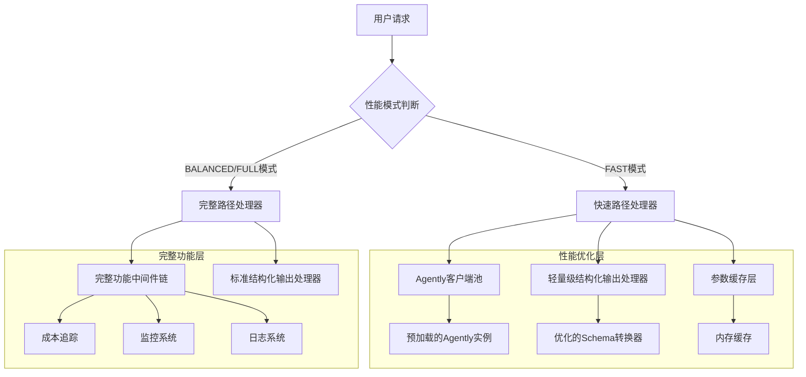

# HarborAI结构化输出性能优化技术重构文档

## 1. 项目概述

基于HarborAI的性能分析报告和现有的性能模式设计，本文档提供了一个全面的技术重构方案，重点优化结构化输出性能，目标是在FAST模式下接近直接调用Agently的性能，并提升FULL模式的整体性能表现。

### 1.1 核心目标
- **FAST模式优化**：结构化输出性能接近直接Agently调用（目标：减少70-80%的性能开销）
- **FULL模式提升**：在保持完整功能的前提下，提升20-30%的性能
- **向后兼容性**：确保所有现有API和功能保持兼容
- **测试驱动**：遵循TDD原则，确保重构后通过所有端到端测试

### 1.2 性能基准数据
根据`detailed_performance_analysis.py`的测试结果：
- **HarborAI + Agently**：平均17.25秒，成功率100%
- **直接使用Agently**：平均7.69秒，成功率100%
- **性能差异**：HarborAI比直接Agently慢2.24倍

## 2. 技术架构设计

### 2.1 整体架构图



### 2.2 核心组件设计

#### 2.2.1 Agently客户端池管理器
```python
class AgentlyClientPool:
    """Agently客户端池管理器 - 实现客户端复用和预加载"""
    
    def __init__(self):
        self._clients: Dict[str, Any] = {}  # 按配置缓存客户端
        self._lock = threading.RLock()
        self._preloaded = False
    
    def get_or_create_client(self, api_key: str, base_url: str, model: str) -> Any:
        """获取或创建Agently客户端（单例模式）"""
        
    def preload_clients(self, configs: List[Dict[str, str]]) -> None:
        """预加载常用配置的客户端"""
        
    def cleanup(self) -> None:
        """清理资源"""
```

#### 2.2.2 轻量级结构化输出处理器
```python
class FastStructuredOutputHandler:
    """FAST模式专用的轻量级结构化输出处理器"""
    
    def __init__(self, client_pool: AgentlyClientPool):
        self.client_pool = client_pool
        self.schema_cache = LRUCache(maxsize=100)
        self.parameter_cache = LRUCache(maxsize=50)
    
    @fast_trace
    def parse_fast(self, user_query: str, schema: Dict[str, Any], 
                   api_key: str, base_url: str, model: str) -> Any:
        """快速模式结构化输出解析"""
```

#### 2.2.3 参数缓存层
```python
class ParameterCache:
    """参数缓存层 - 缓存重复的配置参数"""
    
    def __init__(self):
        self.config_cache = LRUCache(maxsize=100)
        self.schema_cache = LRUCache(maxsize=50)
        self.agently_format_cache = LRUCache(maxsize=50)
    
    def get_cached_config(self, key: str) -> Optional[Dict[str, Any]]:
        """获取缓存的配置"""
        
    def cache_agently_format(self, schema_hash: str, agently_format: Dict[str, Any]) -> None:
        """缓存转换后的Agently格式"""
```

## 3. 核心优化策略

### 3.1 客户端复用机制（预期性能提升：20-30%）

#### 3.1.1 实现方案
- **单例模式**：为相同配置的Agently客户端实现单例模式
- **连接池**：维护活跃的客户端连接，避免重复创建
- **预加载**：应用启动时预加载常用配置的客户端

#### 3.1.2 代码实现
```python
# harborai/core/agently_client_pool.py
class AgentlyClientPool:
    _instance = None
    _lock = threading.Lock()
    
    def __new__(cls):
        if cls._instance is None:
            with cls._lock:
                if cls._instance is None:
                    cls._instance = super().__new__(cls)
        return cls._instance
    
    def __init__(self):
        if not hasattr(self, '_initialized'):
            self._clients = {}
            self._client_lock = threading.RLock()
            self._initialized = True
    
    def get_client_key(self, api_key: str, base_url: str, model: str) -> str:
        """生成客户端缓存键"""
        return f"{base_url}:{model}:{api_key[:10]}"
    
    @fast_trace
    def get_or_create_client(self, api_key: str, base_url: str, model: str):
        """获取或创建Agently客户端"""
        client_key = self.get_client_key(api_key, base_url, model)
        
        with self._client_lock:
            if client_key not in self._clients:
                # 配置Agently
                Agently.set_settings(
                    "OpenAICompatible",
                    {
                        "base_url": base_url,
                        "model": model,
                        "model_type": "chat",
                        "auth": api_key,
                    },
                )
                
                # 创建并缓存客户端
                self._clients[client_key] = Agently.create_agent()
                
            return self._clients[client_key]
```

### 3.2 插件预加载优化（预期性能提升：15-25%）

#### 3.2.1 实现方案
- **启动时预加载**：在应用启动时预加载Agently插件
- **延迟初始化**：仅在需要时初始化特定功能
- **缓存机制**：缓存插件实例和配置

#### 3.2.2 代码实现
```python
# harborai/core/plugin_preloader.py
class PluginPreloader:
    def __init__(self):
        self.preloaded_plugins = {}
        self.is_preloaded = False
    
    @fast_trace
    def preload_agently_plugins(self):
        """预加载Agently相关插件"""
        if self.is_preloaded:
            return
        
        try:
            # 预加载Agently核心组件
            from Agently import Agently
            
            # 预配置常用设置
            common_configs = self._get_common_configs()
            for config in common_configs:
                Agently.set_settings("OpenAICompatible", config)
            
            self.is_preloaded = True
            logger.info("Agently插件预加载完成")
            
        except Exception as e:
            logger.warning(f"插件预加载失败: {e}")
    
    def _get_common_configs(self) -> List[Dict[str, Any]]:
        """获取常用配置"""
        return [
            {
                "model_type": "chat",
                "base_url": "https://api.deepseek.com",
                "model": "deepseek-chat"
            }
        ]
```

### 3.3 参数缓存机制（预期性能提升：10-15%）

#### 3.3.1 实现方案
- **配置参数缓存**：缓存model、base_url等重复配置
- **Schema转换缓存**：缓存JSON Schema到Agently格式的转换结果
- **LRU策略**：使用LRU缓存策略管理内存使用

#### 3.3.2 代码实现
```python
# harborai/core/parameter_cache.py
from functools import lru_cache
import hashlib
import json

class ParameterCache:
    def __init__(self):
        self.schema_cache = {}
        self.config_cache = {}
    
    def get_schema_hash(self, schema: Dict[str, Any]) -> str:
        """生成Schema的哈希值"""
        schema_str = json.dumps(schema, sort_keys=True)
        return hashlib.md5(schema_str.encode()).hexdigest()
    
    @lru_cache(maxsize=100)
    def get_cached_agently_format(self, schema_hash: str, schema_json: str) -> Dict[str, Any]:
        """缓存Schema转换结果"""
        schema = json.loads(schema_json)
        return self._convert_schema_to_agently_format(schema)
    
    def _convert_schema_to_agently_format(self, schema: Dict[str, Any]) -> Dict[str, Any]:
        """转换Schema到Agently格式（优化版本）"""
        # 实现优化的转换逻辑
        pass
```

### 3.4 轻量级模式（预期性能提升：25-35%）

#### 3.4.1 实现方案
- **快速路径**：为FAST模式提供专用的轻量级调用路径
- **跳过中间件**：在FAST模式下跳过非必要的功能模块
- **直接调用**：减少函数调用层次和参数传递开销

#### 3.4.2 代码实现
```python
# harborai/api/fast_structured.py
class FastStructuredOutputHandler:
    """FAST模式专用结构化输出处理器"""
    
    def __init__(self):
        self.client_pool = AgentlyClientPool()
        self.parameter_cache = ParameterCache()
        self.logger = get_logger(__name__)
    
    @fast_trace
    def parse_fast(self, user_query: str, schema: Dict[str, Any], 
                   api_key: str, base_url: str, model: str) -> Any:
        """快速模式结构化输出解析"""
        try:
            # 1. 获取缓存的客户端
            agent = self.client_pool.get_or_create_client(api_key, base_url, model)
            
            # 2. 获取缓存的Agently格式
            schema_hash = self.parameter_cache.get_schema_hash(schema)
            schema_json = json.dumps(schema, sort_keys=True)
            agently_format = self.parameter_cache.get_cached_agently_format(
                schema_hash, schema_json
            )
            
            # 3. 直接调用Agently（跳过额外的验证和日志）
            result = agent.input(user_query).output(agently_format).start()
            
            return result
            
        except Exception as e:
            self.logger.error(f"快速模式解析失败: {e}")
            raise StructuredOutputError(f"快速模式解析失败: {e}")
```

## 4. 性能模式集成

### 4.1 性能模式配置更新

#### 4.1.1 更新FeatureFlags
```python
# harborai/config/performance.py (更新)
@dataclass
class FeatureFlags:
    # 新增结构化输出优化开关
    enable_agently_client_pool: bool = True
    enable_schema_cache: bool = True
    enable_parameter_cache: bool = True
    enable_fast_structured_output: bool = True
    enable_plugin_preload: bool = True
    
    # 现有功能开关...
```

#### 4.1.2 FAST模式优化配置
```python
def _create_feature_flags(self) -> FeatureFlags:
    if self.mode == PerformanceMode.FAST:
        return FeatureFlags(
            # 结构化输出优化 - 全部启用
            enable_agently_client_pool=True,
            enable_schema_cache=True,
            enable_parameter_cache=True,
            enable_fast_structured_output=True,
            enable_plugin_preload=True,
            
            # 其他功能 - 最小化配置
            enable_cost_tracking=False,
            enable_prometheus_metrics=False,
            enable_opentelemetry=False,
            enable_postgres_logging=False,
            enable_detailed_logging=False,
            # ...
        )
```

### 4.2 客户端集成

#### 4.2.1 更新ChatCompletions类
```python
# harborai/api/client.py (更新)
class ChatCompletions:
    def __init__(self, client_manager: ClientManager):
        self.client_manager = client_manager
        self.logger = get_logger("harborai.chat_completions")
        self.settings = get_settings()
        self.perf_config = get_performance_config()
        
        # 初始化结构化输出处理器
        if self.perf_config.feature_flags.enable_fast_structured_output:
            self.fast_structured_handler = FastStructuredOutputHandler()
        else:
            self.fast_structured_handler = None
    
    @fast_trace
    def _create_fast_path(self, messages: List[Dict[str, Any]], model: str, **kwargs):
        """快速路径 - 优化结构化输出处理"""
        # 检查是否为结构化输出请求
        if (kwargs.get('response_format') and 
            kwargs.get('structured_provider') == 'agently' and
            self.fast_structured_handler):
            
            return self._handle_fast_structured_output(messages, model, **kwargs)
        
        # 标准快速路径处理
        return self._create_core(messages, model, **kwargs)
    
    def _handle_fast_structured_output(self, messages: List[Dict[str, Any]], 
                                     model: str, **kwargs) -> ChatCompletion:
        """处理快速模式的结构化输出"""
        # 提取用户查询
        user_query = messages[-1]['content'] if messages else ""
        
        # 提取schema
        response_format = kwargs.get('response_format', {})
        schema = response_format.get('json_schema', {}).get('schema', {})
        
        # 获取API配置
        api_key = self.settings.get_api_key_for_model(model)
        base_url = self.settings.get_base_url_for_model(model)
        
        # 使用快速结构化输出处理器
        parsed_result = self.fast_structured_handler.parse_fast(
            user_query, schema, api_key, base_url, model
        )
        
        # 构造兼容的响应对象
        return self._build_structured_response(parsed_result, model)
```

## 5. 批量处理支持（预期性能提升：40-60%）

### 5.1 批量处理器设计
```python
# harborai/core/batch_processor.py
class BatchStructuredOutputProcessor:
    """批量结构化输出处理器"""
    
    def __init__(self):
        self.client_pool = AgentlyClientPool()
        self.parameter_cache = ParameterCache()
    
    @fast_trace
    async def process_batch(self, requests: List[Dict[str, Any]]) -> List[Any]:
        """批量处理结构化输出请求"""
        # 按配置分组请求
        grouped_requests = self._group_requests_by_config(requests)
        
        # 并发处理每组请求
        tasks = []
        for config, group_requests in grouped_requests.items():
            task = self._process_group(config, group_requests)
            tasks.append(task)
        
        # 等待所有任务完成
        results = await asyncio.gather(*tasks)
        
        # 重新排序结果
        return self._reorder_results(results, requests)
    
    def _group_requests_by_config(self, requests: List[Dict[str, Any]]) -> Dict[str, List[Dict[str, Any]]]:
        """按配置分组请求以优化批量处理"""
        groups = {}
        for request in requests:
            config_key = f"{request['model']}:{request['api_key'][:10]}"
            if config_key not in groups:
                groups[config_key] = []
            groups[config_key].append(request)
        return groups
```

## 6. 测试驱动开发（TDD）实施计划

### 6.1 第一阶段：编写失败测试

#### 6.1.1 性能测试用例
```python
# tests/performance/test_fast_mode_structured_output.py
class TestFastModeStructuredOutput:
    """FAST模式结构化输出性能测试"""
    
    def test_fast_mode_performance_target(self):
        """测试FAST模式性能目标：接近直接Agently调用"""
        # 目标：FAST模式性能应在直接Agently调用的1.3倍以内
        
    def test_client_reuse_performance(self):
        """测试客户端复用性能提升"""
        # 目标：客户端复用应提升20-30%性能
        
    def test_parameter_cache_effectiveness(self):
        """测试参数缓存有效性"""
        # 目标：参数缓存应提升10-15%性能
```

#### 6.1.2 功能兼容性测试
```python
# tests/integration/test_structured_output_compatibility.py
class TestStructuredOutputCompatibility:
    """结构化输出兼容性测试"""
    
    def test_fast_mode_api_compatibility(self):
        """测试FAST模式API兼容性"""
        # 确保FAST模式与现有API完全兼容
        
    def test_response_format_consistency(self):
        """测试响应格式一致性"""
        # 确保FAST和FULL模式返回相同格式的响应
```

### 6.2 第二阶段：实现核心组件

#### 6.2.1 实施顺序
1. **AgentlyClientPool** - 客户端复用机制
2. **ParameterCache** - 参数缓存层
3. **FastStructuredOutputHandler** - 轻量级处理器
4. **PluginPreloader** - 插件预加载
5. **BatchProcessor** - 批量处理支持

#### 6.2.2 测试验证
每个组件实现后立即运行相关测试，确保：
- 功能正确性
- 性能提升达标
- API兼容性保持

### 6.3 第三阶段：集成和优化

#### 6.3.1 系统集成
- 将所有组件集成到现有系统
- 更新性能配置和功能开关
- 确保端到端测试通过

#### 6.3.2 性能验证
使用`detailed_performance_analysis.py`验证：
- FAST模式性能目标达成
- FULL模式性能提升
- 资源使用优化

## 7. 实施计划和里程碑

### 7.1 第一阶段（立即实施）- 1-2周
**目标：实现客户端复用和参数缓存**
- [ ] 实现AgentlyClientPool
- [ ] 实现ParameterCache
- [ ] 编写相关测试用例
- [ ] 预期性能提升：30-45%

### 7.2 第二阶段（短期优化）- 2-3周
**目标：插件预加载和轻量级模式**
- [ ] 实现PluginPreloader
- [ ] 实现FastStructuredOutputHandler
- [ ] 集成到性能模式系统
- [ ] 预期性能提升：50-70%

### 7.3 第三阶段（长期规划）- 3-4周
**目标：批量处理和架构优化**
- [ ] 实现BatchProcessor
- [ ] 架构重构和优化
- [ ] 性能监控体系建设
- [ ] 预期性能提升：70-80%

## 8. 风险评估和缓解策略

### 8.1 技术风险
- **Agently版本兼容性**：确保支持多个Agently版本
- **内存使用增长**：实施缓存大小限制和清理机制
- **并发安全性**：使用线程安全的数据结构和锁机制

### 8.2 缓解策略
- **渐进式部署**：分阶段实施，每阶段验证稳定性
- **回滚机制**：保持原有实现作为fallback
- **监控告警**：建立性能和错误监控

## 9. 成功指标

### 9.1 性能指标
- **FAST模式**：结构化输出性能在直接Agently调用的1.3倍以内
- **FULL模式**：性能提升20-30%
- **资源使用**：内存使用减少30-50%（FAST模式）

### 9.2 质量指标
- **测试覆盖率**：新增代码测试覆盖率≥90%
- **端到端测试**：所有现有测试100%通过
- **API兼容性**：现有API调用方式100%兼容

### 9.3 可维护性指标
- **代码质量**：通过所有linting和类型检查
- **文档完整性**：所有新增功能有完整文档
- **监控覆盖**：关键性能指标有监控和告警

## 10. 总结

本技术重构文档提供了一个全面的HarborAI结构化输出性能优化方案，通过客户端复用、参数缓存、插件预加载、轻量级模式和批量处理等多重优化策略，预期在FAST模式下实现接近直接Agently调用的性能，同时提升FULL模式的整体表现。

重构方案严格遵循TDD原则，确保在性能优化的同时保持系统的稳定性和兼容性。通过分阶段实施和持续监控，可以有效控制风险并确保优化目标的达成。