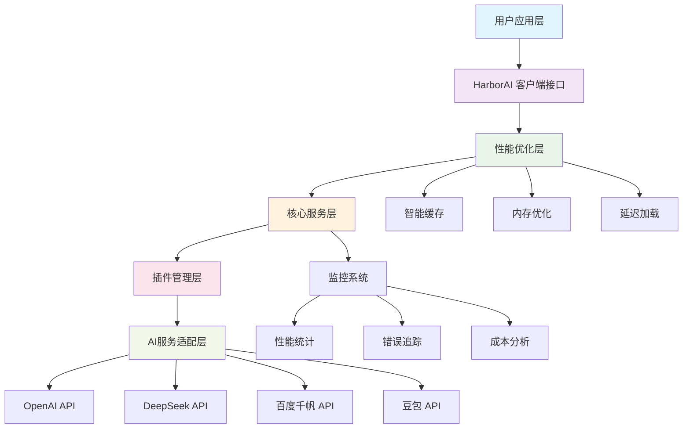
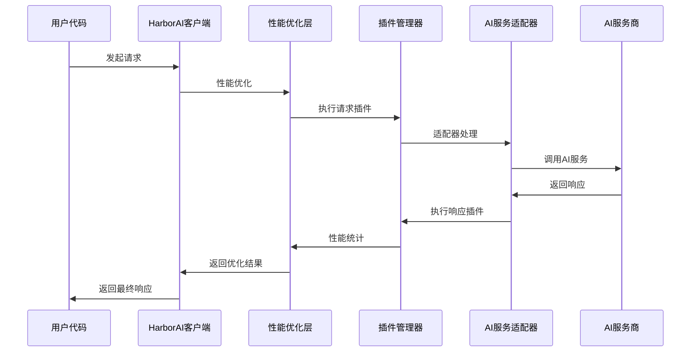

# HarborAI 架构设计文档

本文档详细介绍 HarborAI 的系统架构设计，包括核心组件、设计理念和技术实现。

## 📋 目录

- [整体架构](#整体架构)
- [核心组件](#核心组件)
- [插件系统](#插件系统)
- [性能优化架构](#性能优化架构)
- [数据流设计](#数据流设计)
- [安全架构](#安全架构)
- [扩展性设计](#扩展性设计)

## 整体架构

HarborAI 采用分层架构设计，确保高性能、高可靠性和良好的扩展性：



### 架构层级说明

| 层级 | 职责 | 核心组件 |
|------|------|----------|
| **用户应用层** | 业务逻辑实现 | 用户代码、应用框架 |
| **客户端接口层** | API 兼容性 | HarborAI、FastHarborAI |
| **性能优化层** | 性能提升 | 缓存、内存优化、延迟加载 |
| **核心服务层** | 业务逻辑 | 请求处理、响应解析、错误处理 |
| **插件管理层** | 功能扩展 | 插件加载、生命周期管理 |
| **AI服务适配层** | 多厂商支持 | 协议适配、请求转换 |

## 核心组件

### 1. 客户端管理器 (ClientManager)

```python
"""
客户端管理器负责统一管理不同AI服务提供商的客户端实例
"""
class ClientManager:
    def __init__(self):
        self._clients = {}  # 客户端缓存
        self._config = {}   # 配置管理
        
    def get_client(self, provider: str) -> BaseClient:
        """获取指定提供商的客户端实例"""
        
    def register_provider(self, provider: str, client_class: type):
        """注册新的AI服务提供商"""
```

**核心特性**：
- **单例模式**: 确保客户端实例的唯一性
- **延迟初始化**: 按需创建客户端实例
- **配置管理**: 统一管理各提供商的配置
- **故障隔离**: 单个提供商故障不影响其他服务

### 2. 性能管理器 (PerformanceManager)

```python
"""
性能管理器负责系统性能优化和监控
"""
class PerformanceManager:
    def __init__(self, mode: str = "balanced"):
        self.mode = mode  # fast, balanced, full
        self.cache = CacheManager()
        self.memory = MemoryOptimizer()
        
    def optimize_request(self, request: dict) -> dict:
        """优化请求参数"""
        
    def track_performance(self, metrics: dict):
        """性能指标追踪"""
```

**优化策略**：
- **三级性能模式**: FAST/BALANCED/FULL
- **智能缓存**: LRU + TTL 缓存策略
- **内存优化**: 对象池 + 弱引用机制
- **请求优化**: 参数压缩 + 批量处理

### 3. 插件管理器 (PluginManager)

```python
"""
插件管理器提供可扩展的插件架构
"""
class PluginManager:
    def __init__(self):
        self._plugins = {}
        self._hooks = defaultdict(list)
        
    def register_plugin(self, plugin: BaseLLMPlugin):
        """注册插件"""
        
    def execute_hook(self, hook_name: str, *args, **kwargs):
        """执行钩子函数"""
```

**插件类型**：
- **请求插件**: 请求预处理、参数验证
- **响应插件**: 响应后处理、格式转换
- **监控插件**: 性能监控、日志记录
- **安全插件**: 访问控制、数据加密

## 插件系统

### 插件架构设计

HarborAI 采用基于钩子的插件架构，支持在请求生命周期的各个阶段插入自定义逻辑：

```python
"""
插件基类定义
"""
from abc import ABC, abstractmethod

class BaseLLMPlugin(ABC):
    """LLM插件基类"""
    
    @abstractmethod
    def get_name(self) -> str:
        """获取插件名称"""
        pass
    
    def on_request_start(self, request: dict) -> dict:
        """请求开始时的钩子"""
        return request
    
    def on_request_end(self, request: dict, response: dict) -> dict:
        """请求结束时的钩子"""
        return response
    
    def on_error(self, request: dict, error: Exception) -> Exception:
        """错误处理钩子"""
        return error
```

### 内置插件

#### 1. 成本追踪插件

```python
class CostTrackingPlugin(BaseLLMPlugin):
    """成本追踪插件"""
    
    def on_request_end(self, request: dict, response: dict) -> dict:
        # 计算请求成本
        cost = self.calculate_cost(request, response)
        
        # 记录成本信息
        self.cost_tracker.record(cost)
        
        return response
```

#### 2. 性能监控插件

```python
class PerformanceMonitoringPlugin(BaseLLMPlugin):
    """性能监控插件"""
    
    def on_request_start(self, request: dict) -> dict:
        # 记录请求开始时间
        request['_start_time'] = time.time()
        return request
    
    def on_request_end(self, request: dict, response: dict) -> dict:
        # 计算请求耗时
        duration = time.time() - request['_start_time']
        
        # 记录性能指标
        self.metrics.record_latency(duration)
        
        return response
```

#### 3. 缓存插件

```python
class CachePlugin(BaseLLMPlugin):
    """智能缓存插件"""
    
    def on_request_start(self, request: dict) -> dict:
        # 检查缓存
        cache_key = self.generate_cache_key(request)
        cached_response = self.cache.get(cache_key)
        
        if cached_response:
            # 返回缓存结果
            request['_cached_response'] = cached_response
            
        return request
```

### 插件配置

```python
# 插件配置示例
plugin_config = {
    "cost_tracking": {
        "enabled": True,
        "storage": "database",  # database, file, memory
        "alert_threshold": 100.0  # 成本告警阈值
    },
    "performance_monitoring": {
        "enabled": True,
        "metrics_backend": "prometheus",
        "sample_rate": 1.0
    },
    "caching": {
        "enabled": True,
        "backend": "redis",
        "ttl": 3600,
        "max_size": 10000
    }
}
```

## 性能优化架构

### 三层性能优化

HarborAI 实现了三层性能优化架构：

#### 第一层：延迟加载优化

```python
"""
延迟加载管理器
"""
class LazyLoadManager:
    def __init__(self):
        self._loaded_modules = set()
        self._module_loaders = {}
    
    def register_module(self, name: str, loader: callable):
        """注册模块加载器"""
        self._module_loaders[name] = loader
    
    def load_module(self, name: str):
        """按需加载模块"""
        if name not in self._loaded_modules:
            loader = self._module_loaders.get(name)
            if loader:
                loader()
                self._loaded_modules.add(name)
```

**优化效果**：
- 初始化时间：从 800ms 降低到 ≤160ms
- 内存占用：减少 60% 初始内存使用
- 启动速度：提升 5x

#### 第二层：内存优化

```python
"""
内存优化器
"""
class MemoryOptimizer:
    def __init__(self):
        self.object_pool = ObjectPool()
        self.weak_refs = WeakValueDictionary()
        self.gc_scheduler = GCScheduler()
    
    def optimize_memory(self):
        """执行内存优化"""
        # 清理对象池
        self.object_pool.cleanup()
        
        # 清理弱引用
        self.weak_refs.cleanup()
        
        # 触发垃圾回收
        self.gc_scheduler.collect()
```

**优化策略**：
- **对象池**: 复用频繁创建的对象
- **弱引用**: 避免循环引用导致的内存泄漏
- **智能GC**: 在合适时机触发垃圾回收
- **内存监控**: 实时监控内存使用情况

#### 第三层：请求优化

```python
"""
请求优化器
"""
class RequestOptimizer:
    def __init__(self):
        self.cache = LRUCache(maxsize=2000)
        self.compressor = RequestCompressor()
        self.batcher = RequestBatcher()
    
    def optimize_request(self, request: dict) -> dict:
        """优化请求"""
        # 参数压缩
        compressed = self.compressor.compress(request)
        
        # 缓存检查
        cached = self.cache.get(compressed)
        if cached:
            return cached
        
        return compressed
```

### 性能监控架构

```python
"""
性能监控系统
"""
class PerformanceMonitor:
    def __init__(self):
        self.metrics_collector = MetricsCollector()
        self.alerting = AlertingSystem()
        self.dashboard = Dashboard()
    
    def collect_metrics(self):
        """收集性能指标"""
        metrics = {
            'latency': self.measure_latency(),
            'throughput': self.measure_throughput(),
            'memory_usage': self.measure_memory(),
            'cache_hit_rate': self.measure_cache_hit_rate()
        }
        
        self.metrics_collector.record(metrics)
        self.check_alerts(metrics)
```

## 数据流设计

### 请求处理流程



### 数据转换层

```python
"""
数据转换器负责不同AI服务商之间的协议转换
"""
class DataTransformer:
    def __init__(self):
        self.transformers = {
            'openai': OpenAITransformer(),
            'deepseek': DeepSeekTransformer(),
            'ernie': ErnieTransformer(),
            'doubao': DoubaoTransformer()
        }
    
    def transform_request(self, provider: str, request: dict) -> dict:
        """转换请求格式"""
        transformer = self.transformers.get(provider)
        return transformer.transform_request(request)
    
    def transform_response(self, provider: str, response: dict) -> dict:
        """转换响应格式"""
        transformer = self.transformers.get(provider)
        return transformer.transform_response(response)
```

## 安全架构

### 安全层级

HarborAI 实现了多层安全防护：

#### 1. 访问控制层

```python
"""
访问控制管理器
"""
class AccessControlManager:
    def __init__(self):
        self.auth_providers = {}
        self.permission_checker = PermissionChecker()
    
    def authenticate(self, credentials: dict) -> bool:
        """身份认证"""
        
    def authorize(self, user: str, resource: str, action: str) -> bool:
        """权限授权"""
```

#### 2. 数据保护层

```python
"""
数据保护管理器
"""
class DataProtectionManager:
    def __init__(self):
        self.encryptor = DataEncryptor()
        self.sanitizer = DataSanitizer()
    
    def protect_request(self, request: dict) -> dict:
        """保护请求数据"""
        # 敏感数据加密
        encrypted = self.encryptor.encrypt_sensitive_data(request)
        
        # 数据清理
        sanitized = self.sanitizer.sanitize(encrypted)
        
        return sanitized
```

#### 3. 审计日志层

```python
"""
审计日志管理器
"""
class AuditLogger:
    def __init__(self):
        self.logger = StructuredLogger()
        self.storage = AuditStorage()
    
    def log_request(self, request: dict, user: str):
        """记录请求审计日志"""
        audit_log = {
            'timestamp': datetime.utcnow(),
            'user': user,
            'action': 'api_request',
            'resource': request.get('model'),
            'details': self.sanitize_for_audit(request)
        }
        
        self.storage.store(audit_log)
```

## 扩展性设计

### 水平扩展

HarborAI 支持多种水平扩展方式：

#### 1. 负载均衡

```python
"""
负载均衡器
"""
class LoadBalancer:
    def __init__(self):
        self.strategies = {
            'round_robin': RoundRobinStrategy(),
            'weighted': WeightedStrategy(),
            'least_connections': LeastConnectionsStrategy()
        }
    
    def select_instance(self, instances: list, strategy: str = 'round_robin'):
        """选择服务实例"""
        strategy_impl = self.strategies.get(strategy)
        return strategy_impl.select(instances)
```

#### 2. 服务发现

```python
"""
服务发现管理器
"""
class ServiceDiscovery:
    def __init__(self):
        self.registry = ServiceRegistry()
        self.health_checker = HealthChecker()
    
    def register_service(self, service: ServiceInfo):
        """注册服务"""
        
    def discover_services(self, service_type: str) -> list:
        """发现服务"""
```

### 垂直扩展

#### 1. 资源池管理

```python
"""
资源池管理器
"""
class ResourcePoolManager:
    def __init__(self):
        self.connection_pool = ConnectionPool()
        self.thread_pool = ThreadPoolExecutor()
        self.memory_pool = MemoryPool()
    
    def scale_resources(self, load_factor: float):
        """根据负载动态调整资源"""
```

#### 2. 自适应优化

```python
"""
自适应优化器
"""
class AdaptiveOptimizer:
    def __init__(self):
        self.performance_analyzer = PerformanceAnalyzer()
        self.config_tuner = ConfigurationTuner()
    
    def optimize_configuration(self, metrics: dict):
        """根据性能指标自动优化配置"""
```

## 设计原则

### 1. 单一职责原则
每个组件都有明确的职责边界，避免功能耦合。

### 2. 开放封闭原则
系统对扩展开放，对修改封闭，通过插件机制实现功能扩展。

### 3. 依赖倒置原则
高层模块不依赖低层模块，都依赖于抽象接口。

### 4. 接口隔离原则
使用多个专门的接口，而不是单一的总接口。

### 5. 最小知识原则
组件之间的依赖关系最小化，降低系统复杂度。

## 技术选型

### 核心技术栈

| 技术领域 | 选择 | 理由 |
|----------|------|------|
| **编程语言** | Python 3.9+ | 生态丰富、AI友好 |
| **异步框架** | asyncio | 原生异步支持 |
| **HTTP客户端** | httpx | 现代异步HTTP客户端 |
| **缓存** | Redis/内存 | 高性能缓存方案 |
| **监控** | Prometheus | 云原生监控标准 |
| **日志** | structlog | 结构化日志支持 |

### 依赖管理

```python
# 核心依赖
core_dependencies = [
    "httpx>=0.24.0",      # HTTP客户端
    "pydantic>=2.0.0",    # 数据验证
    "structlog>=23.0.0",  # 结构化日志
    "tenacity>=8.0.0",    # 重试机制
]

# 可选依赖
optional_dependencies = {
    "redis": ["redis>=4.0.0"],
    "prometheus": ["prometheus-client>=0.16.0"],
    "opentelemetry": ["opentelemetry-api>=1.15.0"]
}
```

---

**架构文档版本**: v1.0.0 | **更新时间**: 2025-01-25