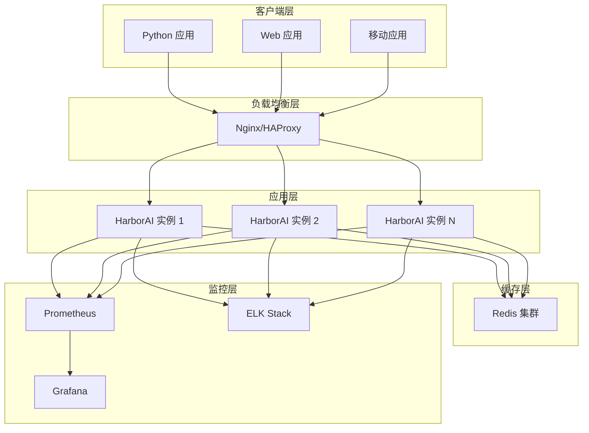

# HarborAI 部署指南

本文档详细介绍 HarborAI 的各种部署方式，包括本地部署、Docker 部署、Kubernetes 部署和云平台部署。

## 📋 目录

- [部署概述](#部署概述)
- [本地部署](#本地部署)
- [Docker 部署](#docker-部署)
- [Kubernetes 部署](#kubernetes-部署)
- [云平台部署](#云平台部署)
- [监控与日志](#监控与日志)
- [安全配置](#安全配置)
- [性能调优](#性能调优)
- [故障排查](#故障排查)

## 部署概述

### 🎯 部署架构

HarborAI 支持多种部署模式：



### 📊 部署模式对比

| 部署模式 | 适用场景 | 优势 | 劣势 | 复杂度 |
|----------|----------|------|------|--------|
| **本地部署** | 开发测试 | 简单快速 | 不适合生产 | ⭐ |
| **Docker 单机** | 小型生产 | 隔离性好 | 单点故障 | ⭐⭐ |
| **Docker Compose** | 中型应用 | 易于管理 | 扩展性有限 | ⭐⭐⭐ |
| **Kubernetes** | 大型生产 | 高可用、自动扩展 | 复杂度高 | ⭐⭐⭐⭐⭐ |
| **云平台** | 企业级 | 托管服务 | 成本较高 | ⭐⭐⭐ |

## 本地部署

### 🚀 快速开始

#### 1. 环境准备

```bash
# 检查 Python 版本
python --version  # 需要 3.8+

# 创建虚拟环境
python -m venv harborai-env

# 激活虚拟环境
# Windows
harborai-env\Scripts\activate
# macOS/Linux
source harborai-env/bin/activate
```

#### 2. 安装 HarborAI

```bash
# 从 PyPI 安装
pip install harborai

# 或从源码安装
git clone https://github.com/your-org/harborai.git
cd harborai
pip install -e .
```

#### 3. 配置环境变量

创建 `.env` 文件：

```bash
# API 配置
DEEPSEEK_API_KEY=your_deepseek_api_key
OPENAI_API_KEY=your_openai_api_key

# 性能配置
HARBORAI_PERFORMANCE_MODE=balanced
HARBORAI_CACHE_ENABLED=true
HARBORAI_MAX_CONNECTIONS=100

# 日志配置
HARBORAI_LOG_LEVEL=INFO
HARBORAI_LOG_FILE=logs/harborai.log

# Redis 配置（可选）
REDIS_URL=redis://localhost:6379/0
```

#### 4. 启动应用

```python
"""
本地部署示例应用
"""
import os
import asyncio
from harborai import HarborAI
from harborai.api.fast_client import FastHarborAI

async def main():
    """主函数"""
    # 创建客户端
    client = FastHarborAI(
        api_key=os.getenv("DEEPSEEK_API_KEY"),
        performance_mode=os.getenv("HARBORAI_PERFORMANCE_MODE", "balanced")
    )
    
    # 测试连接
    try:
        response = await client.chat.completions.create(
            model="deepseek-chat",
            messages=[
                {"role": "user", "content": "Hello, HarborAI!"}
            ]
        )
        
        print("✅ HarborAI 部署成功!")
        print(f"响应: {response.choices[0].message.content}")
        
    except Exception as e:
        print(f"❌ 部署失败: {e}")
    
    finally:
        await client.close()

if __name__ == "__main__":
    asyncio.run(main())
```

### 🔧 本地开发服务器

创建开发服务器 `dev_server.py`:

```python
"""
HarborAI 开发服务器
"""
import asyncio
import logging
from fastapi import FastAPI, HTTPException
from fastapi.middleware.cors import CORSMiddleware
from pydantic import BaseModel
from typing import List, Optional
import uvicorn

from harborai.api.fast_client import FastHarborAI

# 配置日志
logging.basicConfig(level=logging.INFO)
logger = logging.getLogger(__name__)

# 创建 FastAPI 应用
app = FastAPI(
    title="HarborAI API Server",
    description="HarborAI 开发服务器",
    version="1.0.0"
)

# 添加 CORS 中间件
app.add_middleware(
    CORSMiddleware,
    allow_origins=["*"],
    allow_credentials=True,
    allow_methods=["*"],
    allow_headers=["*"],
)

# 全局客户端实例
harbor_client = None

class ChatRequest(BaseModel):
    """聊天请求模型"""
    model: str = "deepseek-chat"
    messages: List[dict]
    temperature: Optional[float] = 0.7
    max_tokens: Optional[int] = None

class ChatResponse(BaseModel):
    """聊天响应模型"""
    content: str
    usage: dict

@app.on_event("startup")
async def startup_event():
    """启动事件"""
    global harbor_client
    
    api_key = os.getenv("DEEPSEEK_API_KEY")
    if not api_key:
        raise ValueError("请设置 DEEPSEEK_API_KEY 环境变量")
    
    harbor_client = FastHarborAI(
        api_key=api_key,
        performance_mode="fast"
    )
    
    logger.info("🚀 HarborAI 服务器启动成功")

@app.on_event("shutdown")
async def shutdown_event():
    """关闭事件"""
    global harbor_client
    
    if harbor_client:
        await harbor_client.close()
    
    logger.info("🛑 HarborAI 服务器已关闭")

@app.get("/health")
async def health_check():
    """健康检查"""
    return {"status": "healthy", "service": "HarborAI"}

@app.post("/chat/completions", response_model=ChatResponse)
async def chat_completions(request: ChatRequest):
    """聊天完成接口"""
    try:
        response = await harbor_client.chat.completions.create(
            model=request.model,
            messages=request.messages,
            temperature=request.temperature,
            max_tokens=request.max_tokens
        )
        
        return ChatResponse(
            content=response.choices[0].message.content,
            usage=response.usage.__dict__
        )
        
    except Exception as e:
        logger.error(f"聊天完成失败: {e}")
        raise HTTPException(status_code=500, detail=str(e))

@app.get("/stats")
async def get_stats():
    """获取统计信息"""
    if hasattr(harbor_client, 'get_stats'):
        return harbor_client.get_stats()
    return {"message": "统计信息不可用"}

if __name__ == "__main__":
    uvicorn.run(
        "dev_server:app",
        host="0.0.0.0",
        port=8000,
        reload=True,
        log_level="info"
    )
```

启动开发服务器：

```bash
python dev_server.py
```

## Docker 部署

### 🐳 Docker 单机部署

#### 1. 创建 Dockerfile

```dockerfile
# Dockerfile
FROM python:3.11-slim

# 设置工作目录
WORKDIR /app

# 安装系统依赖
RUN apt-get update && apt-get install -y \
    gcc \
    && rm -rf /var/lib/apt/lists/*

# 复制依赖文件
COPY requirements.txt .

# 安装 Python 依赖
RUN pip install --no-cache-dir -r requirements.txt

# 复制应用代码
COPY . .

# 安装 HarborAI
RUN pip install -e .

# 创建非 root 用户
RUN useradd --create-home --shell /bin/bash harborai
RUN chown -R harborai:harborai /app
USER harborai

# 暴露端口
EXPOSE 8000

# 健康检查
HEALTHCHECK --interval=30s --timeout=10s --start-period=5s --retries=3 \
    CMD curl -f http://localhost:8000/health || exit 1

# 启动命令
CMD ["uvicorn", "dev_server:app", "--host", "0.0.0.0", "--port", "8000"]
```

#### 2. 创建 .dockerignore

```dockerignore
# .dockerignore
.git
.gitignore
README.md
Dockerfile
.dockerignore
.pytest_cache
.coverage
htmlcov/
.tox/
.cache
.mypy_cache
.vscode/
.idea/
*.pyc
__pycache__/
.env
logs/
```

#### 3. 构建和运行

```bash
# 构建镜像
docker build -t harborai:latest .

# 运行容器
docker run -d \
    --name harborai-app \
    -p 8000:8000 \
    -e DEEPSEEK_API_KEY=your_api_key \
    -e HARBORAI_PERFORMANCE_MODE=fast \
    -v $(pwd)/logs:/app/logs \
    harborai:latest

# 查看日志
docker logs -f harborai-app

# 进入容器
docker exec -it harborai-app bash
```

### 🐙 Docker Compose 部署

#### 1. 创建 docker-compose.yml

```yaml
# docker-compose.yml
version: '3.8'

services:
  harborai:
    build: .
    container_name: harborai-app
    ports:
      - "8000:8000"
    environment:
      - DEEPSEEK_API_KEY=${DEEPSEEK_API_KEY}
      - HARBORAI_PERFORMANCE_MODE=balanced
      - REDIS_URL=redis://redis:6379/0
      - HARBORAI_LOG_LEVEL=INFO
    volumes:
      - ./logs:/app/logs
      - ./config:/app/config
    depends_on:
      - redis
    restart: unless-stopped
    networks:
      - harborai-network

  redis:
    image: redis:7-alpine
    container_name: harborai-redis
    ports:
      - "6379:6379"
    volumes:
      - redis_data:/data
    command: redis-server --appendonly yes
    restart: unless-stopped
    networks:
      - harborai-network

  nginx:
    image: nginx:alpine
    container_name: harborai-nginx
    ports:
      - "80:80"
      - "443:443"
    volumes:
      - ./nginx.conf:/etc/nginx/nginx.conf
      - ./ssl:/etc/nginx/ssl
    depends_on:
      - harborai
    restart: unless-stopped
    networks:
      - harborai-network

  prometheus:
    image: prom/prometheus:latest
    container_name: harborai-prometheus
    ports:
      - "9090:9090"
    volumes:
      - ./prometheus.yml:/etc/prometheus/prometheus.yml
      - prometheus_data:/prometheus
    command:
      - '--config.file=/etc/prometheus/prometheus.yml'
      - '--storage.tsdb.path=/prometheus'
      - '--web.console.libraries=/etc/prometheus/console_libraries'
      - '--web.console.templates=/etc/prometheus/consoles'
    restart: unless-stopped
    networks:
      - harborai-network

  grafana:
    image: grafana/grafana:latest
    container_name: harborai-grafana
    ports:
      - "3000:3000"
    environment:
      - GF_SECURITY_ADMIN_PASSWORD=admin123
    volumes:
      - grafana_data:/var/lib/grafana
      - ./grafana/dashboards:/etc/grafana/provisioning/dashboards
      - ./grafana/datasources:/etc/grafana/provisioning/datasources
    restart: unless-stopped
    networks:
      - harborai-network

volumes:
  redis_data:
  prometheus_data:
  grafana_data:

networks:
  harborai-network:
    driver: bridge
```

#### 2. 创建 Nginx 配置

```nginx
# nginx.conf
events {
    worker_connections 1024;
}

http {
    upstream harborai_backend {
        server harborai:8000;
    }

    # 限流配置
    limit_req_zone $binary_remote_addr zone=api:10m rate=10r/s;

    server {
        listen 80;
        server_name localhost;

        # 限流
        limit_req zone=api burst=20 nodelay;

        # 代理配置
        location / {
            proxy_pass http://harborai_backend;
            proxy_set_header Host $host;
            proxy_set_header X-Real-IP $remote_addr;
            proxy_set_header X-Forwarded-For $proxy_add_x_forwarded_for;
            proxy_set_header X-Forwarded-Proto $scheme;
            
            # 超时配置
            proxy_connect_timeout 30s;
            proxy_send_timeout 30s;
            proxy_read_timeout 30s;
        }

        # 健康检查
        location /health {
            proxy_pass http://harborai_backend/health;
            access_log off;
        }

        # 静态文件缓存
        location ~* \.(js|css|png|jpg|jpeg|gif|ico|svg)$ {
            expires 1y;
            add_header Cache-Control "public, immutable";
        }
    }
}
```

#### 3. 启动服务

```bash
# 创建环境变量文件
echo "DEEPSEEK_API_KEY=your_api_key" > .env

# 启动所有服务
docker-compose up -d

# 查看服务状态
docker-compose ps

# 查看日志
docker-compose logs -f harborai

# 停止服务
docker-compose down

# 停止并删除数据
docker-compose down -v
```

## Kubernetes 部署

### ☸️ Kubernetes 集群部署

#### 1. 创建命名空间

```yaml
# namespace.yaml
apiVersion: v1
kind: Namespace
metadata:
  name: harborai
  labels:
    name: harborai
```

#### 2. 创建配置映射

```yaml
# configmap.yaml
apiVersion: v1
kind: ConfigMap
metadata:
  name: harborai-config
  namespace: harborai
data:
  HARBORAI_PERFORMANCE_MODE: "balanced"
  HARBORAI_LOG_LEVEL: "INFO"
  REDIS_URL: "redis://redis-service:6379/0"
  HARBORAI_MAX_CONNECTIONS: "100"
```

#### 3. 创建密钥

```yaml
# secret.yaml
apiVersion: v1
kind: Secret
metadata:
  name: harborai-secrets
  namespace: harborai
type: Opaque
data:
  DEEPSEEK_API_KEY: <base64_encoded_api_key>
  OPENAI_API_KEY: <base64_encoded_api_key>
```

```bash
# 创建密钥
kubectl create secret generic harborai-secrets \
  --from-literal=DEEPSEEK_API_KEY=your_deepseek_key \
  --from-literal=OPENAI_API_KEY=your_openai_key \
  -n harborai
```

#### 4. 创建部署

```yaml
# deployment.yaml
apiVersion: apps/v1
kind: Deployment
metadata:
  name: harborai-deployment
  namespace: harborai
  labels:
    app: harborai
spec:
  replicas: 3
  selector:
    matchLabels:
      app: harborai
  template:
    metadata:
      labels:
        app: harborai
    spec:
      containers:
      - name: harborai
        image: harborai:latest
        ports:
        - containerPort: 8000
        env:
        - name: DEEPSEEK_API_KEY
          valueFrom:
            secretKeyRef:
              name: harborai-secrets
              key: DEEPSEEK_API_KEY
        - name: OPENAI_API_KEY
          valueFrom:
            secretKeyRef:
              name: harborai-secrets
              key: OPENAI_API_KEY
        envFrom:
        - configMapRef:
            name: harborai-config
        resources:
          requests:
            memory: "256Mi"
            cpu: "250m"
          limits:
            memory: "512Mi"
            cpu: "500m"
        livenessProbe:
          httpGet:
            path: /health
            port: 8000
          initialDelaySeconds: 30
          periodSeconds: 10
        readinessProbe:
          httpGet:
            path: /health
            port: 8000
          initialDelaySeconds: 5
          periodSeconds: 5
        volumeMounts:
        - name: logs
          mountPath: /app/logs
      volumes:
      - name: logs
        emptyDir: {}
```

#### 5. 创建服务

```yaml
# service.yaml
apiVersion: v1
kind: Service
metadata:
  name: harborai-service
  namespace: harborai
  labels:
    app: harborai
spec:
  selector:
    app: harborai
  ports:
  - protocol: TCP
    port: 80
    targetPort: 8000
  type: ClusterIP
```

#### 6. 创建 Ingress

```yaml
# ingress.yaml
apiVersion: networking.k8s.io/v1
kind: Ingress
metadata:
  name: harborai-ingress
  namespace: harborai
  annotations:
    kubernetes.io/ingress.class: nginx
    nginx.ingress.kubernetes.io/rate-limit: "100"
    nginx.ingress.kubernetes.io/rate-limit-window: "1m"
    cert-manager.io/cluster-issuer: "letsencrypt-prod"
spec:
  tls:
  - hosts:
    - harborai.yourdomain.com
    secretName: harborai-tls
  rules:
  - host: harborai.yourdomain.com
    http:
      paths:
      - path: /
        pathType: Prefix
        backend:
          service:
            name: harborai-service
            port:
              number: 80
```

#### 7. 创建 HPA（水平自动扩展）

```yaml
# hpa.yaml
apiVersion: autoscaling/v2
kind: HorizontalPodAutoscaler
metadata:
  name: harborai-hpa
  namespace: harborai
spec:
  scaleTargetRef:
    apiVersion: apps/v1
    kind: Deployment
    name: harborai-deployment
  minReplicas: 3
  maxReplicas: 10
  metrics:
  - type: Resource
    resource:
      name: cpu
      target:
        type: Utilization
        averageUtilization: 70
  - type: Resource
    resource:
      name: memory
      target:
        type: Utilization
        averageUtilization: 80
```

#### 8. 部署到 Kubernetes

```bash
# 应用所有配置
kubectl apply -f namespace.yaml
kubectl apply -f configmap.yaml
kubectl apply -f secret.yaml
kubectl apply -f deployment.yaml
kubectl apply -f service.yaml
kubectl apply -f ingress.yaml
kubectl apply -f hpa.yaml

# 查看部署状态
kubectl get all -n harborai

# 查看 Pod 日志
kubectl logs -f deployment/harborai-deployment -n harborai

# 查看 HPA 状态
kubectl get hpa -n harborai

# 端口转发测试
kubectl port-forward service/harborai-service 8000:80 -n harborai
```

### 🔄 滚动更新

```bash
# 更新镜像
kubectl set image deployment/harborai-deployment \
  harborai=harborai:v2.0.0 -n harborai

# 查看滚动更新状态
kubectl rollout status deployment/harborai-deployment -n harborai

# 回滚到上一个版本
kubectl rollout undo deployment/harborai-deployment -n harborai

# 查看历史版本
kubectl rollout history deployment/harborai-deployment -n harborai
```

## 云平台部署

### ☁️ AWS 部署

#### 1. ECS 部署

```json
{
  "family": "harborai-task",
  "networkMode": "awsvpc",
  "requiresCompatibilities": ["FARGATE"],
  "cpu": "512",
  "memory": "1024",
  "executionRoleArn": "arn:aws:iam::account:role/ecsTaskExecutionRole",
  "taskRoleArn": "arn:aws:iam::account:role/ecsTaskRole",
  "containerDefinitions": [
    {
      "name": "harborai",
      "image": "your-account.dkr.ecr.region.amazonaws.com/harborai:latest",
      "portMappings": [
        {
          "containerPort": 8000,
          "protocol": "tcp"
        }
      ],
      "environment": [
        {
          "name": "HARBORAI_PERFORMANCE_MODE",
          "value": "balanced"
        }
      ],
      "secrets": [
        {
          "name": "DEEPSEEK_API_KEY",
          "valueFrom": "arn:aws:secretsmanager:region:account:secret:harborai/api-keys:DEEPSEEK_API_KEY::"
        }
      ],
      "logConfiguration": {
        "logDriver": "awslogs",
        "options": {
          "awslogs-group": "/ecs/harborai",
          "awslogs-region": "us-west-2",
          "awslogs-stream-prefix": "ecs"
        }
      },
      "healthCheck": {
        "command": [
          "CMD-SHELL",
          "curl -f http://localhost:8000/health || exit 1"
        ],
        "interval": 30,
        "timeout": 5,
        "retries": 3
      }
    }
  ]
}
```

#### 2. Lambda 部署

```python
# lambda_handler.py
import json
import asyncio
from harborai.api.fast_client import FastHarborAI

# 全局客户端实例（Lambda 容器复用）
harbor_client = None

def lambda_handler(event, context):
    """Lambda 处理函数"""
    global harbor_client
    
    # 初始化客户端（仅第一次）
    if harbor_client is None:
        harbor_client = FastHarborAI(
            api_key=os.environ['DEEPSEEK_API_KEY'],
            performance_mode='fast'
        )
    
    try:
        # 解析请求
        body = json.loads(event['body'])
        
        # 异步调用
        loop = asyncio.new_event_loop()
        asyncio.set_event_loop(loop)
        
        response = loop.run_until_complete(
            harbor_client.chat.completions.create(
                model=body.get('model', 'deepseek-chat'),
                messages=body['messages']
            )
        )
        
        return {
            'statusCode': 200,
            'headers': {
                'Content-Type': 'application/json',
                'Access-Control-Allow-Origin': '*'
            },
            'body': json.dumps({
                'content': response.choices[0].message.content,
                'usage': response.usage.__dict__
            })
        }
        
    except Exception as e:
        return {
            'statusCode': 500,
            'body': json.dumps({'error': str(e)})
        }
```

### 🌐 Azure 部署

#### 1. Container Instances

```yaml
# azure-container-instance.yaml
apiVersion: 2019-12-01
location: eastus
name: harborai-container-group
properties:
  containers:
  - name: harborai
    properties:
      image: harborai:latest
      ports:
      - port: 8000
        protocol: TCP
      environmentVariables:
      - name: HARBORAI_PERFORMANCE_MODE
        value: balanced
      - name: DEEPSEEK_API_KEY
        secureValue: your_api_key
      resources:
        requests:
          cpu: 1
          memoryInGB: 2
  osType: Linux
  ipAddress:
    type: Public
    ports:
    - protocol: TCP
      port: 8000
  restartPolicy: Always
tags:
  environment: production
  service: harborai
type: Microsoft.ContainerInstance/containerGroups
```

#### 2. App Service

```yaml
# azure-app-service.yaml
apiVersion: 2021-02-01
kind: WebApp
metadata:
  name: harborai-app
spec:
  location: East US
  properties:
    serverFarmId: /subscriptions/{subscription-id}/resourceGroups/{resource-group}/providers/Microsoft.Web/serverfarms/{app-service-plan}
    siteConfig:
      linuxFxVersion: DOCKER|harborai:latest
      appSettings:
      - name: HARBORAI_PERFORMANCE_MODE
        value: balanced
      - name: DEEPSEEK_API_KEY
        value: "@Microsoft.KeyVault(SecretUri=https://vault.vault.azure.net/secrets/deepseek-key/)"
      - name: WEBSITES_PORT
        value: "8000"
```

### 🔥 Google Cloud 部署

#### 1. Cloud Run

```yaml
# cloudrun.yaml
apiVersion: serving.knative.dev/v1
kind: Service
metadata:
  name: harborai-service
  annotations:
    run.googleapis.com/ingress: all
spec:
  template:
    metadata:
      annotations:
        autoscaling.knative.dev/maxScale: "10"
        autoscaling.knative.dev/minScale: "1"
        run.googleapis.com/cpu-throttling: "false"
    spec:
      containerConcurrency: 100
      timeoutSeconds: 300
      containers:
      - image: gcr.io/project-id/harborai:latest
        ports:
        - containerPort: 8000
        env:
        - name: HARBORAI_PERFORMANCE_MODE
          value: balanced
        - name: DEEPSEEK_API_KEY
          valueFrom:
            secretKeyRef:
              name: api-keys
              key: deepseek-key
        resources:
          limits:
            cpu: 1000m
            memory: 2Gi
          requests:
            cpu: 500m
            memory: 1Gi
```

#### 2. GKE 部署

```bash
# 创建 GKE 集群
gcloud container clusters create harborai-cluster \
    --zone=us-central1-a \
    --num-nodes=3 \
    --enable-autoscaling \
    --min-nodes=1 \
    --max-nodes=10 \
    --machine-type=e2-standard-2

# 获取凭据
gcloud container clusters get-credentials harborai-cluster \
    --zone=us-central1-a

# 部署应用
kubectl apply -f k8s/
```

## 监控与日志

### 📊 Prometheus 监控

#### 1. 应用指标暴露

```python
"""
Prometheus 指标暴露
"""
from prometheus_client import Counter, Histogram, Gauge, start_http_server
import time

# 定义指标
REQUEST_COUNT = Counter(
    'harborai_requests_total',
    'Total number of requests',
    ['method', 'endpoint', 'status']
)

REQUEST_DURATION = Histogram(
    'harborai_request_duration_seconds',
    'Request duration in seconds',
    ['method', 'endpoint']
)

ACTIVE_CONNECTIONS = Gauge(
    'harborai_active_connections',
    'Number of active connections'
)

CACHE_HIT_RATE = Gauge(
    'harborai_cache_hit_rate',
    'Cache hit rate'
)

class MetricsMiddleware:
    """指标中间件"""
    
    def __init__(self, app):
        self.app = app
    
    async def __call__(self, scope, receive, send):
        if scope["type"] != "http":
            await self.app(scope, receive, send)
            return
        
        method = scope["method"]
        path = scope["path"]
        
        start_time = time.time()
        
        # 增加活跃连接数
        ACTIVE_CONNECTIONS.inc()
        
        try:
            await self.app(scope, receive, send)
            status = "success"
        except Exception as e:
            status = "error"
            raise
        finally:
            # 记录指标
            duration = time.time() - start_time
            REQUEST_COUNT.labels(method=method, endpoint=path, status=status).inc()
            REQUEST_DURATION.labels(method=method, endpoint=path).observe(duration)
            ACTIVE_CONNECTIONS.dec()

# 启动指标服务器
start_http_server(9090)
```

#### 2. Prometheus 配置

```yaml
# prometheus.yml
global:
  scrape_interval: 15s
  evaluation_interval: 15s

rule_files:
  - "harborai_rules.yml"

scrape_configs:
  - job_name: 'harborai'
    static_configs:
      - targets: ['harborai:9090']
    scrape_interval: 5s
    metrics_path: /metrics

  - job_name: 'redis'
    static_configs:
      - targets: ['redis:6379']

alerting:
  alertmanagers:
    - static_configs:
        - targets:
          - alertmanager:9093
```

#### 3. 告警规则

```yaml
# harborai_rules.yml
groups:
- name: harborai_alerts
  rules:
  - alert: HighErrorRate
    expr: rate(harborai_requests_total{status="error"}[5m]) > 0.1
    for: 2m
    labels:
      severity: warning
    annotations:
      summary: "HarborAI error rate is high"
      description: "Error rate is {{ $value }} errors per second"

  - alert: HighLatency
    expr: histogram_quantile(0.95, rate(harborai_request_duration_seconds_bucket[5m])) > 1
    for: 5m
    labels:
      severity: warning
    annotations:
      summary: "HarborAI latency is high"
      description: "95th percentile latency is {{ $value }}s"

  - alert: LowCacheHitRate
    expr: harborai_cache_hit_rate < 0.8
    for: 10m
    labels:
      severity: warning
    annotations:
      summary: "HarborAI cache hit rate is low"
      description: "Cache hit rate is {{ $value }}"
```

### 📈 Grafana 仪表板

```json
{
  "dashboard": {
    "title": "HarborAI 监控仪表板",
    "panels": [
      {
        "title": "请求速率",
        "type": "graph",
        "targets": [
          {
            "expr": "rate(harborai_requests_total[5m])",
            "legendFormat": "{{method}} {{endpoint}}"
          }
        ]
      },
      {
        "title": "响应时间",
        "type": "graph",
        "targets": [
          {
            "expr": "histogram_quantile(0.95, rate(harborai_request_duration_seconds_bucket[5m]))",
            "legendFormat": "95th percentile"
          },
          {
            "expr": "histogram_quantile(0.50, rate(harborai_request_duration_seconds_bucket[5m]))",
            "legendFormat": "50th percentile"
          }
        ]
      },
      {
        "title": "错误率",
        "type": "singlestat",
        "targets": [
          {
            "expr": "rate(harborai_requests_total{status=\"error\"}[5m]) / rate(harborai_requests_total[5m])",
            "legendFormat": "Error Rate"
          }
        ]
      },
      {
        "title": "缓存命中率",
        "type": "singlestat",
        "targets": [
          {
            "expr": "harborai_cache_hit_rate",
            "legendFormat": "Cache Hit Rate"
          }
        ]
      }
    ]
  }
}
```

### 📝 日志管理

#### 1. 结构化日志

```python
"""
结构化日志配置
"""
import logging
import json
from datetime import datetime

class JSONFormatter(logging.Formatter):
    """JSON 格式化器"""
    
    def format(self, record):
        log_entry = {
            'timestamp': datetime.utcnow().isoformat(),
            'level': record.levelname,
            'logger': record.name,
            'message': record.getMessage(),
            'module': record.module,
            'function': record.funcName,
            'line': record.lineno
        }
        
        # 添加额外字段
        if hasattr(record, 'request_id'):
            log_entry['request_id'] = record.request_id
        
        if hasattr(record, 'user_id'):
            log_entry['user_id'] = record.user_id
        
        if record.exc_info:
            log_entry['exception'] = self.formatException(record.exc_info)
        
        return json.dumps(log_entry)

# 配置日志
def setup_structured_logging():
    """设置结构化日志"""
    logger = logging.getLogger()
    logger.setLevel(logging.INFO)
    
    # 控制台处理器
    console_handler = logging.StreamHandler()
    console_handler.setFormatter(JSONFormatter())
    logger.addHandler(console_handler)
    
    # 文件处理器
    file_handler = logging.FileHandler('logs/harborai.json')
    file_handler.setFormatter(JSONFormatter())
    logger.addHandler(file_handler)
```

#### 2. ELK Stack 配置

```yaml
# logstash.conf
input {
  file {
    path => "/app/logs/*.json"
    start_position => "beginning"
    codec => "json"
  }
}

filter {
  if [level] == "ERROR" {
    mutate {
      add_tag => ["error"]
    }
  }
  
  if [response_time] {
    mutate {
      convert => { "response_time" => "float" }
    }
  }
}

output {
  elasticsearch {
    hosts => ["elasticsearch:9200"]
    index => "harborai-logs-%{+YYYY.MM.dd}"
  }
}
```

## 安全配置

### 🔒 安全最佳实践

#### 1. API 密钥管理

```python
"""
安全的 API 密钥管理
"""
import os
import boto3
from azure.keyvault.secrets import SecretClient
from azure.identity import DefaultAzureCredential

class SecretManager:
    """密钥管理器"""
    
    def __init__(self, provider: str = "env"):
        self.provider = provider
        self._clients = {}
    
    def get_secret(self, key: str) -> str:
        """获取密钥"""
        if self.provider == "env":
            return os.getenv(key)
        elif self.provider == "aws":
            return self._get_aws_secret(key)
        elif self.provider == "azure":
            return self._get_azure_secret(key)
        else:
            raise ValueError(f"不支持的密钥提供商: {self.provider}")
    
    def _get_aws_secret(self, key: str) -> str:
        """从 AWS Secrets Manager 获取密钥"""
        if "aws" not in self._clients:
            self._clients["aws"] = boto3.client('secretsmanager')
        
        response = self._clients["aws"].get_secret_value(SecretId=key)
        return response['SecretString']
    
    def _get_azure_secret(self, key: str) -> str:
        """从 Azure Key Vault 获取密钥"""
        if "azure" not in self._clients:
            vault_url = os.getenv("AZURE_KEY_VAULT_URL")
            credential = DefaultAzureCredential()
            self._clients["azure"] = SecretClient(
                vault_url=vault_url, 
                credential=credential
            )
        
        secret = self._clients["azure"].get_secret(key)
        return secret.value

# 使用示例
secret_manager = SecretManager(provider="aws")
api_key = secret_manager.get_secret("harborai/deepseek-api-key")
```

#### 2. 网络安全

```yaml
# network-policy.yaml
apiVersion: networking.k8s.io/v1
kind: NetworkPolicy
metadata:
  name: harborai-network-policy
  namespace: harborai
spec:
  podSelector:
    matchLabels:
      app: harborai
  policyTypes:
  - Ingress
  - Egress
  ingress:
  - from:
    - namespaceSelector:
        matchLabels:
          name: ingress-nginx
    ports:
    - protocol: TCP
      port: 8000
  egress:
  - to: []
    ports:
    - protocol: TCP
      port: 443  # HTTPS
    - protocol: TCP
      port: 6379  # Redis
```

#### 3. RBAC 配置

```yaml
# rbac.yaml
apiVersion: v1
kind: ServiceAccount
metadata:
  name: harborai-service-account
  namespace: harborai

---
apiVersion: rbac.authorization.k8s.io/v1
kind: Role
metadata:
  name: harborai-role
  namespace: harborai
rules:
- apiGroups: [""]
  resources: ["configmaps", "secrets"]
  verbs: ["get", "list"]

---
apiVersion: rbac.authorization.k8s.io/v1
kind: RoleBinding
metadata:
  name: harborai-role-binding
  namespace: harborai
subjects:
- kind: ServiceAccount
  name: harborai-service-account
  namespace: harborai
roleRef:
  kind: Role
  name: harborai-role
  apiGroup: rbac.authorization.k8s.io
```

## 性能调优

### ⚡ 性能优化配置

#### 1. 应用层优化

```python
"""
应用层性能优化
"""
import asyncio
import uvloop
from fastapi import FastAPI
from fastapi.middleware.gzip import GZipMiddleware
from fastapi.middleware.trustedhost import TrustedHostMiddleware

# 使用 uvloop 提升性能
asyncio.set_event_loop_policy(uvloop.EventLoopPolicy())

app = FastAPI()

# 添加压缩中间件
app.add_middleware(GZipMiddleware, minimum_size=1000)

# 添加信任主机中间件
app.add_middleware(
    TrustedHostMiddleware, 
    allowed_hosts=["*.yourdomain.com", "localhost"]
)

# 连接池配置
HTTPX_CONFIG = {
    "limits": {
        "max_connections": 100,
        "max_keepalive_connections": 20
    },
    "timeout": {
        "connect": 5.0,
        "read": 30.0,
        "write": 10.0,
        "pool": 5.0
    }
}
```

#### 2. 数据库优化

```python
"""
Redis 连接池优化
"""
import redis.asyncio as redis

# Redis 连接池配置
redis_pool = redis.ConnectionPool(
    host='redis',
    port=6379,
    db=0,
    max_connections=50,
    retry_on_timeout=True,
    socket_keepalive=True,
    socket_keepalive_options={
        1: 1,  # TCP_KEEPIDLE
        2: 3,  # TCP_KEEPINTVL
        3: 5,  # TCP_KEEPCNT
    }
)

redis_client = redis.Redis(connection_pool=redis_pool)
```

#### 3. 系统级优化

```bash
# 系统参数优化
# /etc/sysctl.conf

# 网络优化
net.core.somaxconn = 65535
net.core.netdev_max_backlog = 5000
net.ipv4.tcp_max_syn_backlog = 65535
net.ipv4.tcp_fin_timeout = 30
net.ipv4.tcp_keepalive_time = 1200
net.ipv4.tcp_max_tw_buckets = 5000

# 文件描述符限制
fs.file-max = 2097152

# 应用限制
echo "* soft nofile 65535" >> /etc/security/limits.conf
echo "* hard nofile 65535" >> /etc/security/limits.conf
```

## 故障排查

### 🔍 常见问题诊断

#### 1. 性能问题

```bash
# 检查资源使用
kubectl top pods -n harborai
kubectl top nodes

# 检查 HPA 状态
kubectl get hpa -n harborai

# 查看详细指标
kubectl describe hpa harborai-hpa -n harborai
```

#### 2. 连接问题

```bash
# 检查网络连接
kubectl exec -it deployment/harborai-deployment -n harborai -- \
  curl -v http://redis-service:6379

# 检查 DNS 解析
kubectl exec -it deployment/harborai-deployment -n harborai -- \
  nslookup redis-service

# 检查端口监听
kubectl exec -it deployment/harborai-deployment -n harborai -- \
  netstat -tlnp
```

#### 3. 日志分析

```bash
# 查看应用日志
kubectl logs -f deployment/harborai-deployment -n harborai

# 查看事件
kubectl get events -n harborai --sort-by='.lastTimestamp'

# 查看 Pod 状态
kubectl describe pod <pod-name> -n harborai
```

#### 4. 故障恢复脚本

```bash
#!/bin/bash
# recovery.sh - 故障恢复脚本

set -e

NAMESPACE="harborai"
DEPLOYMENT="harborai-deployment"

echo "🔍 开始故障诊断..."

# 检查 Pod 状态
echo "检查 Pod 状态..."
kubectl get pods -n $NAMESPACE

# 检查服务状态
echo "检查服务状态..."
kubectl get svc -n $NAMESPACE

# 重启部署
echo "重启部署..."
kubectl rollout restart deployment/$DEPLOYMENT -n $NAMESPACE

# 等待部署完成
echo "等待部署完成..."
kubectl rollout status deployment/$DEPLOYMENT -n $NAMESPACE

# 验证健康状态
echo "验证健康状态..."
kubectl get pods -n $NAMESPACE

echo "✅ 故障恢复完成"
```

---

**部署指南版本**: v1.0.0 | **更新日期**: 2025-01-25 | **下次更新**: 2025-02-25